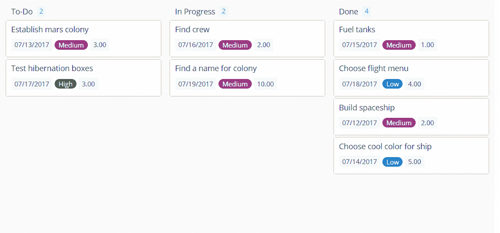

# Zenkit 希望结合 Wunderlist 和 Trello  的精华

> 原文：<https://web.archive.org/web/https://techcrunch.com/2017/10/12/zenkit-wants-to-combine-the-best-of-wunderlist-and-trello/>

来自德国软件生产商 Axonic 的项目管理服务 Zenkit 最近以替代 Trello 和类似的[看板](https://web.archive.org/web/20230319092444/https://en.wikipedia.org/wiki/Kanban)风格的系统而出名。今天，它正在扩展其服务，推出了一个新的任务管理功能，更类似于[神童列表](https://web.archive.org/web/20230319092444/https://www.wunderlist.com/)，这是一个非常受欢迎的待办事项应用程序，微软在 2015 年收购了它，它可能会在不久的将来[关闭](https://web.archive.org/web/20230319092444/https://techcrunch.com/2017/04/19/microsoft-to-shut-down-wunderlist-in-favor-of-its-new-app-to-do/)。

这里的想法是让用户在同一个应用程序中访问看板风格的工具和列表。像 Zenkit 看板(或 Trello)上的项目一样，待办事项列表视图中的新项目可以包括标签、描述和任务。此外，该服务还允许添加自定义字段(如到期日、优先级、复选框等)。)还有一个评论功能，可以在服务内部讨论项目。

不出所料，它还包括标记每个项目的阶段的能力，如果您选择在视图之间切换，这将反映在看板板上。

Axonic 创始人兼首席执行官马丁·韦尔克(Martin Welker)表示:“当微软表示他们将淘汰 Wunderlist 时，我们决定也应该将这些功能添加到 Zenkit 中。“我对结果感到非常兴奋。有史以来第一次，用户可以在列表和看板之间切换，而不会丢失任何信息。现在我们终于可以和睦相处了。”

有了这次更新，Zenkit 基本上给了用户更多的灵活性，让他们可以跟踪自己的工作项目。用户现在可以在列表、看板、日历视图、类似 Excel 的表格视图和思维导图视图之间进行选择。

Trello 的粉丝会说，他们更喜欢一个更固执己见的系统，但对于那些希望在单一系统上实现标准化、同时仍能让员工灵活选择不同工作跟踪方式的公司(甚至个人)，Zenkit 给我的印象是一个可信的替代方案。

唯一有点困难的地方是第三方支持。例如，虽然 Zapier 具有 Zenkit 集成功能，但 IFTTT 没有。不过，对大多数人来说，这可能不是一个大问题。