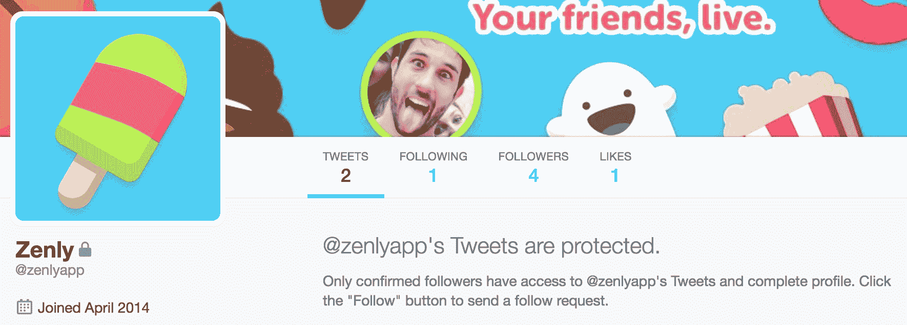

# Zenly 证明位置共享并未消亡

> 原文：<https://web.archive.org/web/https://techcrunch.com/2016/05/19/zenly-solomoyolo/>

既然你已经放弃了签到并与你的朋友分享你的位置，一家法国初创公司正提出更好的技术和新的使用案例，让位置再次变得酷起来。 [Zenly](https://web.archive.org/web/20230226195817/https://zen.ly/) 多年来一直在默默从事位置方面的工作，青少年现在越来越沉迷于这款应用。索罗莫回来了。

Zenly 不能更直接了当。当你打开应用程序时，你会看到一个巨大的地图，上面有你和你朋友的位置。你可以点击朋友的照片，查看他们的确切位置。或者你可以漫无目的地浏览你的朋友，在地图上跳来跳去。这是 Zenly 的核心特点。

当我第一次听到这个想法时，我并不相信。如果您可以与您的亲密朋友和家人分享您的位置，会怎么样？这个问题听起来一点也不令人信服。听起来很像苹果的 Find My Friends，有点像 Foursquare，也很让人想起几十个失败的创业公司(R.I.P. Sam Altman 的 [Loopt](https://web.archive.org/web/20230226195817/https://en.wikipedia.org/wiki/Loopt) ， [Gowalla](https://web.archive.org/web/20230226195817/https://techcrunch.com/2011/12/02/report-facebook-has-acquired-gowalla/) ， [BrightKite](https://web.archive.org/web/20230226195817/https://en.wikipedia.org/wiki/Brightkite) ，[Highlight](https://web.archive.org/web/20230226195817/https://en.wikipedia.org/wiki/Highlight_(application))……)。

我也从来不喜欢持续的位置共享。首先，我关心我的隐私。其次，后台定位应用会耗尽我手机的电池。第三，我为什么要用这样的东西呢？

但我认真地尝试了一下，非常喜欢。Zenly 是一款设计精良、令人上瘾的应用。我倾向于不时打开它，只是因为它与外面的一切如此不同。这不是另一个消息应用程序。这不是一个社交网络。这不是一个工具。它介于所有这些领域之间。我一直打开应用程序。

它始于定位技术。Zenly 拥有坚如磐石、高效而精确的定位算法。该应用程序试图找出你朋友的确切地址。以我的经验来看，除了少数例外，Zenly 一直很准确，比如显示了我朋友的家庭住址。

同时 Zenly 不杀你的电池。我一直定期打开这个应用程序，然而在过去的 7 天里，它甚至没有进入最大电池杀手的前 10 名——它已经消耗了我 3%的电池。

在幕后，Zenly 试图节省尽可能多的电池。例如，当没人想看到你的位置时，应用程序不会跟踪你的位置。如果朋友打开应用程序，那么 Zenly 会请求您的位置。但在一天的大部分时间里，Zenly 并不做太多事情。

然后，这个应用程序充满了小细节，使它成为一个完美的体验。例如，你可以看到你朋友的电池电量。例如，如果你想知道为什么有人不回复你的短信，这可能会很有用。

如果您想与某人共享您的位置几个小时，您可以向他们发送一个链接，以便他们可以在浏览器的地图上跟踪您。如果你的朋友没有 Zenly，或者你只是想在 Craigslist 上结识向你出售自行车的人，这可能会很有用。

但是位置共享并不适合所有人。考虑到我已经在 Foursquare 上签到，然后蜂拥而上好几年了，我已经很适应了。但是很多朋友还是不愿意。您可以选择只与您的一些朋友分享您当前所在的城市。或者你甚至可以暂时隐藏你的位置给你所有的朋友或者只是其中的一些朋友。

但即使在涉及隐私时有这种摩擦，Zenly 也无缘无故地离开了。这家初创公司在与世界分享之前，一直致力于打造一款杀手级产品。虽然这款应用已经在 App Store 和 Play Store 上市一年零四个月了，但这家初创公司的行为多少有点像一家秘密初创公司。

昨天，我去了 Zenly 的办公室，看了看度量仪表板。Zenly 的注册用户即将达到 100 万。现在约有 340，000 月活跃用户和约 80，000 日活跃用户。而且这些数字还在快速增长。对于一家尚未专注于增长的初创公司来说，这并不坏。

> 现在每月活跃用户约 340，000 人，每日活跃用户约 80，000 人

这些用户是谁？青少年。该应用程序已经在一些高中和中学疯狂传播。有的用户短短几天就加了几十个好友。他们会一直关注他们的朋友在做什么，他们是否一起出去玩，周五晚上是否有聚会。也许他们中的一些人喜欢上了另一个 Zenly 用户，而另一些人只是感到无聊。

这就是为什么该公司最近筹集了 1120 万美元的首轮融资(€1000 万美元)，由 Idinvest 和 T2 牵头，其他投资者也参与其中，如基马风险投资公司、索罗门·海克斯、托尼·贾穆斯、达米安·莫林、爱德华·布伊格、马克西姆·普拉德斯、奥利维尔·托马斯、罗曼·科塔德和巴斯汀·卡德亚克。

[gallery ids="1324671，1324673，1324672"]

现在很明显，Zenly 已经破解了无缝位置共享技术的代码。现在，这家初创公司面临着两个严峻的挑战。

像其他社交应用一样，Zenly 需要尽可能地吸引现有用户。如果你不每隔一天打开这个应用程序，你就会忘记它。这家初创公司在这方面有一些想法。第二，Zenly 需要找到一种保持增长的方法，这样它才能成为必备。在 Zenly 上有三个朋友很酷。但是有二十个朋友会更有趣。

现在 Zenly 已经确定了核心功能(位置共享)，这家初创公司可以在此基础上添加社交层。最近，该公司增加了表情符号，所以你可以用符号 ping 你的朋友。例如，我一直在发送表情符号，告诉他们我在路上或者我要迟到了。我也用这个功能给异地恋的朋友打电话问好。老实说，我也曾把它当作一个笑话，用表情符号给我的朋友发垃圾邮件。

> 既然 Zenly 已经确定了核心功能(位置共享)，那么这家初创公司可以在此基础上增加社交层

更明显的是，你可以点击“会面”按钮，在“地图”、“城市地图”或“优步”中开始旅程。如果你的朋友没那么远，你可以用 Zenly 当指南针。例如，如果你在音乐节上迷路了，这可能会很有用。

这些只是将社交要素与地图结合使用时有意义的社交要素的一些示例。Zenly 不想成为[又一个](https://web.archive.org/web/20230226195817/https://techcrunch.com/2016/05/18/google-allo-chat-app/)消息应用，或者又一个基于 feed 的社交网络应用。

但是知道你朋友的位置很有价值。与其他消费者应用相比，用户不需要每天在应用上主动发帖。分享你的位置已经很有趣了。这可能是 Zenly 促进用户增长的最有趣的技巧。