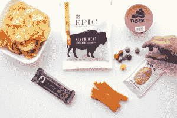
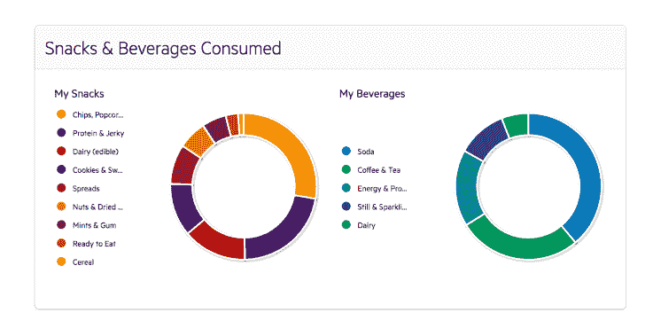

# ZeroCater 从餐饮扩展到办公室小吃 

> 原文：<https://web.archive.org/web/https://techcrunch.com/2017/08/17/zerocater-snacks/>

总部位于旧金山的 ZeroCater 是越来越多的创业公司之一，它们希望通过向全国各地的中小企业提供午餐来打破企业的午餐惯例。该公司寻求从竞争对手中脱颖而出的一种方式是推出一种新产品，向客户的货架上提供农产品和小吃。

[成立于 2011 年](https://web.archive.org/web/20221210023507/https://beta.techcrunch.com/2011/08/10/zerocater-raises-1-5-million-for-no-hassle-office-lunches/)的 ZeroCater 是最早进入日益增长的办公餐饮市场的湾区创业公司之一。虽然像脸书这样的公司通过自己的内部厨房员工为员工提供全套膳食服务，但 ZeroCater 帮助简化了向初创公司和较小的科技公司提供各种食物选择的过程。

随着时间的推移，ZeroCater 逐渐转向高端市场，为越来越大的组织提供服务，同时也向该国的新地区扩张。现在，该公司在旧金山、纽约、华盛顿 DC、芝加哥、奥斯汀和洛杉矶都有分公司，正在寻找更好地为客户服务的方法。

可供选择的小吃

考虑到这一点，ZeroCater 推出了一个新的小吃和厨房选项，通过它将向顾客提供各种新鲜农产品、包装小吃和饮料。

ZeroCater 负责与其零食产品相关的所有库存管理、送货补货和清理工作。像其餐饮选项一样，ZeroCater 收取每人每天的费用，以保持冰箱和货架上有饮料和食物，并将根据公司的预算制定定制计划。

据创始人兼首席执行官 Arram Sabeti 称，虽然 ZeroCater 今天只是向湾区的客户提供小吃，但该公司已经在一些初创公司中测试了这项服务，并已经获得了 100 万美元的业务。

萨贝蒂告诉我，顾客的兴趣部分是由小吃和餐饮的单一供应商驱动的，但它的大部分业务是通过比现有的小吃供应商更好而赢得的。事实上，ZeroCater 决定推出这项服务是因为它对自己选择的供应商感到不满。

“这就是我们决定进入这个领域的原因……这是一次可怕的经历，”他说。

新产品利用该公司建立的技术来分析办公室工作人员的胃口，并将提供一个仪表板，客户可以使用它来跟踪员工的零食和消费习惯。与大多数其他供应商不同，ZeroCater 的客户将确切知道其员工在吃什么，以及吃了多少。

对于 ZeroCater 来说，自成立以来仅筹集了 560 万美元，零食将只是该公司增长业务的又一种方式。虽然 ZeroCater 刚刚在湾区推出，但它预计随着时间的推移，零食将在其他市场推出。这项服务对现有顾客开放，但也对那些对提供其他餐饮不感兴趣的人开放。