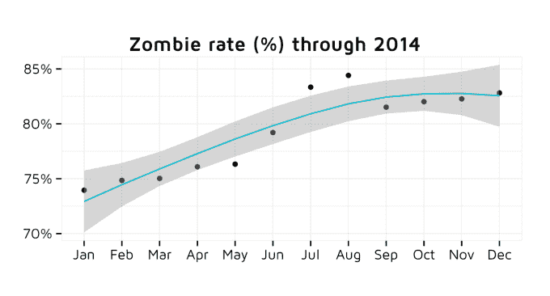
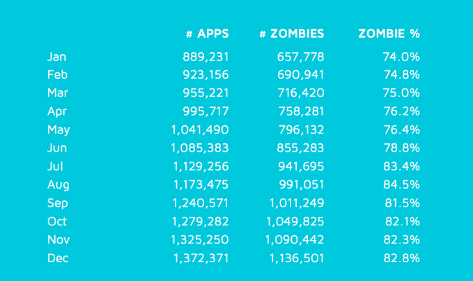
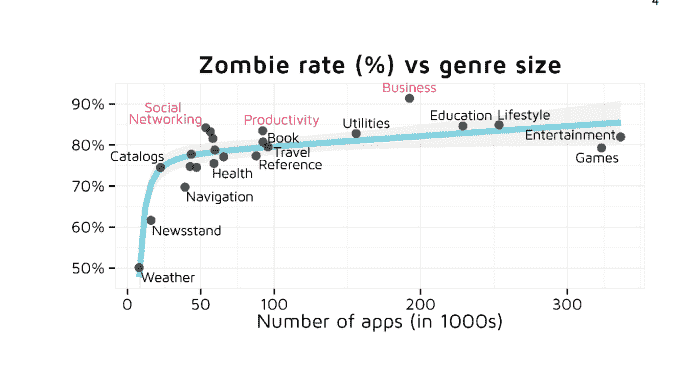
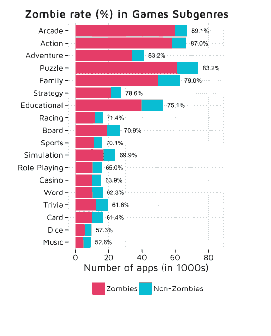
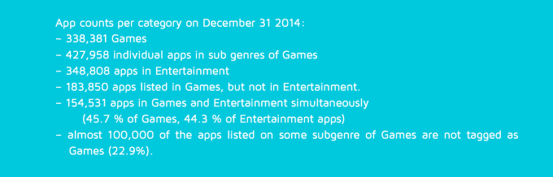
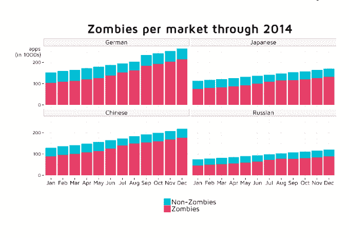

# “僵尸”应用不断增加——83%的应用不在顶级列表中，高于去年的 74% 

> 原文：<https://web.archive.org/web/http://techcrunch.com/2015/01/30/zombie-apps-on-the-rise-83-of-apps-not-on-top-lists-up-from-74-last-year/>

随着应用程序经济没有显示出放缓的迹象，iOS 应用程序商店也在继续增长，根据[应用程序分析公司](https://web.archive.org/web/20221206140010/https://beta.techcrunch.com/2014/09/08/adjust-series-c/) [adjust](https://web.archive.org/web/20221206140010/http://www.adjust.com/) 今天早上发布的一份新报告[显示，现在已经有超过 142 万个应用程序。该报告发现的一个有趣的指标是有多少应用程序实际上对消费者不可见 adjust 亲切地称之为“僵尸应用”据报道，如今，App Store 中 83%的应用程序都是僵尸程序，比去年 1 月的 74%有所上升。](https://web.archive.org/web/20221206140010/https://www.adjust.com/assets/downloads/the-undead-app-store.pdf)

如果你想知道，如果一个应用程序三天中有两天出现在 App Store 的前 300 名列表中，它就不会被认为是“僵尸”。通过排名，浏览这些类别列表的最终用户可以有机地发现应用程序。目前，155 个 iOS 国家商店中的每一个都显示了 23 种不同类型的多达 300 个位置，在“游戏”下有 18 个额外的子类别也有免费和付费的目标列表，这意味着有几个潜在的位置的机会。

然而，当处于僵尸状态时，只能通过搜索特定类型的应用程序或直接搜索应用程序的名称来发现应用程序。

报告称，2014 年，App Store 中僵尸应用的数量几乎翻了一番，从 1 月份的 657778 个增加到 12 月份的 1136501 个。在此期间，应用商店增长了 54.3%，从 889，231 个应用程序增加到 1，372，371 个应用程序。

今年 3 月，App Store 的应用数量突破了 100 万。“僵尸”的数量在 9 月达到了同样的里程碑。

一些流派比其他流派更难竞争，调整也注意到。例如,“商业”类别如今被全球少数几个成功的应用程序所主导，新来者的排名机会很小。例如，他们可能会选择竞争不那么激烈的类别，如“生产力”或“金融”。

与此同时，“导航”和“体育”应用的僵尸等级要低得多，因为它们通常是特定位置的，因此只能与一小部分本地应用竞争。

类别的大小和僵尸比率之间有明确的关系。例如，因为 App Store 中最小的类别是“天气”，所以它的一半应用程序都排在前列。

但是一旦一个类型拥有大约 250，000 个应用程序，僵尸比率就会迅速上升。“游戏”类别是这个问题的一个很好的例子——它有超过 80%的僵尸率。一些应用营销人员明白这一点，这可能是为什么 22.9%列在游戏子类别中的应用甚至不屑于列在顶级“游戏”类别中。

国际市场上的僵尸应用也面临着自己的挑战。如今，德国和中国应用商店的僵尸率(分别为 80.6%和 81.3%)高于日本和俄罗斯(分别为 77.6%和 73.2%)。有时商店会受益，因为竞争本地热门榜单的应用更少了。其他时候，成功的应用程序被翻译成该语言，然后在市场上推出时进入排名，这也影响了僵尸率。

“僵尸”指标的逐年增加表明，对于今天的应用程序开发人员来说，理解和利用 ASO(应用程序商店优化)技术是多么重要 ASO 类似于搜索的 SEO，但专注于在应用程序商店的搜索结果页面中获得高排名。

对于开发者来说，仔细选择要列出的应用类别也很有用。因为应用程序可以归入不同的类别，苹果允许开发者最多选择三种类型。选择那些市场竞争不那么激烈的应用可能是一个主要优势，可以帮助应用程序避免陷入僵尸状态。

Adjust 的报告大胆宣称“应用商店已死”，但事实并非如此。浏览应用程序商店的列表只是今天发现应用程序的一种方式，而且它正在成为一种不太重要的方式。很多时候，消费者使用的不仅仅是列表，他们还会查看精选、收藏和搜索应用。苹果甚至已经开始在这方面做一些改进，例如，去年春天[在其 iOS 应用商店增加了](https://web.archive.org/web/20221206140010/https://beta.techcrunch.com/2014/03/25/apple-improves-app-store-with-related-search-suggestions-full-rollout-to-complete-this-week/)相关的搜索建议。

但应用发现的挑战也让其他公司得以介入，并在这一领域领先苹果，最明显的是脸书。[现在](https://web.archive.org/web/20221206140010/https://beta.techcrunch.com/2015/01/28/facebook-mobile-only-2/)有 5.26 亿月活跃用户仅通过他们的移动设备访问脸书，这家社交网络刚刚[宣布](https://web.archive.org/web/20221206140010/https://beta.techcrunch.com/2015/01/28/facebook-q4-2014/)其移动广告业务占该公司 36 亿美元广告收入的 69%。这些广告中有许多是应用安装广告，将用户指向各种应用商店进行下载。事实证明，这些定向广告对脸书来说是有利可图的，而且在许多情况下与最终用户更相关。

Adjust 的完整报告[在这里](https://web.archive.org/web/20221206140010/https://www.adjust.com/assets/downloads/the-undead-app-store.pdf)提供，详细介绍了其他应用行业趋势，包括国际应用市场的增长。