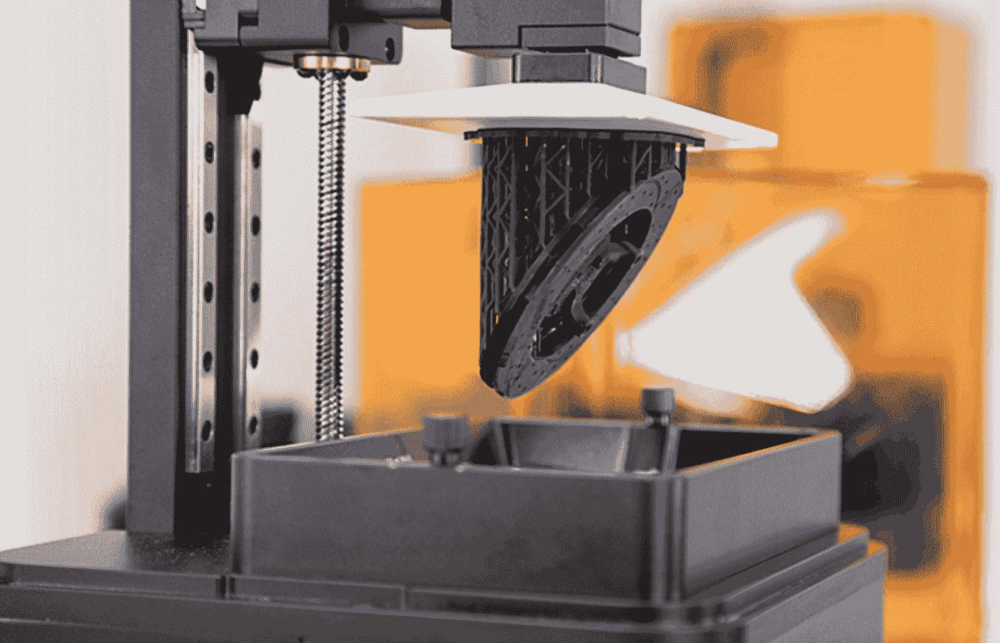

# Zortrax 推出新型高速高分辨率打印机 ink spire 

> 原文：<https://web.archive.org/web/https://techcrunch.com/2018/09/17/zortrax-launches-a-new-high-speed-high-resolution-printer-the-inkspire/>

# Zortrax 推出了一款新的高速、高分辨率打印机 Inkspire

Zortrax 推出了一款新型打印机 Inkspire，这款打印机使用 LCD 在几分钟内打印出高质量的树脂物体。这种打印机本质上是传统立体平版印刷(SLA)打印机的升级版，使用单帧光来创建 25 微米的层。

大多数 SLA 打印机使用激光或 DLP 在树脂上照射图案。光线会立即硬化树脂，产生一层材料，然后随着物体的增长，打印机拉起并拉出该层材料。售价 2699 美元的 Inkspire 中的 UV LCD 一次投射一整层，比标准 SLA 系统精确 9 倍。它每小时可以打印 20 到 36 毫米，该系统可以连续打印对象，允许您每月打印数十万个小对象。

“这种打印机也非常适合快速成型微小但极其精细的产品，如珠宝或假牙。但还有更多可能的应用，”联合创始人 Marcin Olchanowski 说。“使用相对较小的模型，如 HDMI 封盖，一台 Zortrax Inkspire 可以在 1 小时 30 分钟内 3D 打印 77 个。30 台打印机在一个 3D 打印场协同工作，每月可提供大约 360，000 到 500，000 个零件的产量(取决于每天安排的班次)。这就是 Zortrax Inkspire 如何将商业模式引入中等规模甚至高规模的生产领域。”

这家打印机公司现在是中欧最大的公司之一，在决定采用这种 SLA 打印形式之前，它探索了多种技术。

Olchanowski 说:“在这个项目的早期阶段，我们正在研究技术本身，我们似乎不太可能创造出这样的设备。”“我们尝试了 SLA 和 DLP，但我们对这些技术并不满意。我们认为他们没有发展。但是，一步一步，我们成功了。我们看到了树脂 3D 打印技术的巨大发展前景，因为如今客户期望打印模型的质量更高。”

该公司每年销售 6500 台打印机，今年的收入将达到 1370 万美元。他们也在销售新打印机的树脂，大约两个月后发货。

像 Inkspire 这样的打印机比传统的基于挤压机的打印机更难使用，比如 Makerbots。然而，质量和打印速度要好得多，为一次性零件的真正 3D 打印生产铺平了道路。