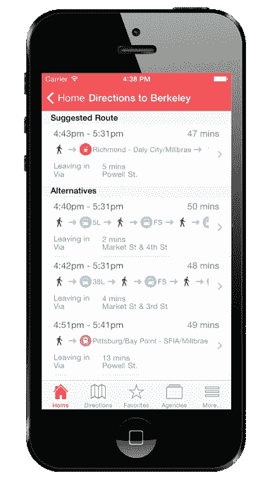

# Zoute 将其实时交通应用程序引入 iPhone，More Markets 

> 原文：<https://web.archive.org/web/https://techcrunch.com/2014/04/14/zoute-brings-its-real-time-transit-app-to-iphone-more-markets/>

# Zoute 将其实时交通应用程序带到 iPhone 和更多市场

[Zoute](https://web.archive.org/web/20221005185618/http://www.zoute.me/) 是一款结合了实时出发信息和固定路线计划的交通应用，现已面向美国八个主要市场的 [iPhone 用户](https://web.archive.org/web/20221005185618/https://itunes.apple.com/us/app/zoute/id836348718?mt=8)推出。该公司最初在安卓系统上为湾区用户推出，后来扩展到纽约、波士顿、芝加哥、洛杉矶、华盛顿、费城和波特兰。

对于那些不熟悉的人来说，这个应用程序来自移动开发者[乐海](https://web.archive.org/web/20221005185618/http://www.crunchbase.com/person/hai-le)和[李莉](https://web.archive.org/web/20221005185618/http://www.crunchbase.com/person/li-li-2)，之前是早期基于位置的服务 Loopt，后来被[绿点](https://web.archive.org/web/20221005185618/https://beta.techcrunch.com/2012/03/09/how-green-dot-will-use-loopt-to-go-after-mobile-payments/)收购。他们去年在帮助构建了 GoBank 的应用程序后离开了绿点，以便在 Zoute 上工作。

该团队注意到目前市场上的许多交通应用程序都是为单个城市或单个交通机构开发的，他们希望开发一个应用程序，为没有汽车或没有公共交通工具的人提供他们需要的所有信息。此外，他说，该应用程序旨在通过提供实时出发信息和固定时间表来提供更全面的信息。

Zoute 与各种交通应用和聚合器竞争，包括 [CityMapper](https://web.archive.org/web/20221005185618/http://citymapper.com/apps/) 、[交通应用](https://web.archive.org/web/20221005185618/https://beta.techcrunch.com/2013/05/31/the-transit-app-nabs-35k-downloads-in-72-hours-blows-past-google-maps-in-canadian-app-store-after-going-free/)、 [Moovit](https://web.archive.org/web/20221005185618/https://itunes.apple.com/us/app/moovit-public-transit-trip/id498477945?mt=8) 、 [Transit](https://web.archive.org/web/20221005185618/https://itunes.apple.com/us/app/transit-directions-public/id561866269?mt=8) 和其他应用，尽管有些应用，如 [Embark](https://web.archive.org/web/20221005185618/https://beta.techcrunch.com/2013/08/22/apple-acquires-embark-another-mapping-app-with-transit-information/) 和 [HopStop](https://web.archive.org/web/20221005185618/https://beta.techcrunch.com/2013/07/19/apple-reportedly-acquires-hopstop/) 已经被苹果公司收购，以帮助其改进自己的原生地图应用。

为了帮助该公司决定下一步将 Zoute 带到哪里，他们在应用程序中推出了“将 Zoute 带到我的城市”功能，然后通过关注用户请求的那些区域来做出回应。

根据 [Google Play](https://web.archive.org/web/20221005185618/https://play.google.com/store/apps/details?id=me.zoute) 提供的数据，该应用自几个月前推出以来，已经吸引了数千名湾区用户，但随着对多个城市的支持，尤其是 iOS，这一数字应该会很快增长。

新的 iPhone 应用程序可以在这里免费下载。