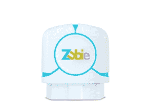

# Zubie 让您的汽车成为物联网的一部分

> 原文：<https://web.archive.org/web/https://techcrunch.com/2016/03/09/zubie-makes-your-car-a-part-of-the-internet-of-things/>

似乎我谈论联网汽车和 V2X 以及自动驾驶汽车就像这是我的工作一样。大概因为是吧。但是像很多人一样，我还没有一辆能以任何方式连接的汽车。有很多新公司希望通过使用 [OBD-II](https://web.archive.org/web/20230327154040/https://en.wikipedia.org/wiki/OBD2) 端口将 Wi-Fi 和联网应用程序带到我们已经驾驶的汽车上，来为我们纠正这种情况。

如果你想知道你的车是否有这些 OBD-II 端口，除非它是一辆老式阿尔法罗密欧或雪佛兰 Impala，它确实有。自 1996 年以来，美国制造的每辆汽车都被要求配备 OBD-II 端口，这涵盖了今天路上行驶的大多数汽车。当出现问题时，这与端口机制用来获取诊断代码是一样的。你可能会在方向盘附近的仪表板下找到它。

虽然一些竞争设备只是 Wi-Fi 热点，但 [Zubie](https://web.archive.org/web/20230327154040/http://www.zubie.com/) 希望将你的汽车完全连接到物联网。在这方面并不孤单——像 [Mojio](https://web.archive.org/web/20230327154040/https://www.moj.io/) 和 [Dash](https://web.archive.org/web/20230327154040/https://dash.by/) 这样的公司也通过 OBD-II 端口连接汽车。

Zubie 给我发了一个测试单元(100 美元一年，不带 Wi-Fi，100 美元一次性费用，带 Wi-Fi)让我玩几个星期。设置非常简单；在大约三个步骤，我有单位插入到端口和应用程序启动和运行。你可以选择使用用户名和密码登录，或者只使用你的脸书帐户。最后一步是实际驾驶汽车启动装置，所以我绕着街区走了一圈。这就足够了；我准备好要走了。

没有 Wi-Fi 的 Zubie

我让 Zubie 做的第一件事是将每次旅行的报告发送到 Google Drive 中的电子表格中。它创建了一个名为“Zubie”的文件夹，并将该表命名为“车辆行程日志”，这样就很直观了。它跟踪的内容包括起止地点、每次旅行花费的时间以及每次旅行使用的燃料成本。

就像插入同一端口的类似保险公司设备一样，Zubie 可以跟踪和评估你的驾驶习惯。显然，我有急刹车的习惯，但除此之外，我在快速加速、超速(分为严重超速和轻微超速)和最高速度方面的分数都很好。该应用程序有一个地图，显示像急停和超速这样的事情发生在哪里。如果您正在监控家中的新司机，这将非常方便。

Zubie 使用诊断端口提供的所有信息，为您提供日常所需之外的更多信息，包括电池状态(即使您的汽车不是电动的)、发动机问题、燃油油位、里程表读数和维护间隔。大多数时候，所有这些数据都不是非常有用，因为所有东西都在工作。但是 Zubie 最近宣布与嘉实多创新投资公司合作，与经销商分享所有这些数据。如果你给服务部门许可，机械师可以在你之前知道你的车需要保养。

如果你已经屈服于物联网网关药物，如智能恒温器或联网灯泡，Zubie 还集成了 [IFTTT](https://web.archive.org/web/20230327154040/https://ifttt.com/) 应用。Zubie 可以设置为个人或商业用途，我可以看到通过车载连接跟踪车队会变得更加容易。一个全新的功能还允许车队经理在非工作时间查看车辆的行驶情况。

毕竟，Zubie 还可以作为车内设备的 Wi-Fi 热点(使用威瑞森无线*账户)。

你愿意出多少钱？如果答案是 100 美元左右，你就走运了。如果你不需要 Wi-Fi，设备本身是免费的，但你每年要为 Zubie 服务支付 100 美元。如果你确实想要 Wi-Fi，插件设备的固定费用是 100 美元，还有威瑞森 4G LTE 数据计划的费用。无论哪种方式，通过 Zubie 加入联网汽车的世界都比购买一辆新车便宜得多。

*披露:TechCrunch 通过美国在线归威瑞森所有。