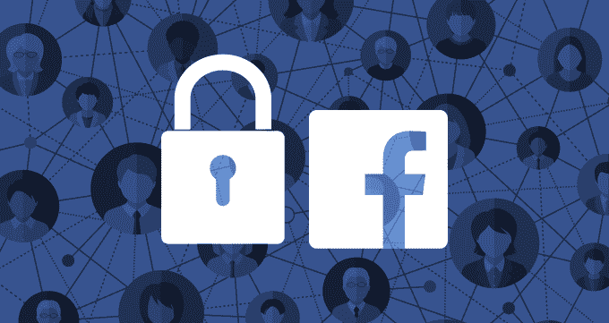

# 扎克伯格史诗般的安全宣言 TechCrunch 的 10 个关键点

> 原文：<https://web.archive.org/web/https://techcrunch.com/2018/09/13/zuckerberg-strikes-back/>

马克·扎克伯格想让你知道，他正竭尽全力在 T2 破坏民主之前修复脸书。今晚他发布了一份[3260 字的对抗选举干扰的作战计划](https://web.archive.org/web/20221025222740/https://www.facebook.com/notes/mark-zuckerberg/preparing-for-elections/10156300047606634/)。在钻研脸书的战略和进展时，他在几个显着的段落中透露了他自己的哲学。

扎克伯格已经抛弃了他过早的怀疑，并准备好指挥军队。他认为脸书的真实身份政策是其他社交网络缺乏的真理的强大武器，但如果 Instagram 和 WhatsApp 被监管机构分拆，这种武器将被削弱。他已经结束了相互指责，希望大家一起努力解决问题。他采用了一种愤世嫉俗的风格，这可以让他开阔眼界，并帮助他预测人们会如何滥用他的创作。

以下是扎克伯格安全宣言中最重要的部分:

扎克伯格欣然接受了他战时战术家的角色

> “虽然我们希望在发现威胁时迅速采取行动，但同样重要的是，我们要等到尽可能多地发现网络后，才能记下账目，以避免向我们的对手通风报信，否则他们会采取额外措施来掩盖他们剩余的踪迹。理想情况下，我们会选择最大程度地破坏他们运营的时机。”

他对 Google+、Snapchat 和脸书 IPO 杀手的愤怒现在指向了选举攻击者

> “这些是极其复杂和重要的问题，今年是紧张的一年。我正以同样的专注和严谨来解决这些问题，就像我以前解决产品挑战一样，比如将我们的服务转移到移动设备上。”

平衡言论自由和安全既复杂又昂贵

> “这些问题变得更加困难，因为人们对什么样的结果是好的，或者什么样的权衡是可以接受的，没有达成一致。当谈到自由表达时，有思想的人会对正确的平衡得出不同的结论。当谈到实施解决方案时，肯定会有一些投资者不同意我在安全领域投入这么多资金的做法。”

**因允许使用假名而将推特和 YouTube 置于风口浪尖……**

> “脸书的一个优势是，我们有一个原则，即你必须使用你的真实身份。这意味着我们对什么是真实账户有一个清晰的概念。对于 Instagram、WhatsApp、Twitter、YouTube、iMessage 或任何其他不需要提供真实身份的服务来说，这就更难了。”

**…同时论证为什么如果脸书没有分裂，互联网会更安全**

> “幸运的是，我们的系统是共享的，所以当我们在脸书发现坏演员时，我们也可以在 Instagram 和 WhatsApp 上删除与他们相关的账户。我们可以与其他公司共享信息，也可以帮助他们删除虚假账户。”'

**政治广告不是生意，它们应该是一种道德义务**

> “在决定这一政策时，我们还讨论了是否完全禁止政治广告会更好。最初，这似乎简单而有吸引力。但是我们决定反对——不是因为钱，因为这种新的验证过程成本很高，所以我们不再从政治广告中获得任何有意义的利润——而是因为我们相信让人们有发言权。我们不想拿走许多团体用来参与政治进程的重要工具。”

**扎克伯格否决了员工对脸书的学术研究**

> “由于这些争议(如剑桥分析)，脸书员工对允许研究人员访问数据有相当大的担忧。最终，我认为支持这种学术研究的好处大于风险。但我们正在投入大量资源，以确保这项研究以尊重人们隐私和符合最高道德标准的方式进行。”

**呼吁执法部门加强执法**

> “有些关键信号只有执法部门才能获得，比如资金流动。例如，我们的系统使得设立虚假账户或从国外购买政治广告变得更加困难。但是，如果没有额外的情报，脸书或其他人仍然很难发现外国对手是否在美国成立了一家公司，向其汇款，然后在我们的服务上注册了一个真实的账户，并从美国购买了广告。”

**主要参与者必须联合起来，而不是减少他们自己的指责**

> “防止选举干预比任何一个组织都重要。现在很明显，每个人——政府、科技公司和大西洋理事会等独立专家——都需要更好地分享信号和信息，以防止滥用。。。我要说的最后一点是，我们都在一起。成功的定义是，我们在网络攻击和协同信息作战造成伤害之前阻止它们。”

**扎克伯格乌托邦式理想主义的终结**

> “我学到的一个重要教训是，当你建立连接几十亿不同国家和文化的人的服务时，你会看到人类所有的优点，你也会看到人们试图以各种可能的方式滥用这些服务。”