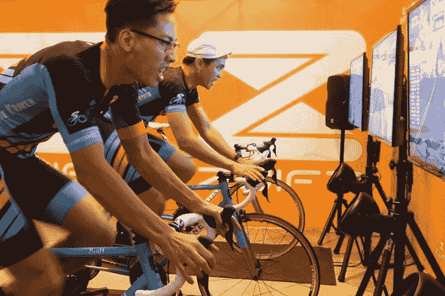

# Zwift 将室内健身与大型多人在线游戏相结合

> 原文：<https://web.archive.org/web/https://techcrunch.com/2016/10/21/zwift-merges-indoor-fitness-with-massive-multi-player-online-gaming/>

其核心， [Zwift](https://web.archive.org/web/20230314230236/http://zwift.com/) 是室内骑行软件。但在其功能之上是一个社区，在该公司运营的两年里，该社区的规模和实力都有所增长。在旧金山 [Rapha 的](https://web.archive.org/web/20230314230236/http://pages.rapha.cc/clubs/san-francisco)自行车赛的一次活动中，我发现自己被核心用户包围着，他们自豪地炫耀着他们的团队名称，并会面，通常不是第一次。甚至[巴里·邦兹](https://web.archive.org/web/20230314230236/http://www.barrybonds.com/)也出现在这家正在发生的小店，来看看 Zwift 在做什么。

如果不亲自尝试，你可能很难理解游戏、健身和社交是如何联系在一起的。这是一个骑行社区，建立在游戏软件上，连接到室内训练。简而言之，Zwift 已经开发了一款软件，让你在自己家里或当地的健身房里，就能感觉到你正和朋友们一起骑在你最喜欢的风景优美的道路上。

Zwift 在过去的一年中稳步增长，迄今为止已有 170，000 个帐户，250 万次乘坐和 4，500 万英里乘坐。根据该团队的说法，平均骑行时间超过一小时，这令人印象深刻。如果你曾经在家里或健身房骑过自行车，你就会知道任何超过 20 分钟的事情，你就会开始觉得自己像一只仓鼠(或者至少我是这样)。

那么为什么这么多人没听说过 Zwift 呢？这家公司并不新。拥有 17，000 名推特粉丝，10 万名脸书[粉丝](https://web.archive.org/web/20230314230236/https://www.facebook.com/gozwift/)和 50 万名 YouTube 粉丝[的 Zwift 最近在自行车赛道之外鲜有主流媒体报道。大约一个月前，马克·扎克伯格(Mark Zuckerberg)确实发表了他对 Zwift 的支持，当时他发现自己在手臂骨折后使用它作为恢复选项。原来这个平台上还有许多其他的科技高管，包括](https://web.archive.org/web/20230314230236/https://www.youtube.com/channel/UCeOCqLG5Wy65aiENWfuFzUQ/featured)[麦克斯·拉夫琴](https://web.archive.org/web/20230314230236/http://levchin.com/)、[凯文·斯特罗姆](https://web.archive.org/web/20230314230236/https://techcrunch.com/2016/08/02/silicon-copy/)和优步的[艾德·贝克](https://web.archive.org/web/20230314230236/https://www.crunchbase.com/person/ed-baker)。但该公司为何在技术圈不那么知名的最大障碍是，除非你亲自尝试，否则很难真正理解它的伟大之处，或者你会在何时何地使用它。

[gallery ids="1405241，1405236，1405238，1405240，1405237，1405248，1405247"]

Zwift 不是你可以随便购买的硬件或设备。这是一项基于订阅的服务，你每月支付 10 美元和 BYOBike。与 Peloton 不同，Peloton 要求你购买一辆 2000 美元的自行车来骑行或上课，你可以在任何室内训练机上使用任何公路自行车，不管它的年龄或爱好如何，只需添加一些传感器。亲自尝试 Zwift 仍然需要一些相当高端的运动设备或属于拥有上述设备的健身房的设置。Zwift 很难获得，尽管从技术上讲，它是健身爱好者可以使用的平台。不过，当你看到它的实际效果时，你会立刻想跨上马鞍亲自尝试一下，不管你穿的是什么，在我的例子中是牛仔裤和高跟鞋。

深究软件本身，Zwift 做了两件事。首先，它跟踪你的活动和表现统计。“这一切背后其实都有真实的数据。这不仅仅是一个游戏。我们测量每个人的瓦特，记录他们的心率，我们有他们的节奏，他们兜售自行车的速度。联合创始人兼首席开发人员 [Jon Mayfield](https://web.archive.org/web/20230314230236/https://zwift.com/blog/102-the-early-days) 表示:“我们将所有数据记录到一个真实的数据文件和行业标准 fit 文件中，它还会上传到 Strava 等所有标准服务中。

第二，它连接到兼容的硬件，以调整自行车的张力，并反映您所看到的前方路线的骑行体验。“当你在 Zwift 上坡或下坡时，自行车所安装的某些训练器有一个智能功能，可以实际改变阻力。所以我们支持每一个聪明的教练来控制这种感觉。所以当你登上一座陡峭的山峰时，你会感觉到它。当你走下坡路时，如果你确实想踩油门，那会很容易。我们还使用了这种可控功能，因此当您进行锻炼时，我们可以让您做得更好，这样您只需要付出正确的努力，每次都可以得到完美的结构化训练间隔。”

忠实于 Zwift 游戏化的本质，您有一个包含您的统计数据的个人资料和一个您可以定制的头像，不仅可以选择您的球衣，还可以选择您骑的自行车的品牌和型号。2017 年，该公司预计将改进人物定制，包括小胡子、山羊胡、珠宝等。

语音交互也将在未来几个月推出，它将允许你与平台上的任何人交谈，从而有助于建立社交方面。Zwift 的 iOS 应用程序目前处于测试阶段，预计将上市，使这项服务变得更加移动和易于使用。随着这款新应用的推出，您只需要一个心率监视器就可以在 Zwift 上跑步或骑行。然后，当然还有跑步，最早将在圣诞节向当前用户推出测试版。在启动时，跑步将与现有的自行车课程一起进行。但是，为越野跑、马拉松建立专门的体验，甚至有可能把它变成自己的订阅服务，这是有巨大潜力的。

为了支持这些新的努力，Zwift 将在 11 月初完成一轮 2500 万美元的融资。尽管该公司无法透露具体参与方，但这轮融资由一家总部位于伦敦的私募股权公司牵头，该公司在视频游戏领域也有其他投资。这些资金将用于进一步的产品开发，并为未来的增长奠定基础。在首轮融资之前，Zwift 已经悄悄地筹集了资金，首先是在今年早些时候启动的朋友和家人融资，以及他们的第一轮天使融资。

Zwift 迄今面临的最大挑战是等待硬件赶上。例如，虚拟现实是该公司已经建立并提供的东西，但耳机仍然笨重，不是为虚拟现实中的健身而设计的。智能训练器是该公司的核心功能，平均价格仍在 1000 美元左右，受欢迎的模块供应有限。Zwift 的首席执行官 Eric Min 表示，预计 2017 年初将会有硬件合作。“我们的愿景是创建最具参与性和社交活跃性的健身平台。”该公司正在与固定自行车制造商进行谈判，最终将与 Zwift 兼容的跑步机进行谈判，使这项服务更容易获得，更容易使用。

“如果你长时间工作，如果你住在户外活动受限的地方，那里有天气问题，你总是有机会在 Zwift 与一群有趣的人一起骑自行车，”产品副总裁兼奥运自行车手 [Mike McCarthy](https://web.archive.org/web/20230314230236/http://www.usbhof.org/inductee-by-year/128-mike-mccarthy) 说。“这并没有剥夺户外骑行的权利。它只是给了人们更多骑行的机会。”

我个人看好 Zwift，希望看到他们成长为自己有潜力引领的虚拟健身未来。尽管住在阳光明媚、气候温和的旧金山，我还是觉得室内锻炼更方便。你可以在家里或当地的健身房流汗，冲个澡，然后继续你的一天。还有一个额外的安全因素，就是不想在晚上骑车或跑步，尤其是作为一名女性。对于像我这样的都市人来说，它还消除了被车撞的风险，这种情况比我们任何人知道的都要多得多。

Zwift 的社交方面也很耐人寻味。如果我能赶上我在柏林的朋友，而我们实际上是在同一个环路上并排骑行，我可能会锻炼得更多。每月有 500 多项社区活动，您可以参加很多团体骑行活动。但我发现最有激励性的是，尽管在自行车上是静止的，但你觉得你要去某个地方。Zwift 与 [Strava](https://web.archive.org/web/20230314230236/https://www.strava.com/) 的集成显示了你完成的虚拟路径，看到地图和你骑行路径的倾斜度统计数据会给你一种成就感，这是卡路里计数或心率统计数据所不能提供的。考虑到所有这些原因，再加上跑步，我认为 Zwift 有巨大的潜力进入主流健身领域。