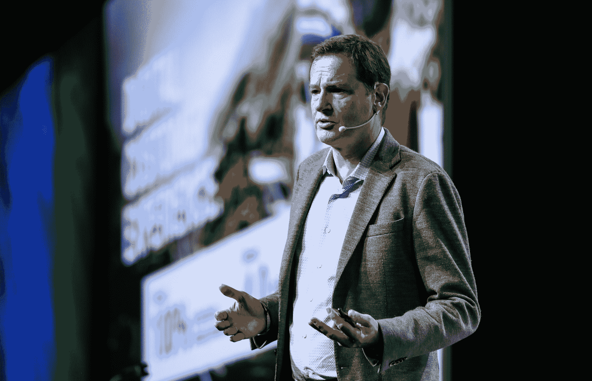
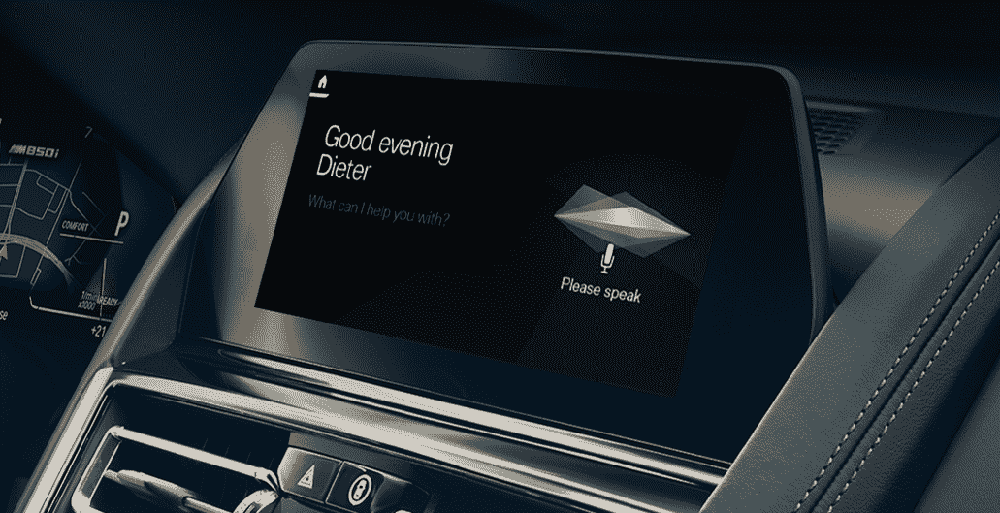
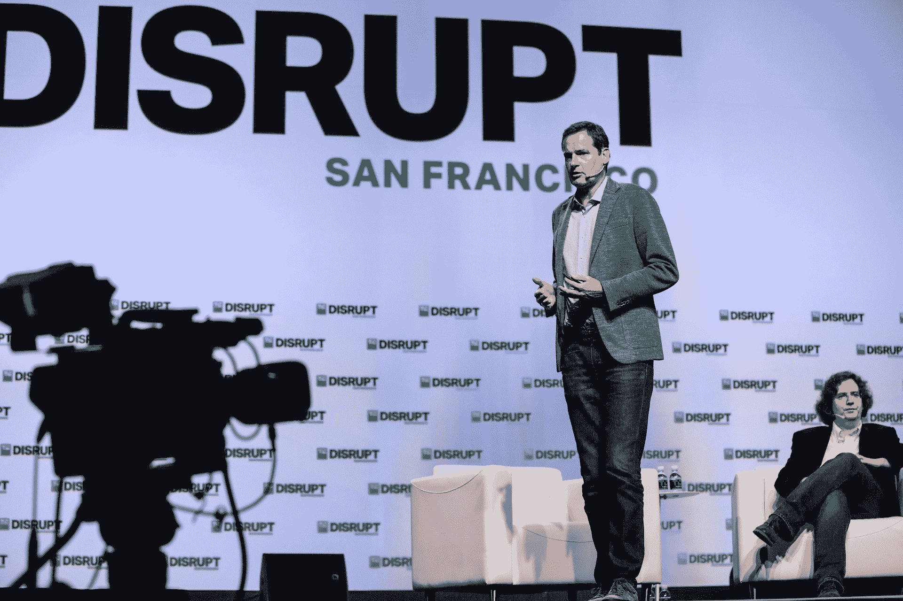

# 宝马为其汽车推出个人语音助手 

> 原文：<https://web.archive.org/web/https://techcrunch.com/2018/09/06/bmw-launches-a-personal-voice-assistant-for-its-cars/?>

在 TechCrunch [Disrupt SF 2018](https://web.archive.org/web/20230108000345/https://techcrunch.com/events/disrupt-sf-2018/) 上，宝马今天首次推出了其汽车数字个人助理，名副其实的宝马智能个人助理。但你不必说“嘿，宝马智能私人助理”就能唤醒它。你可以给它取任何你想要的名字。

该声明是在宝马也推出了与亚马逊的 Alexa 集成的几周之后发布的，但值得强调的是，这些是互补的技术。宝马自己的助手完全是关于你的汽车的，而它与亚马逊和微软的合作伙伴关系实现了与你的驾驶体验没有直接关系的其他功能。

“随着时间的推移，宝马的私人助理会通过你的每一个语音命令和使用你的汽车来了解你，”宝马数字产品和服务高级副总裁迪特·梅说。“一天比一天好。”

坚持微软、谷歌和亚马逊助手的先例，宝马助手的声音是女性(尽管宝马在新闻材料中经常使用男性名字和代词)。随着时间的推移，它肯定会得到更多的声音。

那么宝马助手能做什么呢？一旦你上了一辆兼容的车，你就可以通过语音控制所有标准的车内功能。想想导航和气候控制(“嘿，约翰，我很冷”)，或者检查轮胎压力、油位和其他发动机设置。

你也可以进行一些更随意的对话(“嘿，查理，生活的意义是什么？”)，但更重要的是，助理会不断地了解你。现在，助手可以记住你的首选设置，但随着时间的推移，它会了解更多，甚至主动建议更改。“例如，晚上在城外开车，私人助理可以向你推荐宝马远光灯辅助系统，”May 指出。

此外，你还可以使用助手来了解你的汽车的更多功能，随着汽车变得越来越复杂，这变得越来越困难。

宝马基于微软的 Azure 云和对话技术构建了这款助手。Azure 长期以来一直是宝马的首选公共云，两家公司多年来一直保持着密切的关系。毕竟，宝马还在其汽车中集成了一些对访问 Office 365 文件和使用 Skype 进行商业活动的支持，对 Cortana 的支持可能也将很快推出。

不过，这听起来有点令人困惑。毕竟为什么车里有三个助手。所有那些“嘿，阿利克夏”，“嘿，查理”，“嘿，科塔娜”终究会让人有点困惑。但宝马辩称，每家都有专长。对于 Alexa 来说，这可能是购物，而 Cortana 则是完成工作，宝马则是你的车。如果其他一切都失败了，宝马现有的礼宾服务仍然存在，让你与人类交谈。

[gallery ids="1706322，1706331，1706330，1706329，1706327，1706326，1706325，1706323，1706321"]

从 2019 年 3 月开始，助手功能将在支持 23 种语言和市场的基础版本中提供。在美国、德国、英国、意大利、法国、西班牙、瑞士、奥地利、巴西和日本，该服务将在 2019 年 3 月推出更多功能，如支持天气搜索、兴趣点搜索和音乐访问。在这些市场，这位助理还将拥有更自然的声音。在中国，这个扩展版本将稍后上线，目前计划于 2019 年 5 月推出。在这些市场，它将推广到支持宝马操作系统 7.0 的汽车，作为该公司实时驾驶舱专业计划的一部分。

如果您从 11 月开始订购宝马 3 系，该助理将立即为您提供，并包含在您拥有的前三年内。对于新的 X5、Z4 和 8 系车型，宝马助手支持将从 2019 年 3 月开始以无线软件升级的形式提供。