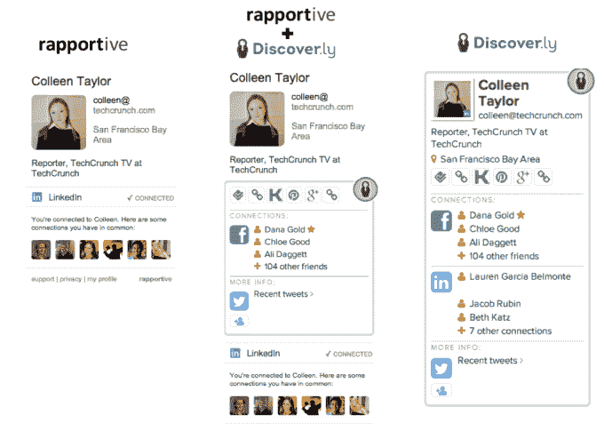

# Discoverly 首次推出 Gmail 插件，弥补了 Rapportive 用户的损失

> 原文：<https://web.archive.org/web/http://techcrunch.com/2014/10/13/discoverly-debuts-a-gmail-plugin-that-makes-up-for-what-rapportive-users-lost/?_=1675616668394>

自从被 LinkedIn 收购以来，【Rapportive 的情况一直不太好，Rapportive 是一个方便的 Gmail 小工具，可以在 Gmail 的侧边栏中显示联系人的社交账户和更新。LinkedIn，本着让 Rapportive 应用程序更有利于自己的网络的精神，[去掉了最初让它受欢迎的大部分功能](https://web.archive.org/web/20230314170654/https://techcrunch.com/2014/06/17/linkedin-owned-email-widget-rapportive-is-about-to-get-less-useful/)。

但是今天，Rapportive 的替代产品正在首次亮相:[discovery](https://web.archive.org/web/20230314170654/http://discover.ly/)正在推出一个 Gmail 小工具，它的工作方式类似于旧的 Rapportive，显示你的电子邮件联系人的完整社交资料，包括 Twitter、脸书、AngelList、Crunchbase 等网站上的联系人。

[发现](https://web.archive.org/web/20230314170654/http://discover.ly/)，对于那些不熟悉的人，[已经为社交网络](https://web.archive.org/web/20230314170654/https://techcrunch.com/2013/03/06/discoverly-seed-funding/)提供了一个类似 Rapportive 的产品。通过使用[浏览器插件](https://web.archive.org/web/20230314170654/http://discover.ly/)，您可以在浏览网页时查看更多关于您的连接的数据。例如，你可以在 LinkedIn 上看到你们共同的脸书朋友，或者在 Twitter 上看到脸书和 LinkedIn 的信息。

但随着今天 Gmail 支持的推出，Discoverly 终于解决了 Rapportive 的退出和后续变化带来的漏洞。

你可能还记得，对于那些没有在 LinkedIn 个人资料中列出脸书和 Twitter 信息的联系人，LinkedIn 的 Rapportive 不再显示这些信息。它不再显示联系人最近的推文和状态更新。

另一方面，Discoverly 会列出你的联系人的社交资料，向你展示共同好友的列表，并为你提供一种快速查看最近推文的方式。如果你想继续安装 Rapportive，你可以。“我们非常尊重说唱歌手，”Discoverly 首席执行官西奥多·苏梅(T2)说。

“本着这种尊重的精神，Discoverly 可以与 Rapportive 合作，向 Rapportive 注入额外的社交数据，以便用户再次获得完整的视图，”他说。“对于非 Rapportive 用户，Discoverly 的工作方式很像以前的 Rapportive，显示电子邮件联系人的完整社交资料。”

目前，Discoverly 的活跃用户每月使用 Chrome 扩展约 13 次，但他们的使用量呈爆发式增长。有时，他们会一头扎进去，花上整整 15 分钟研究某样东西，然后一周内不再碰它。

这就是为什么 Summe 说 Gmail 插件现在将成为 Discoverly 的旗舰产品——因为用户更经常登录 Gmail。此外，那些使用 Rapportive 的人已经习惯于浏览侧边栏，寻找收件箱中与他们交流的人的其他背景信息。

今天为 Gmail 用户推出的产品仅仅是一个开始。展望未来，Discoverly 将致力于将其他社交网络集成到这个小工具中，甚至将其用例扩展到核心“网络”人群之外，以允许查看朋友发布到照片共享网站(例如 Instagram)的最后一张照片。

该团队还将努力引入一种体验——无论是在 Gmail 中还是作为一个独立的网络应用程序——让你可以查看和分析你在网络上的所有联系。

“困难的部分是建立数据集，我们已经建立了，”Summe 解释说。“现在的问题是给用户一个好的用户界面来管理这些数据。”

Discoverly 带有 Gmail 功能的更新插件将于今天发布。你可以从主页[点击](https://web.archive.org/web/20230314170654/http://discover.ly/)获取当前扩展名。