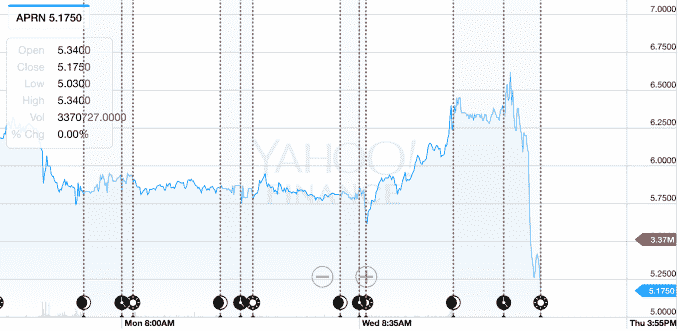

# 蓝色围裙今天过得很糟糕 

> 原文：<https://web.archive.org/web/https://techcrunch.com/2017/08/10/blue-apron-is-having-a-really-bad-day/?__s=XXXXXXXX>

# 蓝围裙今天过得很糟糕

今天早上，蓝色围裙发布了第二季度的收益报告(这是它有史以来的第一份收益报告),事情进展的并不顺利，股票也因此暴跌。

该公司的股票在收益报告中下跌了超过 14 %,与华尔街想要的相比，这是相当复杂的。蓝色围裙正寻求削减其营销支出，试图控制其燃烧，这导致其客户数量下降。该公司在过去的日子里能够挤出一点利润，但从那以后，它开始积极地在营销上花费，因为它试图获得客户。

问题很快就变成了如何让这些顾客留下来并继续购买食物。这一次，该公司能够改善其客户群的健康状况，因为他们花了更多的钱，购买了稍微多一点的饭菜，但它仍然必须表明，即使它开始缩减营销，它也可以扩大这一基础。该公司报告收入为 2.381 亿美元，每股亏损 47 美分，而华尔街预计收入为 2.358 亿美元，每股亏损 30 美分。

图表时间:

因此，收入好于预期，但亏损扩大，因为它削减了营销费用。据 Business Insider 报道，该公司对其下一季度发出了一些负面信号，预计下半年将亏损 1.21 亿至 1.28 亿美元。这些评论可能是在收益电话会议上发表的，我们现在正在回顾。但这些负面信号将会对一家刚刚上市的公司造成不利影响，尤其是在 Snap 业绩下滑、对新 IPO 的兴趣可能减弱的不确定时期。

如果蓝色围裙看到今年下半年出现一些动荡，亚马逊的持续威胁肯定不会有所帮助。慢慢有消息传出，亚马逊正在瞄准餐包配送领域，随着时间的推移，这一领域的股价已经下跌。该公司以每股 10 美元的价格上市，但此后股价暴跌，市值缩水近一半。

尽管如此，首次公开募股仍将继续。据报道，Dropbox 正在慢慢接近 IPO，TechCrunch 此前报道称，Stitch Fix 已经秘密申请 IPO。