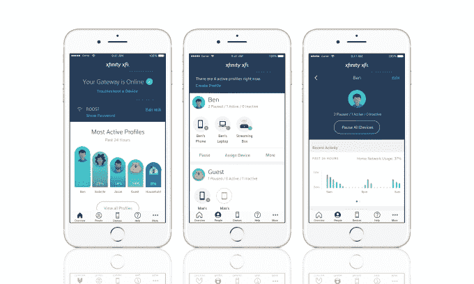
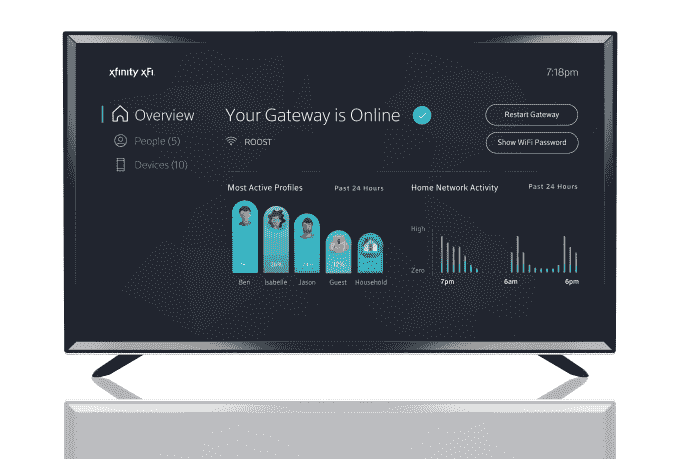

# 康卡斯特投资网状网路由器制造商 Plume，推出 Xfinity xFi 管理家庭无线网络 

> 原文：<https://web.archive.org/web/https://techcrunch.com/2017/05/08/comcast-invests-in-mesh-router-maker-plume-launches-xfinity-xfi-for-managing-your-homes-wireless-network/?_ga=2.178723040.533610682.1526850281-1447864512.1494524635>

康卡斯特今天早上推出了一项名为 Xfinity xFi 的新服务，这将允许客户通过在线仪表盘、通过电视进行语音控制，以及通过用于 T2 iOS T3 和 T4 Android T5 设备的应用程序，更好地管理和控制他们的家庭 Wi-Fi 网络。该系统旨在简化常见任务的执行，如查找 Wi-Fi 密码或监控网络活动，以及访问其他控制，如设置设备“就寝时间”计划，或配置新设备加入网络时的短信提醒等。

通常，配置您的家庭网络、监控连接的设备和控制互联网访问需要直接在路由器上进行更改，或者利用第三方互联网监控软件应用程序，或者较新的硬件设备之一，如 [Luma](https://web.archive.org/web/20221001022649/https://beta.techcrunch.com/2016/09/14/luma-nabs-another-9-5-million-in-series-a-funding-from-andreessen-horowitz-and-gv/) 路由器、 [Circle with Disney](https://web.archive.org/web/20221001022649/https://beta.techcrunch.com/2015/11/04/circle-with-disney-is-a-new-device-that-helps-families-manage-online-usage-and-apps/) 等。

相反，Comcast 的 xFi 服务通过一个界面提供了一套类似的功能，免费提供给现有的互联网用户。

该服务可以通过手机应用程序、网站或使用 X1 语音遥控器通过电视进行控制。它要求 Xfinity 客户有一个支持的设备来工作——要么是 xFi 无线网关，要么是 xFi 高级无线网关。

xFi 无线网关是今天 1000 万 Comcast 用户家庭中无线网关的更名名称。与此同时，高级网关是一种新设备，可供更快的宽带层使用，将用于提供 1g 速度、Wi-Fi 千兆速度、Xfinity 语音以及家庭安全和自动化应用。

在网络管理方面，xFi 将允许你设置网络，查看和更改你的 Wi-Fi 名称和密码，查看所有连接的设备并为它们取昵称以方便参考，解决 Wi-Fi 问题，在新设备加入时通过短信接收提醒，甚至通过点击暂停互联网。

xFi 还包括内置的家长控制，以保护儿童免受不良网络内容的影响。客户可以为每个家庭成员设置配置文件，监控谁在网络上最活跃以及何时最活跃，并设置设备“就寝时间”，这将在一天的特定时间禁止设备访问互联网。

该服务提供了针对网络钓鱼和恶意软件的保护，并与 xFi 网关上可用的防火墙相结合，以提高安全性。

因为这项服务是基于云的，客户可以从任何地方管理和监控他们的家庭互联网。

此外，康卡斯特表示，它已经投资了 T2，这是一个“路由器杀手”，可以智能地平衡设备之间的家庭带宽，T3 提供了扩展整个家庭 Wi-Fi 的插件盒 T4。康卡斯特正在将 Plume 和 xFi 整合到一个统一的体验中，并将在今年发布自己的 xFi pods，可以与康卡斯特的网关配对，以帮助 Wi-Fi 信号到达整个家庭。

康卡斯特预测，随着新的高级网关的推出和新客户的增加，到年底将有 1500 万个家庭支持 xFi。

此举出台之际，康卡斯特正在寻找新的方式来吸引客户使用其高速互联网服务。这一服务的增长受到了有线电视用户减少趋势的推动——包括所谓的“有线电视用户”，他们从一开始就没有注册过有线电视。今年 4 月，该公司宣布其在 T2 有 2250 万电视用户和 2510 万宽带用户，使其成为美国最大的宽带供应商 T4。

该声明也是在今天关于康卡斯特与 Charter Communications 的交易的新闻之后发布的，这两家美国最大的有线电视公司将在未来的无线交易中合作。这两家公司都需要新的收入来源，因为削减开支的步伐仍在影响着它们有线电视业务的增长。两家公司已经达成协议，允许它们转售威瑞森网络的无线服务，并计划在未来联手与其他运营商谈判类似的协议。