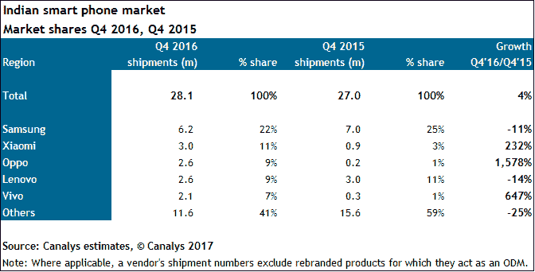

# 三星和中国品牌在 2016 年第四季度完全主导了印度智能手机市场 

> 原文：<https://web.archive.org/web/https://techcrunch.com/2017/01/24/samsung-and-china-domination/?_ga=2.208172635.893664512.1538318888-1510196584.1533849207>

印度正处于一场革命之中:中国智能手机革命。在最近一个季度的业务中，有史以来第一次没有印度公司跻身该国五大智能手机销售商之列。

三星和一大批雄心勃勃的中国年轻公司一直忙于在印度推广他们的设备，印度是全球少数几个智能手机销售增长潜力尚未开发的市场之一，现在有了他们进步的切实证据。

根据分析公司科纳仕公司的最新数据，三星以 22%的市场份额领先于小米(11%)、Oppo、联想(均为 9%)和 Vivo(7%)。曾经占据主导地位的印度品牌，在过去一年里集体份额缩水超过一半。

“在 2015 年第四季度，Micromax、Intex 和 Lava 占据了第二、第三和第五名的位置，几乎占据了 30%的市场份额。科纳仕公司说:“一年过去了，这三家厂商都跌出了前五名，它们的市场份额下降到了 11%左右。

除了中国竞争对手具有竞争力的价格和可观的营销预算，还有一个因素在起作用:去货币化。印度政府宣布召回 500 印度卢比和 1，000 印度卢比钞票，以打击该国所谓的“黑钱”，科纳仕公司表示，这对商业包括智能手机销售产生了重大影响。

“本土品牌的目标客户通常会从独立零售商那里购买现金。随着非货币化导致的短期流动性紧缩，这些零售商正在遭受消费者支出放缓的影响。科纳仕公司分析师 Rushabh Doshi 解释说:“随着零售商寻求将库存转移到快速移动的最新设备上，本地供应商正在失去市场。

该分析公司称，事实上，2016 年第四季度的总销量同比下降了 25%，达到 1160 万台。

但这不应减损中国手机制造商在印度的增长。特别是小米，2016 年来自印度的年收入首次达到 10 亿美元，销售额增长了 232%，而联想的市场份额增长了 11%，Opp 对印度的总出货量增长了 1500%以上。

对印度来说，并不完全是厄运和黑暗，恰恰相反。

[Counterpoint](https://web.archive.org/web/20221006083534/http://www.counterpointresearch.com/press_release/indiahandset2016q4analysis/)的新研究发现，印度智能手机用户数量首次突破 3 亿，2016 年总出货量增长 18%。这远远高于全球 3%的平均水平，这也说明了为什么中国品牌，甚至是苹果，据报道，苹果[正与印度](https://web.archive.org/web/20221006083534/https://www.bloomberg.com/news/articles/2017-01-19/apple-is-ready-to-start-making-iphones-in-india-at-a-price)商谈在印度制造智能手机，正在增加他们对印度智能手机市场的关注。

顺便说一下，苹果没有出现在科纳仕公司的报告中，但 Counterpoint 表示，它在印度销售了 250 万部 iPhones，这是它在印度表现最好的一年。这比去年的 200 万有所增加。这是一个很大的进步，但正如图表所示，就数量而言，它仍然落后于该领域——尽管它的业务确实占据了全球几乎所有的智能手机利润。