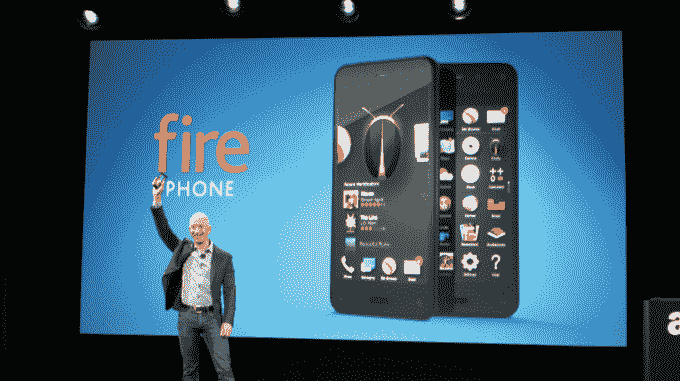

# 亚马逊 Fire Phone Flops 

> 原文：<https://web.archive.org/web/https://techcrunch.com/2014/10/23/amazon-fire-phone-flops/?_ga=2.264248716.2038255187.1635282355-240280965.1627318537>

鉴于亚马逊在推出后两个月将 Fire 手机的价格降至 99 美分*(导致许多“大甩卖！”笑话)，这可能不会令人感到惊讶:Fire Phone 并不成功。*

在今天的亚马逊财报电话会议上，亚马逊指出，该公司将减记 1.7 亿美元，“主要与”过度承诺 Fire Phone 有关。他们订购了过多的库存，并向供应商做出了他们无法兑现的承诺。

那么，亚马逊还有多少 Fire 手机呢？有什么猜测吗？五百万美元？两千万美元？

第三季度末 Fire 手机库存的最终统计结果是:8300 万美元。

[八十。三个。百万。美元。](https://web.archive.org/web/20221209174328/http://www.sadtrombone.com/)

谁会想到一款手机的存在仅仅是为了向你出售来自亚马逊的商品，而严重依赖于[这个愚蠢的噱头](https://web.archive.org/web/20221209174328/https://beta.techcrunch.com/gallery/heres-what-the-amazon-fire-phones-crazy-3d-head-tracking-looks-like/)不会卖得很好？