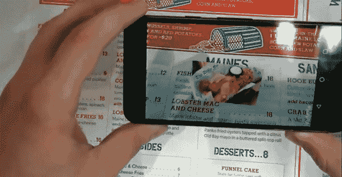

# MenuMe 将菜单文本转化为照片 

> 原文：<https://web.archive.org/web/https://techcrunch.com/2016/05/08/menume-turns-menu-text-into-photos/?amp;utm_medium=TechNWSRM&utm_source=Twitter&utm_content=AR-News-Consumer&cl1=Newsrooms365-Vuforia-2016-Twitter-TechNWSRM-AR-News-Consumer&cmsrc=Newsrooms365>

# MenuMe 将菜单文本转换成照片

在 TechCrunch Disrupt NY 2016 黑客马拉松上，一个工程师团队合作开发了一个应用程序，可以帮助游客更好地了解菜单上描述的食物。只需将手机对准餐馆的菜单，该应用程序就会识别文本，并将其转化为有问题的食物的图像，然后覆盖在相机的取景器上。

黑客背后的团队成员 Ocean Huang、Brent Bevolo、Jose Portcarrero 和 Bret Deasy 最初想出了一个菜单扫描应用程序的想法，此前他们首先尝试了一个可以扫描书籍文本的应用程序。但是他们很快意识到这并不是对现有技术的最好利用。

“这是第一个想法的自然支点，”贝沃洛指出。

该小组于昨晚午夜开始开发 MenuMe Android 应用程序，因此可以公平地说，MenuMe 此时不处于可以上传到 Google Play 的状态。

该应用利用 Vuforia Android SDK 来实现文本和图像识别功能，并在增强现实中显示 3D 对象。这实际上是一个简单但实用的 AR 实现，事实上——它是将一种你不懂的语言翻译成照片的通用语言。

你不仅能知道菜单上写的是什么，MenuMe 还能帮你决定你觉得这顿饭是否美味。

虽然今天演示的黑客有点仓促，但如果团队决定完成这个项目，他们说他们将使用谷歌图像搜索来寻找食物图像，以匹配文本。

但这款应用有一天会出现在 Google Play 上吗？

“我们走着瞧，”黄说。

手指交叉。