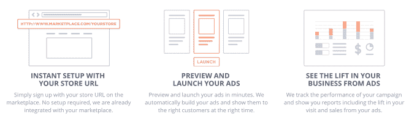
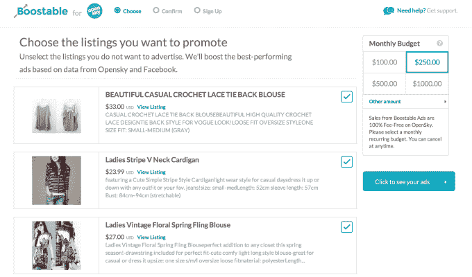

# Boostable 获得 320 万美元，其广告为您的活动、众筹或在线商店 TechCrunch 带来更多销售

> 原文：<https://web.archive.org/web/http://techcrunch.com/2014/10/22/boostable-marketplace-ads/?aolNcraveContentSept>

[Boostable](https://web.archive.org/web/20230131012358/http://www.boostable.com/) 不一定要卖它的广告。市场出售它们。当用户出售商品时，票务、众筹和电子商务市场就能赚钱，因此它们受到激励，将流量导向自己托管的商品，这正是 Boostable 的简易广告购买工具为市场卖家所做的事情。因此，市场做跑腿工作，向卖家推荐 Boostable 的广告，广告推动销售，每个人都赚钱。

如果这听起来有利可图，你知道为什么 Morado Ventures、Omidyar Network 和 SV Angel 投资了 Y Combinator alum Boostable 的 320 万美元种子基金。这笔资金将有助于吸引更多的名牌市场。

大多数人说你应该和你喜欢的人一起开公司。塞尔丘克·阿特里从他的死对头开始。

Boostable 联合创始人兼首席执行官塞尔库克·阿特里

Atli 最初来自伊斯坦布尔，靠富布赖特奖学金来到纽约，最终在加州结束，在那里他为一家名为 Social Wire 的电子商务广告公司筹集了 400 万美元。其最大的竞争对手之一是 Alex Chang 创立的 Social Amp。多年后，当两人共同创立 Boostable，从 SV Angel 筹集了 50 万美元，并通过 YC 时，激烈的竞争变成了富有成效的合作伙伴关系。让你的敌人离得更近，对吗？

市场赚了很多钱，但利润很少。Etsy 每笔交易的利润仅为 3.5%。这意味着他们知道谁是潜在的回头客，但他们没有太多的广告支出来接触他们。但是在上面列出的卖家可以获得丰厚的利润。问题是他们不够精明，无法将这些利润再投资于有效的广告，而且这些卖家非常分散，广告工具开发者很难找到他们。

不过，Boostable 解决了这个难题。Marketplaces 向其提供客户定位数据，并向其卖家推广该工具，卖家只需设定预算并粘贴其电子商务商店、房间租赁、众筹项目或活动的 URL。Boostable auto 为他们的列表生成创意，并在脸书上运行优化的广告活动，目标是该市场上的以前的购买者或其他潜在客户。理想情况下，这些推动了销售投资回报——对卖家来说是积极的销售，为市场赚取费用，Boostable 从中提成。Boostable 现在拥有大约 10 个市场，包括“独特的”电子商务门户 OpenSky。

例如，如果一个珠宝商想要在 OpenSky 上销售更多的项链，他们只需将他们的 OpenSky URL 输入 Boostable，这将购买它的广告，并赚取珠宝商，市场和它自己的钱，只要广告足够有效，让足够多的人购买项链来抵消广告预算。

这个计划并不新鲜，至少在网下是如此。这叫合作广告。像 GoPro 这样的产品制造商将帮助百思买这样的零售商销售更多的设备，这样他们都赚了钱。Boostable 想把整个事情放到网上。Atli 告诉我，“这是一个 1500 亿美元的业务，其中 98%是线下的。”

为了追逐这个市场，现在[筹集了 320 万美元](https://web.archive.org/web/20230131012358/http://www.crunchbase.com/organization/boostable)，这要归功于它在加入 YC 之前筹集的部分“种子”，现在完成了来自 Morado Ventures、Omidyar Network、SV Angel、Digital Garage、Vast Ventures、Fuel Capital、Lightbank 和重量级广告技术天使如 Ric Calvillo (Nanigans)、Auren Hoffman (LiveRamp)、David Marcus(脸书)、Hiten Shah (Kissmetrics)和 Linda Rothenberg (Endeavor)的投资。这将有助于它扩展到六人团队之外，签约更多像 Ticketmaster 和易贝这样的市场巨头，并增加更多像 Twitter 这样的广告渠道。

卖家可以粘贴他们的一个列表，比如他们在 OpenSky 上的电子商务商店，并开始通过 Boostable 运行自动生成的广告

那么，为什么市场不建立这些广告工具，这样他们就不必与 Boostable 分享利润了呢？Atli 说“这是一种完全不同的能力。他们已经外包了所有的广告工具。”此外，Boostable 还有一个优势，因为许多卖家同时在多个市场上运营，所以它可以帮助他们在所有店面上获得更多销售，这是一个市场本身无法做到的。

一个问题是，许多市场旨在促进比较购物和发现。如果一个卖家购买了指向他们列表的广告，他们不希望访问者立即点击市场上的一个竞争卖家并购买。这就是为什么 Boostable 正在与 marketplaces 合作，要么从广告的卖家列表登录页面中删除一些比较购物宣传片，要么在广告中包含优惠券代码，以激励客户从为广告付费的任何人那里购买。然而，市场厌倦了改变他们的产品。

好消息是 Boostable 有一个大胡萝卜在晃。如果它能让来自竞争市场的卖家对它的广告工具忠诚，它可以承诺让他们进入一个新的市场，如果他们合作。

商业过去是非常专业的。但是现在，几乎每个人都在卖一些东西——他们房子里的一个免费房间，一件手工艺品，他们举办的一场活动的门票，或者他们 Kickstarter 的贡献点。Boostable 可能是一家将新一代商家转化为利润丰厚的新广告客户的公司。

*【图片来源:[牵头商务](https://web.archive.org/web/20230131012358/http://www.leadcommerce.com/blog/the-benefits-of-cloud-based-ecommerce-software-solutions.html)*