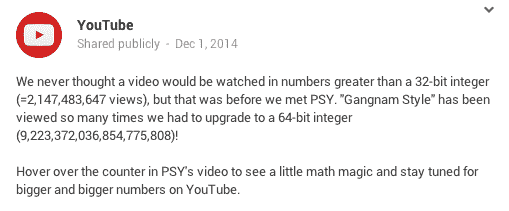

# 《江南 Style》被观看了很多次，打破了 YouTube 的代码 

> 原文：<https://web.archive.org/web/https://techcrunch.com/2014/12/03/gangnam-style-has-been-viewed-so-many-times-it-broke-youtubes-code/?fb_action_ids=10204103439960057&fb_action_types=og.shares>

# 《江南 Style》被观看了很多次，打破了 YouTube 的代码

哎呦！

对于编码人员来说，这只是一个有趣的琐事:PSY 的《江南 Style》已经被观看了很多次，以至于它打破了 YouTube 的观看计数，成为第一个打破 32 位整数范围的视频。

**以下是 YouTube 对这个话题的评论:**

不知道那是什么意思？只要知道当你编码时，你经常要考虑*如何*存储像数字这样的数据。您想要 32 位整数，还是 64 位整数？32 位整数*占用的内存稍少，但只能用于存储 2，147，483，648 到 2，147，483，647 之间的数字。64 位整数的内存使用量稍大，但可以存储从 9，223，372，036，854，775，808 到 9，223，372，036，854，775，807 的数字。

(*为了简单起见，我们忽略了[有符号/无符号整数](https://web.archive.org/web/20221204032601/http://en.wikipedia.org/wiki/Signedness))

你知道《吃豆人》的死亡画面吗，在那里事情在 256 级后变得很可怕？类似的想法，只是 8 位数字对 32 位。

截至昨天的里程碑和随后的代码更改，YouTube 现在理论上可以支持高达 9 万亿次观看的视频。开始看。