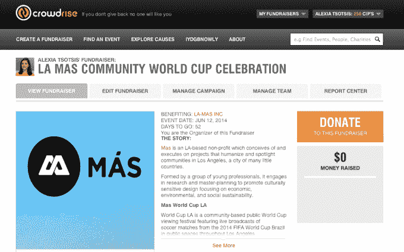
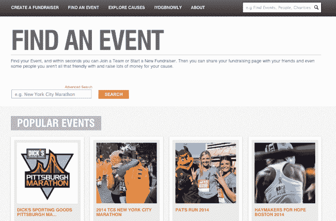

# Fred Wilson 在 CrowdRise 领导了 2300 万美元的资金，这是一个为每个人提供的“慈善水”

> 原文：<https://web.archive.org/web/http://techcrunch.com/2014/04/21/fred-wilson-leads-23m-funding-for-crowdrise-a-charity-water-for-everyone/?fb_comment_id=fbc_1407442882863533_92543_1407533326187822>

慈善机构和非营利组织如何为他们的事业筹集足够的资金？好吧，正常的路线，如果你愿意的话，需要被“打乱”,这意味着许多每盘数千美元的晚餐，许多个人伸出手，也许是一些马拉松比赛。

2009 年，爱德华·诺顿(是的，*即*爱德华·诺顿)和他的联合创始人罗伯特·沃尔夫、肖纳·罗伯逊和杰弗瑞·沃尔夫在试图为[马赛荒野保护信托基金](https://web.archive.org/web/20230129092835/http://www.maasaiwilderness.org/)筹集资金时构思了这个 [CrowdRise](https://web.archive.org/web/20230129092835/http://www.crowdrise.com/) 的想法。他们最初打算筹集 6 万至 7.5 万美元，但该集团最终通过自己的定制在线平台筹集了 120 万美元。

看到这一成功后，他们想，“如果我们能够将我们学到的一些经验融入到一个可以帮助他人的产品中，会怎么样？”克劳迪斯出生了。

诺顿告诉我，“传统的筹款活动，比如晚会，是最没有成本效益的筹款方式之一。”。他断言筹集资金不应该是非营利组织的核心焦点，他们的使命才应该是。

但是目标经常被颠倒。作为今年第一次加入非营利董事会的人，在没有你通常用来在职业上(LinkedIn)和社交上(脸书)联系人们的在线工具的情况下，负责一定数量的筹款有点令人生畏。

诺顿表示，他认为传统的、现实生活中为非营利组织筹集资金的方式是错误的，并且不认为它们应该占组织发展成本的三分之一甚至五分之一。

他还认为，现有的大多数在线工具要么没有迎合非营利组织的需求，要么有一种“蒸发”的体验。“‘脸书’是我的社交生活所定义的我；“Linkedin”是我职业生涯定义的我；“而‘CrowdRise’就是我的活动家生活所定义的我，”他解释道，希望 crowd rise 将成为每个人慈善活动的平台。

> "传统的筹款活动，比如晚会，是最不划算的筹款方式之一."—爱德华·诺顿

就功能而言，CrowdRise 是所有慈善机构的慈善之水。这项服务允许你注册，建立个人资料(像 T2·索菲亚·布什的这里(T3))，建立或参与各种活动(像 Lady Gaga 的生来如此基金会(T5)或为女性募集挑战(T7))，并积累 CIPs 或 CrowdRise 影响点。

例如，[这是我的非盈利组织](https://web.archive.org/web/20230129092835/http://www.crowdrise.com/tsotsis/fundraiser/alexiatsotsis) [LA Mas](https://web.archive.org/web/20230129092835/http://www.mas.la/) 的募捐者；如果我通过为我的竞选筹款和拉选票等行动积累了 15 万 CIPS，我将在 CrowdRise 主页上赢得一个梦寐以求的位置。

该公司今天宣布融资 2300 万美元，由弗雷德·威尔逊和联合广场风险投资公司(Union Square Ventures)牵头，包括 Spark Capital、Index Ventures、RatPac、CAA Ventures、UTA 风险投资公司和贝佐斯探险公司。这家初创公司的种子轮包括 Lightbank、Specific Media、High Line Ventures、克里斯·萨卡(Chris Sacca)和杰克·多西。

弗雷德·威尔森的参与引人注目，因为他是第一个支持众筹巨头 [Kickstarter](https://web.archive.org/web/20230129092835/https://www.kickstarter.com/) 的人。威尔逊回忆道，由于他在非营利众筹组织 [DonorsChoose](https://web.archive.org/web/20230129092835/http://www.donorschoose.org/) 的董事席位，他知道众筹模式可能会变成一项大生意。他认为潜在的在线慈善市场每年有 300 亿美元，如果由于产品效用的增加而采用增加，它有可能成为 500 亿至 700 亿美元的市场。

当然，诺顿和 CrowdRise 首席执行官罗伯特·沃尔夫并没有声称已经为非营利组织发明了众筹模式。“直邮是众筹的一种形式，让人们小规模聚集并不新鲜，”Wolfe 说。

但 Kickstarter 根本不涉及慈善活动，Indiegogo 和 Crowdtilt 也不关注慈善活动，尽管 Crowdtilt 的费用较低，为 2.5%。CrowdRise 通过从交易中抽取 3%到 5%的费用来赚钱，并在今天的波士顿马拉松赛上尝试收取 1%的费用。CrowdRise 认为，他们所做的是价格竞争，其游戏化，个人资料功能和红十字会等大型合作伙伴关系使其与众不同。

尽管 CrowdRise 希望成为慈善活动的*和*众筹平台，但它也无法避免大型众筹平台经历的一些认知问题。“很多人说，‘我不想做 Kickstarter，因为我不想乞讨。’"众筹大师弗雷德·威尔逊在谈到这些问题时说. "不是乞讨，是‘我在拍这部电影，来和我一起参与吧。人们说，‘那不是品牌上的。橡胶鸡晚餐是。很烦。"

> “人们将会做更多的捐赠，因为这将会又快又容易。”—弗雷德·威尔逊

威尔逊表示，非营利众筹的大规模采用只是时间问题，这意味着人们现在就在网上。“人们需要时间来认识到这些服务不仅是合法的，而且是未来的发展方向。没有办法让在 Twitter 上关注你的 10 万人来参加你的晚宴。”

CrowdRise 不愿透露数字，理由是非营利众筹的正确指标尚未确定，但它确实表示它是盈利的，并认为 Kickstarter 在该平台上筹集 10 亿美元的基准是可以实现的。

除了融资，CrowdRise 还宣布与纽约市马拉松赛、波士顿马拉松赛、芝加哥马拉松赛、铁人赛事、红十字会、联合国儿童基金会、婚礼网站 The Knot 和 Today Show 建立合作伙伴关系，此外还有一个新的“社会公益”功能，允许人们为非营利以外的公益事业筹集资金，如医疗保健治疗 a la [Watsi](https://web.archive.org/web/20230129092835/https://watsi.org/) 。

威尔逊认为，Crowdrise 是一个巨大的机会，不仅从商业角度来看，而且因为它最终将迫使人们进一步向慈善机构捐款，“人们将会更多地捐款，因为这将是快速而简单的。”这是件好事。

