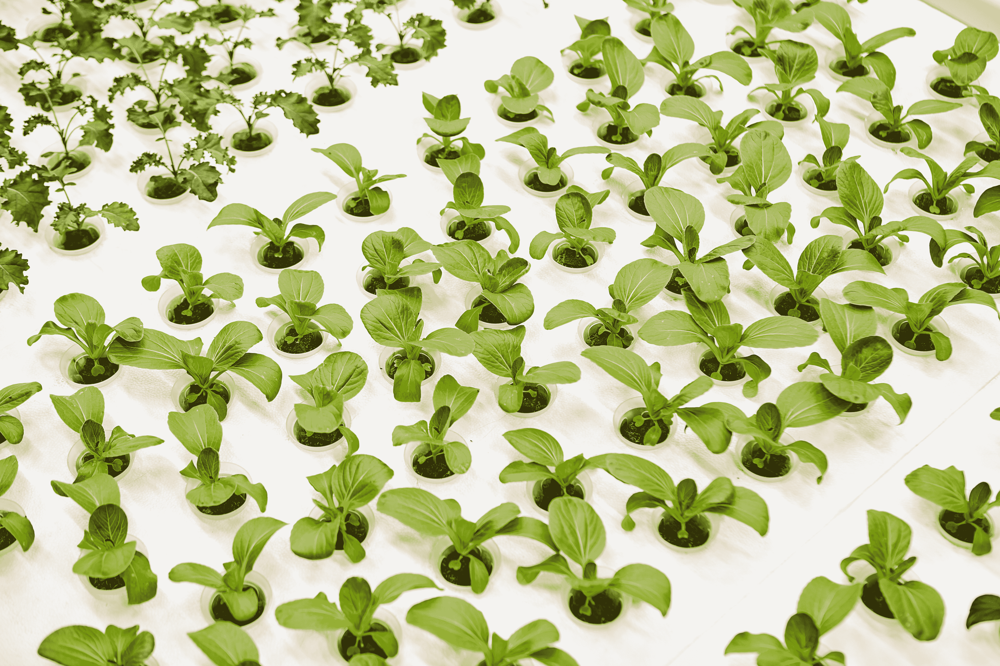
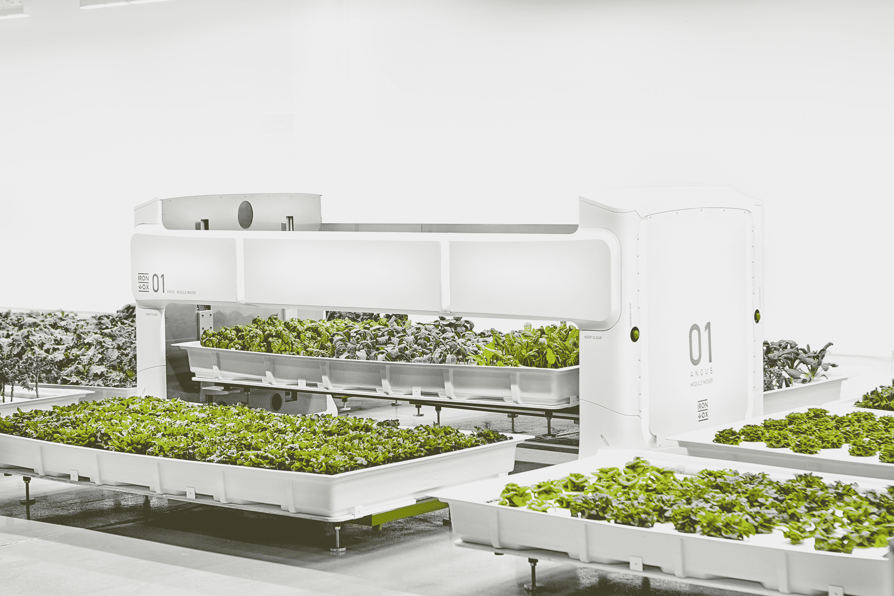

# Iron Ox 开设首个完全自主的农场

> 原文：<https://web.archive.org/web/https://techcrunch.com/2018/10/03/iron-ox-opens-its-first-fully-autonomous-farm/?guccounter=1>

在过去的两年半时间里，铁牛公司一直致力于完善其农业机器人来照料其室内农场。在首次小规模测试其系统后，该公司正在开设其第一个完全自主的生产农场，并计划很快开始销售其产品。

该农场目前正在种植一些绿叶蔬菜，包括长叶莴苣、butterhead 和羽衣甘蓝，此外还有罗勒、芫荽叶和细香葱。照料这些植物的机器人是 Angus，这是一台 1000 磅重的机器，可以提起和移动种植农产品的大型水培箱，以及 Iron Ox 用于收获农产品的机械臂。

正如 Iron Ox 的联合创始人兼首席执行官布兰登·亚历山大(Brandon Alexander)告诉我的那样，目前的设置每年可以生产约 26，000 株植物，相当于一英亩的户外农场——尽管这一个显然是室内的，密度要高得多。

亚历山大指出，他和他的联合创始人乔恩·宾尼(Jon Binney)在其他一些机器人公司工作过之后，决定进入室内农业领域——对亚历山大来说，这包括在 Google X 的一段时间——那里的重点往往更多地是建立酷技术，而不是如何使用这些机器人。“我们已经看到了许多新奇的机器人技术，并希望避免这种情况，”他告诉我。虽然创始团队考虑过进入仓储物流或无人机领域，但他们最终选择了农业，因为正如亚历山大所说，他们不仅想建立一个良好的企业，还想创造社会公益。

今天，美国大多数绿叶蔬菜(铁牛专注的那种产品)都生长在加利福尼亚州和亚利桑那州——尤其是在美国其他地区更冷的冬季。这意味着一月份在东海岸出售的长叶莴苣通常要经过 2000 多英里的运输才能到达那里。“这就是我们转向室内的原因，”亚历山大说。"我们可以分散经营农场。"

室内水培农场一年的产量可以达到室外农场的 30 倍，而占用的空间却少得多，这也很有帮助。

然而，为了达到铁牛可以经营一个自主农场的地步，需要大量的工作和工程印章。亚历山大告诉我，最大的挑战是让机械臂通过它的立体摄像机来观察植物，然后计划拾取操作来收获农产品，这并不总是均匀的。为了自主运行这个操作，它显然必须可靠地运行。

安格斯是一个较大的机器人，它拿起 800 磅重的托盘，把农产品放到机器臂上，也花了一些时间才弄好。毕竟，你不想太快地移动这些货盘，否则你会有很多水要清理。

所有这一切，包括监测植物及其生长的系统，监视它们的传感器和水培系统，都是由一个基于云的服务控制的，它告诉机器人什么时候该收获，应该执行哪些操作。然而，机器人本身会自动执行这些任务。

然而，有一件事让该团队感到有些惊讶，那就是仅仅用 LED 照明来经营一个室内农场仍然会导致电费过于昂贵而无法盈利。因此，展望未来，Iron Ox 实际上押注于通过高效 LED 照明增强的更传统的温室。

这意味着该团队不能在城市中建造这些自主农场，因为你不能将许多温室堆叠在一起。但是正如 Alexander 指出的，即使你必须在城市外 20 英里的地方，这仍然比运送产品到几千英里外的超市要好的多。

正如 Alexander 强调的，团队花了大量时间与农民和厨师交谈，以了解他们需要什么。事实证明，农民大多抱怨他们找不到劳动力。这并不奇怪。农业劳动力短缺开始成为农民的一个主要问题，尤其是在像加州这样的州。至于厨师，他们最看重的当然是质量，但也包括可预测性和稳定的质量。

现在的计划是从第一个农场开始销售产品，然后随着时间的推移扩大到更多更大的地方。Iron Ox 现在有资金这样做，因为它已经筹集了超过 500 万美元，包括今年早些时候宣布的 300 万美元。

