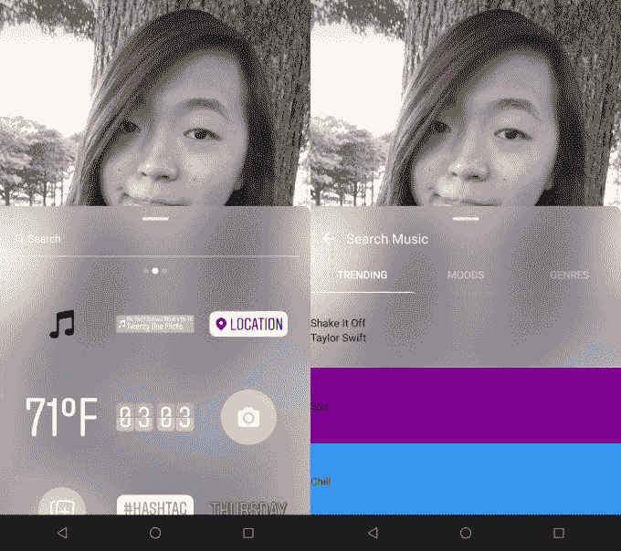
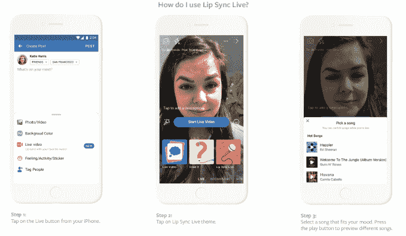

# 脸书允许带版权音乐的视频，测试现场对口型

> 原文：<https://web.archive.org/web/https://techcrunch.com/2018/06/05/facebook-lip-sync-live/?hootPostID=0e5c81022a8c173f2b544f9f579719df>

由于[与](https://web.archive.org/web/20221206094431/https://www.facebook.com/facebookmedia/blog/building-community-together-with-music/)[达成](https://web.archive.org/web/20221206094431/https://www.facebook.com/facebookmedia/blog/a-diverse-music-community-is-a-very-good-thing/)协议[所有](https://web.archive.org/web/20221206094431/https://techcrunch.com/2018/02/21/facebook-inks-music-licensing-deal-with-ice-covering-160-territories-290k-rightsholders-on-fb-insta-oculus-and-messenger/)T8主要唱片公司以及许多独立唱片公司，脸书用户将不再被撤下他们上传的带有版权背景音乐的视频。

脸书也开始测试一项旨在从青少年音乐应用中窃取用户的功能。脸书新推出的“对口型直播”让用户挑选一首流行歌曲，假装在脸书直播中演唱。数百首歌曲将开始播放，包括卡米拉·卡贝洛的《哈瓦那》(Havana)，枪炮与玫瑰乐队(Guns N Roses)的《欢迎来到丛林》，以及德雷克的《上帝的计划》(God's Plan)。

[https://web.archive.org/web/20221206094431if_/https://www.youtube.com/embed/5C7k6ycD38M?feature=oembed](https://web.archive.org/web/20221206094431if_/https://www.youtube.com/embed/5C7k6ycD38M?feature=oembed)

视频

当新规则生效后，用户上传带有音乐的视频时，他们会很快被通知该歌曲是否被允许通过交易和罚款来分享，或者他们的视频是否会被静音，除非他们向版权所有者提交争议，然后版权所有者通过脸书的版权管理工具批准。脸书将对使用其音乐的艺术家和唱片公司进行补偿，但它不会透露费率，也不会透露他们是通过上传还是视频观看来计算的。

此次发布与脸书去年 12 月宣布的 [Sound Collection](https://web.archive.org/web/20221206094431/https://techcrunch.com/2017/12/08/facebook-sound-collection/) 功能是分开的，该功能只允许用户在视频中添加音效或无名音乐。脸书不会提供一种工具，至少目前不会，让用户选择流行的版权音乐添加到他们的视频中——这是 TechCrunch 一直呼吁的功能，最近,[为 Instagram](https://web.archive.org/web/20221206094431/https://techcrunch.com/2018/05/07/instagram-music/) 开发了原型。

这很不幸，因为大多数用户在上传视频之前没有编辑工具来添加音乐，尤其是不能从他们的手机上。但至少如果背景中有一首歌曲在立体声音响上播放，用户就不会像以前那样被屏蔽视频了。幸运的是，脸书表示，在未来几个月，它计划“开始测试将你喜欢的音乐添加到脸书故事中的选项。”这可以使用与我们报道的 Instagram 功能相同的设计。

Instagram 的未发布音乐贴纸原型允许用户将流行歌曲添加到他们的故事中。

对于寻求鼓励原创分享的脸书来说，今天的声明是朝着正确方向迈出的一大步。在 feed 上观看一个来自朋友的不稳定、即兴的视频可能很难，特别是如果它比人们现在添加到他们故事中的 15 秒剪辑更长的话。但是有了正确的配乐，一个无聊的片段会变得史诗，或者一个好听的片段会变得真正感伤。配有音乐的视频可以提高脸书的观看时间和参与度，而不需要依赖该公司为了用户的精神健康而降级的病毒式 pap。

## 脸书对音乐剧

皮尤的调查数据显示，脸书很难让青少年留在社交网络上，这一点从其受欢迎程度的下降就可以看出。尽管试图让自己看起来酷的青少年可能会说他们使用脸书的次数比实际少，但这些回答揭示了该应用在年轻人中的下降趋势。

一个毫无问题地招募他们的应用程序是唇形同步应用程序 Musical.ly。它充满了令人担忧的，可能违反儿童在线保护法的十几岁女孩伴着有伤风化的流行歌曲跳舞的视频。但不一定需要唱歌才能表演的机会和容易掌握的内容提示使该应用程序增长到 2 亿注册用户和 6000 万月活跃用户。

脸书想在这些孩子 13 岁时就吸引他们，让他们成为有利可图的终身用户。因此，脸书现在正在几个市场现场测试对口型。用户首先进入直播，选择唇同步直播选项，选择一首歌曲，在流期间添加滤镜和效果的同时说出歌词，然后可以永久共享最终的视频。Live With 功能可以与朋友一起分享音乐，让人们在他们最喜欢的果酱上二重唱。观众可以点击歌曲的标题和艺术家，在脸书上关注这位音乐家，尽管我认为应该有一种方法可以在 Spotify、Apple Music 或 YouTube Music 上听到这首歌。

对于脸书来说，突然变得足够酷让孩子们热情地对口型是很难的，特别是因为它需要通知他们的朋友进行现场直播。这种对关注的恳求可能会让一些用户过于害羞，不敢在镜头前炫耀自己的东西。嘴唇同步可能更适合静态视频，人们可以在分享之前确定他们看起来足够好，或者朋友们必须积极观看的故事。

音乐是人类分享和联系的最核心的方式之一。令人惊讶的是，脸书与唱片行业保持距离这么久了。

iLike 的音乐流媒体应用是脸书平台 v1 上最受欢迎的应用之一，但这家科技巨头转向了不同的方向。它还在 2012 年关闭了登陆标签，乐队曾用 BandPage 等应用程序从他们的页面上播放音乐。尽管 Spotify 通过脸书现已倒闭的桌面工具条上的病毒式分销在美国获得了重大突破，但脸书从未投资或收购这家已经上市的初创公司。

至少，很高兴看到脸书专注于音乐的社交方面，因为它已经与唱片公司达成协议，而不是试图建立自己的 Spotify 竞争对手。如果它可以合法地为任何人在他们的视频中添加配乐，我们可能会看得更多。这不仅能让我们适应更多的视频广告，还能让朋友们用流行音乐的情感力量表达自己不同的一面。