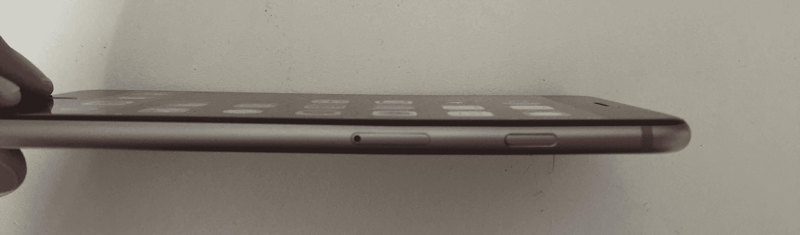

# iPhone 6 Plus 变弯了 

> 原文：<https://web.archive.org/web/http://techcrunch.com/2014/09/23/the-iphone-6-plus-gets-bent/?ncid=fb>

每年，苹果都会发布新的 iPhone。每年，我们都会经历一个非常相似的周期。首先是谣言和泄露，然后是工厂生产线的谍照，然后是公告！然后是评论，长队，预购数字，第一个周末的销售数字…这让我们今天。

欢迎来到我们活动的 ["-gate"](https://web.archive.org/web/20230129233344/https://techcrunch.com/2012/09/26/the-iphone-5s-camera-is-faulty-shows-a-purple-haze/) 部分，在数百万人刚刚购买了新的、可能有[缺陷的设备](https://web.archive.org/web/20230129233344/https://techcrunch.com/2010/07/18/the-iphone-4-antennagate-story-as-told-through-ridiculous-taiwanese-animation/)几天后，一些[关键缺陷](https://web.archive.org/web/20230129233344/https://techcrunch.com/2012/09/28/tim-cook-apologizes-for-apple-maps-points-to-competitive-alternatives/)被曝光。不幸的是，今年我们没有能够拿出一些全新的东西。

对于 iPhone 6，更尖锐的是，iPhone 6 Plus，[报告](https://web.archive.org/web/20230129233344/https://twitter.com/edbott/status/514430872464801792)表明，当手机放在口袋里，长时间放置时，会弯曲。

在 [MacRumors 论坛](https://web.archive.org/web/20230129233344/http://www.macrumors.com/2014/09/23/iphone-6-plus-bending-pockets/)上有许多照片，法国博客 [MacBidouille](https://web.archive.org/web/20230129233344/http://www.macbidouille.com/news/2014/09/23/attention-a-ne-pas-ranger-l-iphone-6-dans-votre-poche) 也贴出了一张弯曲 iPhone 的照片，还有[德国博客 Stadt Bremerhaven](https://web.archive.org/web/20230129233344/http://stadt-bremerhaven.de/iphone-6-plus-will-it-bend/) 。

他们在这里:

首先，让我们把事情搞清楚。

iPhone 6 和 6 Plus 并不是第一款屈服的苹果产品。我们在弯曲 iPhone 5 和后来的 5s 上看到了同样的歇斯底里。事实上， [iPod touch](https://web.archive.org/web/20230129233344/https://discussions.apple.com/thread/4725062?tstart=0) 也出现过[类似的问题](https://web.archive.org/web/20230129233344/https://www.google.com/search?q=ipod+touch+bending&es_sm=91&source=lnms&tbm=isch&sa=X&ei=vJchVNbPNIWfyASBt4LACw&ved=0CAkQ_AUoAg&biw=1555&bih=1148)。

并且[苹果并不是唯一一家](https://web.archive.org/web/20230129233344/http://forums.androidcentral.com/htc-one-m8/381873-bent-m8.html)。

虽然更薄、更大的 iPhone 6 和 6 Plus 在你的口袋里揉皱很长时间后可能会容易弯曲，但我们迄今为止看到的只是少数人的早期报告。

我们已经联系了苹果，看看他们是否有什么要说的，当我们知道更多的时候，我们会给你回复。