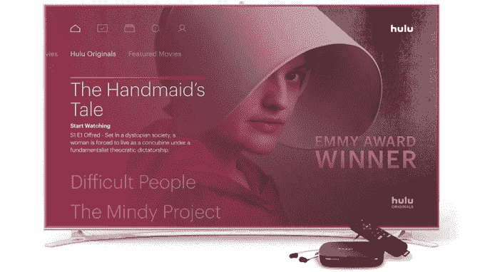

# 据科技博客 report  报道，YouTube TV 和 Hulu Live TV 现在拥有数十万用户

> 原文：<https://web.archive.org/web/https://techcrunch.com/2018/01/22/youtube-tv-and-hulu-live-tv-now-have-hundreds-of-thousands-of-subscribers-says-report/?ncid=mobilenavtrend>

据今天早上发布的美国消费者新闻与商业频道报道称，Hulu 和 YouTube 正在争夺各自直播电视流媒体服务的用户，Hulu Live 的付费用户已经增长到 45 万，YouTube TV 的付费用户刚刚超过 30 万。两家公司仍落后于竞争对手，其中包括 Dish 的 Sling TV，该公司拥有超过 200 万[估计](https://web.archive.org/web/20230307165224/https://www.fiercecable.com/cable/sling-tv-has-more-than-2m-subs-comscore-says)订户，以及 AT & T 的 DirecTV Now，[刚刚达到 100 万](https://web.archive.org/web/20230307165224/http://deadline.com/2017/12/directv-now-reaches-1-million-subscribers-1202220358/)。

当然，DirecTV 现在已经受益于美国电话电报公司的促销活动，这些活动允许客户以每月 10 美元的价格将流媒体电视服务添加到他们的移动计划中，以及提供免费 HBO 的活动。这给了它扩大基础的优势。

与此同时，Dish 的 Sling TV 比其他产品存在的时间更长——它早在 2015 年初就向用户开放了。

另一方面，YouTube TV 和 Hulu Live TV 都是流媒体电视市场的相对新来者。去年推出的两项服务——前者于 2017 年 4 月[推出](https://web.archive.org/web/20230307165224/https://techcrunch.com/2017/04/05/youtubes-35-live-tv-streaming-app-is-now-available-in-five-us-cities/)，后者于次月推出[。](https://web.archive.org/web/20230307165224/https://techcrunch.com/2017/05/03/hulu-with-live-tv/)

Hulu 在用户数量上领先于 YouTube，部分原因在于可用性。Hulu Live TV 在美国各地推出，但在敲定交易时，没有在所有城市推出四大网络——美国广播公司、哥伦比亚广播公司、福克斯和全国广播公司。

YouTube 采取了不同的方法。除非它能提供所有四个，或者在某些情况下，至少三个主要网络，否则它不会推广到一个城市。美国消费者新闻与商业频道指出，今天，80%的美国家庭都可以使用它。

它报道的用户数量来自美国消费者新闻与商业频道，但没有得到 Hulu 或 YouTube 的证实。

CBNC 的报告还淡化了流媒体电视的潜力，引用了 BTIG 分析师里奇·格林菲尔德对市场的悲观描述。格林菲尔德说，这些服务将很难大幅增加他们的客户群，因为它们很容易取消，而且他们仍然必须与视频点播的替代品竞争，如网飞。

也就是说，如果消息来源的数字是准确的，你会看到在不到一年的时间里，每个服务都接近 50 万大关。这不是一件可以完全忽略的事情——尤其是考虑到现在流媒体电视有这么多选择。除了美国消费者新闻与商业频道报告中提到的四家，还有 PlayStation Vue 新的、以娱乐为中心的菲洛；以及关注体育的富博电视。

此外，YouTube TV 的推出不仅没有完成，它甚至还没有在所有平台上推出它的应用程序。(例如，它的 Roku 应用程序仍在开发中。换句话说，考虑到 YouTube 电视对年轻用户群的吸引力，以及它计划在未来某个时候将类似于 YouTube 的社交元素整合到其电视应用中，现在低估 YouTube 电视的潜力还为时过早。

Hulu 也没有完全充实自己的用户体验。CES 2018 上的公司[描述了其计划](https://web.archive.org/web/20230307165224/https://techcrunch.com/2018/01/09/hulus-next-big-update-will-include-a-new-live-tv-guide-plus-personalization-improvements/)以更好地个性化其建议，让用户更多地控制各种设置，添加直播电视指南，并推出可定制的奥运会仪表盘等。明年，它计划增加社交功能，包括在你的朋友中强调电视趋势，让用户创建推荐列表并与朋友一起观看。

当这些产品计划在 YouTube 和 Hulu 上实现时，它们都将有一个更好的价值主张，而不仅仅是机顶盒电视。他们可以把看电视变成一种自己的社交体验，一种新的在线交流方式。反过来，如果流媒体电视观众发现新功能引人注目，这可能会刺激更多的用户增长。