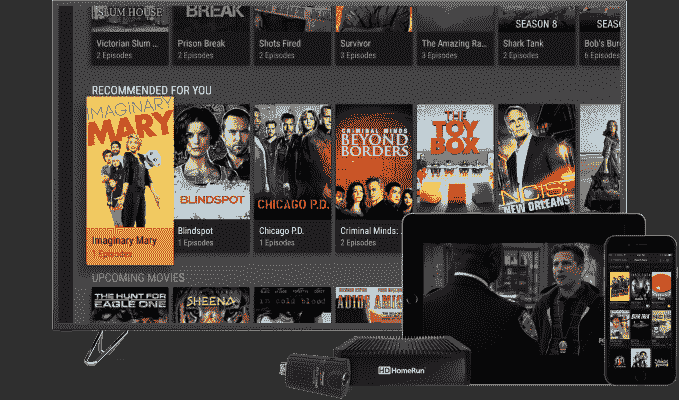

# Plex 的 DVR 现在可以让你跳过广告...为你移除它们

> 原文：<https://web.archive.org/web/https://techcrunch.com/2017/11/27/plexs-dvr-now-lets-you-skip-the-commercials-by-removing-them-for-you/?ncid=mobilerecirc_featured>

Plex 证实，它将推出一项新功能，允许脐带切割者跳过使用其软件录制的电视节目中的商业广告，使该公司的低成本流媒体直播电视解决方案更具吸引力。与其他商业广告跳过选项不同，Plex 的选项将自动删除录像中的商业广告。

该公司最初提供用于组织个人收藏的家庭媒体软件，最近开始为断线钳提供服务，通过连接的天线观看直播电视节目，并由 T2 录制这些节目。

它的直播电视服务在技术上与直播电视流媒体服务不同，因为它是从你家中的数字天线捕捉信号，而不是像 Sling TV 这样通过互联网播放节目。但它确实提供了一种简单的方式来观看来自空中广播网络的免费电视节目，如 ABC、NBC、Fox、CBS、PBS、CW 等。

现在 Plex Pass 的用户可以跳过广告了。

这项新功能的工作原理是在你录制的媒体中定位广告。然后，在媒体存储到您的媒体库中之前，它实际上*会删除*它们。这听起来甚至比 [TiVo 的商业跳过选项](https://web.archive.org/web/20230326062654/https://support.tivo.com/articles/Features_Use/SkipMode)更好，因为你不必按下按钮来跳过广告——它们会主动为你拉出。

然而，Plex 的功能可能不是完美的解决方案。正如博客 [Cord Cutter News 指出的](https://web.archive.org/web/20230326062654/http://www.cordcuttersnews.com/plexs-dvr-now-auto-removes-commercials-recordings/)(它是第一个发现该功能到来的)，根据 Plex 自己的文档，这个过程可能需要很长时间，并导致 CPU 使用率很高。

此外，该功能目前只对 Plex Pass 用户(即那些为 Plex 付费的用户)提供测试版。

首先，你需要确保你的[更新频道设置为“beta”](https://web.archive.org/web/20230326062654/https://support.plex.tv/hc/en-us/articles/201844613)以便试用。(该公司告诉 TechCrunch，你需要安装该软件的最新版本——版本 1.10.0.4516。)

“删除商业广告”选项将出现在直播电视和 DVR 的 Plex 服务器设置中。

我们还被告知，该选项适用于除 FreeBSD 和无法转码的设备之外的所有平台。

尽管还是相当新，Plex 的直播电视服务一直在稳步增长。该公司[今年 9 月为其软件](https://web.archive.org/web/20230326062654/https://techcrunch.com/2017/09/26/plex-adds-personalized-streaming-news-to-its-media-player-software/)添加了流媒体新闻服务，截至 2017 年 11 月，注册账户已增长至 1500 万。它没有说其中有多少是付费用户，但是这个数字已经从六月份的 1300 万增长了。