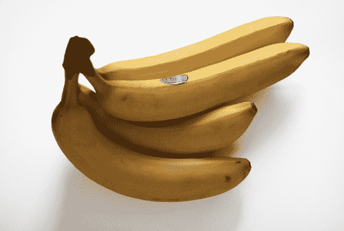
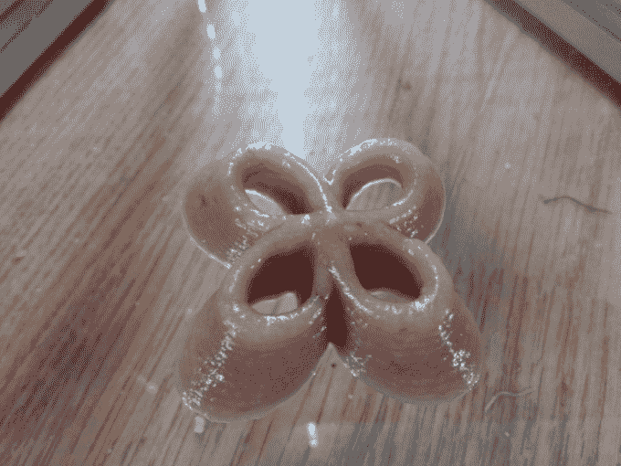

# 惊喜！香蕉不是很好的 3D 打印材料 

> 原文：<https://web.archive.org/web/https://techcrunch.com/2014/11/21/surprise-bananas-do-not-make-a-great-3d-printing-material/?ncid=rss&cps=gravity>

# 惊喜！香蕉不是很好的 3D 打印材料

这个打印是香蕉。

一个一个一个一个一个。

这个指纹是 BA-好吧，好吧，我完成了。

但实际上，你在下面看到的这种可怕的、肉肉的 3D 打印形状简直就是香蕉。香蕉泥，混合了一点马铃薯淀粉，用来把东西粘在一起。

作为最近在[3d digital cooks](https://web.archive.org/web/20221207160538/http://3digitalcooks.com/2014/11/printing-with-bananas/)(一个专注于 3d 打印食品的博客，比如巧克力，土豆，或者在这种情况下，香蕉)的家伙们的实验，它…仍然是一项正在进行的工作。从理论上来说，这相当不错，只是不太…你知道，令人胃口大开。PFT，细节。

下一步:想办法让它不会马上变成棕色。他们最好的猜测是使用某种抗坏血酸。(我们调查了人们是否会在乎他们的 3d 打印香蕉食品是棕色的，100%的受访者说“3D 打印香蕉食品是什么鬼东西？”我就当你同意了。)

之后的下一步:弄清楚你到底想用可食用的香蕉浆打印出什么。

出于好奇，这是用食物打印的样子——尽管在这种情况下是酸奶，而不是香蕉。

[https://web.archive.org/web/20221207160538if_/https://www.youtube.com/embed/5r0t-Qg7vVA?feature=oembed](https://web.archive.org/web/20221207160538if_/https://www.youtube.com/embed/5r0t-Qg7vVA?feature=oembed)

视频

[Via [Engadget](https://web.archive.org/web/20221207160538/http://www.engadget.com/2014/11/21/3d-print-mashed-bananas/?ncid=rss_truncated)