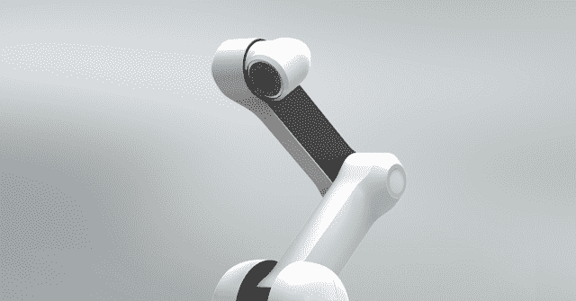
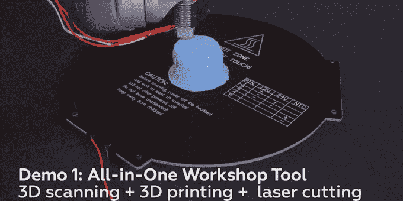
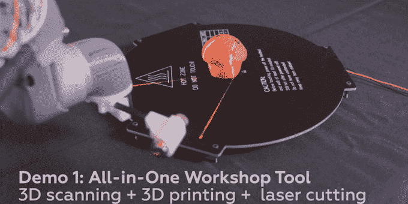
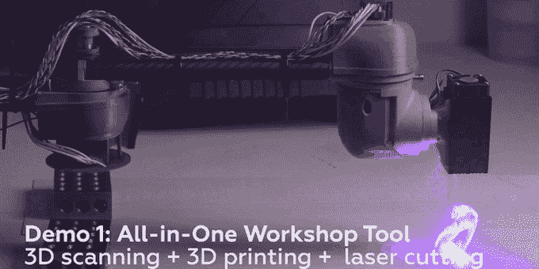
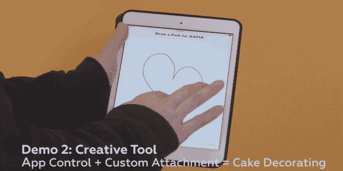

# 这个机械臂可以做从 3D 打印到激光切割到蛋糕装饰的任何事情

> 原文：<https://web.archive.org/web/http://techcrunch.com/2016/01/06/this-robotic-arm-can-do-everything-from-3d-printing-to-laser-cutting-to-cake-decorating/?ncid=rss&cps=gravity_1462_-8406906313433201705>

# 这个机械臂可以做从 3D 打印到激光切割到蛋糕装饰的一切事情

你知道吗，有双手真是太棒了。我们大多数人几乎每天都认为这是理所当然的。有了合适的工具，你的手可以做任何事情。

这是碳机器人公司 KATIA 背后的想法，这是一款今天在拉斯维加斯 TechCrunch 硬件战场上推出的产品。一个机械臂，无限可能。

KATIA——或者，正如它的创造者所熟知的,**K**ick**A**ss**T**rainable**I**intelligent**A**RM——是一个超级灵活和可编程的机械臂，它使用可交换的手来承担各种各样的任务。

想让它成为 3D 打印机？弹出 3D 打印模块。

3D 扫描仪？将打印头换成激光头。

激光切割机？它能做到。

蛋糕装饰师？为什么不呢？给它一些糖霜，一条路，然后开火。

不确定这一切是如何组合在一起的？这里有一个演示视频:

KATIA 的有效载荷能力为 1 公斤，允许它在半径约 1 米的范围内拾取、旋转和精确放置重达 2.2 磅的任何东西。

别担心:他们不只是把 Arduino 放在底座上，然后给它接上几个伺服系统。在它成为高通的机器人加速器后，他们配备了骁龙 600 芯片组和所有与之配套的功能:1.9Ghz 四核 CPU、WiFi/蓝牙等。理论上，你可以给这个东西添加多个高清摄像头，给它一个视觉系统(该公司实际上希望及时做到这一点)，芯片组可以轻松地实时浏览这些镜头。

但是为什么要给一个机器人手臂？因为它可以让它做所有需要的数字运算来做各种奇妙的事情，比如训练手臂通过触摸来执行任务。需要手臂反复拿起和移动一个物体？移动手臂，教它所说的物体在哪里，它们需要在哪里，它能够学习这些动作，并高度精确地复制它们。

虽然他们开始关注消费者和 DIY 市场，但 Carbon Robotics 的首席执行官罗莎娜·迈尔斯(Rosanna Myers)表示，他们已经看到来自航空、生物、制造和其他行业的巨大兴趣。

Carbon 计划以 1999 美元的价格直接向消费者出售 KATIA 基本单元[，并在未来购买可选的附加组件(如前面提到的激光/3d 打印模块)。](https://web.archive.org/web/20230323204550/http://www.carbon.ai/)

