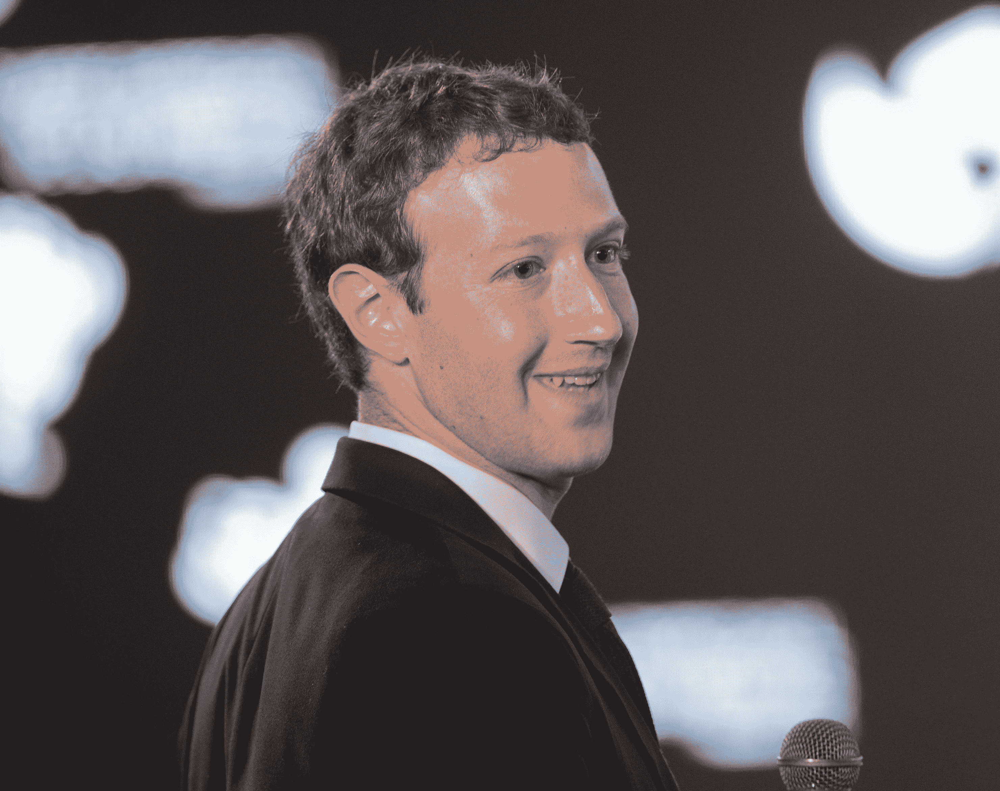

# 扎克伯格和盖茨联手对 2016 年清洁能源真正意味着什么 

> 原文：<https://web.archive.org/web/https://techcrunch.com/2016/01/06/what-zuckerberg-and-gates-teaming-up-really-means-for-clean-energy-in-2016/?ncid=rss&cps=gravity_1730_4077050654980257704>

约翰·兰普顿是在线发票公司的创始人

[Due](https://web.archive.org/web/20221006140317/https://due.com/)

.

More posts by this contributor

马克·扎克伯格和比尔·盖茨在 2010 年首次合作拍摄《连线》 封面，该封面重温了史蒂文·利维的《T4 黑客:计算机革命的英雄》25 周年纪念日。

在采访中，盖茨表示，黑客精神有更多新的机会继续存在。“他们需要推动个人电脑行业的那种对年轻天才和幼稚无知的疯狂狂热，并能对人类状况产生同样的影响。”

自那篇封面故事以来，扎克伯格和盖茨发扬黑客精神，申请成为世界上最慷慨和最知名的慈善家。

扎克伯格向新泽西州纽瓦克的学校捐赠了 1 亿美元；开源项目 [Diaspora](https://web.archive.org/web/20221006140317/http://diasporaproject.org/) 的未披露金额；是参与创建生命科学突破奖的个人之一；此外，通过硅谷社区基金会，向医疗保健行业捐赠了数百万美元，如向旧金山总医院捐赠了 7500 万美元。

至于盖茨，他早就离开了微软，去领导比尔·梅林达·盖茨基金会。他已经捐出了超过 280 亿美元的个人财产，用于预防和治疗疟疾等疾病；引进能够帮助发展中国家农民种植可持续作物的技术；并支持美国能够挖掘学生潜力的教育项目。

最引人注目的是，比尔·盖茨和马克·扎克伯格是“捐赠誓言”项目的两位成员，该项目由盖茨和沃伦·巴菲特发起，亿万富翁将捐出至少一半的财富。大约有 138 位亿万富翁签署了誓言，其中包括拉里·埃里森、埃隆·马斯克、特德·特纳和迈克尔·彭博。原始签名人扎克伯格最近加大了赌注，宣布他将放弃 99%的脸书股票，价值 450 亿美元。

但是，扎克伯格和盖茨在他们慈善生涯中最雄心勃勃的项目中再次合作。

## 宣布突破能源联盟

宣布“突破性能源联盟”的时机是恰当的。这发生在巴黎 COP21 气候变化大会的前夕。在与妻子普莉希拉和盖茨宣布联盟的一份[脸书邮报](https://web.archive.org/web/20221006140317/https://www.facebook.com/photo.php?fbid=10102500936699601&set=a.529237706231.2034669.4&type=3&theater)中，扎克伯格声明:

> “解决清洁能源问题是建设更美好世界的重要组成部分。没有安全的能源和稳定的气候，我们将无法在其他挑战上取得有意义的进展，如教育或连接世界。然而，可持续能源系统的进展太慢，而且当前的系统不鼓励那种能让我们更快实现目标的创新。”

他还补充说，“突破能源联盟将投资于有可能改变我们所有人生产和消费能源的方式的想法。”

在宣布联盟的同时，盖茨加入了 20 个国家领导人的 [*任务创新*](https://web.archive.org/web/20221006140317/http://mission-innovation.net/) ，根据其网站，“旨在重振和加速全球清洁能源创新，目标是让清洁能源广泛负担得起。”

参与国计划将每年的研究支出提高到 200 亿美元。在私营部门，盖茨和扎克伯格是 28 位富有投资者之一，其中还包括理查德·布兰森、杰夫·贝索斯和马云，“[将为最有前途的技术的早期高风险研究提供资金。”](https://web.archive.org/web/20221006140317/https://www.washingtonpost.com/national/health-science/obama-bill-gates-to-lead-major-effort-to-spur-spending-on-climate-research/2015/11/29/80b157ca-96e7-11e5-94f0-9eeaff906ef3_story.html)

 美联社图片/Pablo Martinez Monsivais

## 这对 2016 年的清洁能源意味着什么？

我们[应该问](https://web.archive.org/web/20221006140317/http://www.johnrampton.com/global-business-leaders-unite-to-tackle-the-development-of-clean-reliable-and-accessible-energy-for-all/)的最大问题是突破性能源联盟是否会影响清洁能源的未来。

### **满足对清洁能源的需求**

总部位于巴黎的国际能源机构进行了一项研究，发现“尽管最近有一些成功的故事，但清洁能源的进展远未达到将全球气温上升限制在不超过 2 摄氏度所需的水平。”此外，国际能源机构声称，“仅通过预计将于今年 12 月在巴黎达成协议的联合国谈判进程，世界将难以实现其气候目标。”正因为如此，国际能源机构建议，迫切需要开发和部署“突破性技术”来应对气候变化。

盖茨和扎克伯格也意识到了这一点。

在 2015 年 7 月的一篇[博客文章](https://web.archive.org/web/20221006140317/http://www.gatesnotes.com/Energy/Energy-Innovation)中，盖茨宣布他计划“在未来五年内向清洁能源技术投资 10 亿美元”至于扎克伯格，他指出，脸书已经在公司的设施中投资可再生和清洁能源。

突破能源联盟正在通过将私营和公共部门结合起来，继续解决对清洁能源的需求，这比盖茨和扎克伯格已经采取的措施产生了更大的影响。

鉴于最近在 [COP21](https://web.archive.org/web/20221006140317/http://www.cop21paris.org/) 上宣布的“历史性”协议，共有 195 个国家同意在本世纪末将全球变暖限制在 2 摄氏度以下，趁热打铁并继续推动积极参与清洁能源解决方案的研发是有意义的。

正如联合国秘书长潘基文所言，“是时候承认按照国际利益行事最符合国家利益了。我们必须按照科学的指示去做。我们必须保护支撑我们的地球。我们需要大家齐心协力。”

**联盟将吸引投资者**

就像“给予承诺”一样，突破能源联盟将能够吸引世界上最富有的企业家和投资者。虽然部分原因可能是由于竞争或社会意识，但事实是，该联盟正在使清洁能源成为私营部门的一个有利可图的机会。

正如在其网站上提到的，“这些投资者肯定会被长期获得高额回报的可能性所激励。”

盖茨和扎克伯格都意识到投资清洁能源对商业有益。正如盖茨在他 7 月份的博客文章中所说，“在所有将受到气候变化影响的人中，那些生活在贫穷国家的人将受害最深。”他补充说，“负担得起的清洁能源将有助于消除贫困。”

在最近的印度之行中，扎克伯格强调了将印度的每个人都连接到网上的重要性。原因？印度可能成为脸书最大的市场。通过在印度提供广泛的互联网接入，新的商业机会，如在能源领域，可以使数十亿人摆脱贫困。

微软和脸书的创始人知道清洁能源对商业的重要性。如果清洁能源有能力带来新的就业机会和减少贫困，那么投资者为什么不跟随呢？亚马逊、维珍和阿里巴巴似乎也意识到了这一点，这就是为什么它们已经是 BEC 的一部分。

正如[美国能源部长欧内斯特·莫尼斯](https://web.archive.org/web/20221006140317/http://www.bostonglobe.com/opinion/2015/11/30/government-private-sector-need-invest-clean-energy/nSjYWGp3iuxcrhNaegguvN/story.html)所认为的，“新能源供应、需求和基础设施技术将产生万亿美元规模的支出。早期创新者肯定会受益。”

### **该联盟将把私营和公共部门联合起来进行研发**

莫尼斯还指出，公共和私营部门都已经认识到研究和开发清洁能源的重要性。这正是 BEC 的目标。

BEC 在其网站上表示，“目前政府对清洁能源的资助水平根本不足以应对我们面临的挑战。”该网站继续说:

> “我们还必须增加有经验的领先投资者的技能和资源，推动创新从实验室走向市场。私营部门知道如何建立公司，评估成功的潜力，并承担风险，从而带来创新的想法并将其推向世界。”

研发卓有成效。Joe Romm 在为 ThinkProgress 撰写的一篇文章中自豪地宣称，自 90 年代中期以来,“清洁能源研发的成功超出了大多数人的想象——自 1999 年以来太阳能光伏成本下降了 99%以上，自 90 年代末以来下降了 95%！”

罗姆接着谈到 BEC 时说，“尽管 R&D 清洁技术基金的增加总是受欢迎的，但现在最需要的是资金，用于加速部署和项目融资现在已经可以投入市场的技术。”

无论目前的情况是否如此，将私营和公共部门结合在一起可能会导致为市场成熟的清洁能源技术提供资金。

其他努力也说明了商业世界和投资者社区在解决清洁技术解决方案方面发挥更大作用的转变，而不是以前把它留在科学家和政府手中。例如，看到像最近的[清洁技术公开赛](https://web.archive.org/web/20221006140317/http://www.cleantechopen.org/)这样的年度比赛是令人兴奋和鼓舞的，这是早期清洁技术公司的最大加速器。最近，它宣布了国家加速器、全球创意竞赛和全球清洁技术创新计划(GCIP)的[获奖者，所有这些都旨在鼓励研发努力，同时支持企业家专注于启动清洁技术创业公司。到目前为止，在过去十年中，清洁技术开放已经帮助企业筹集了超过 12 亿美元的外部资金。](https://web.archive.org/web/20221006140317/http://finance.yahoo.com/news/cleantech-open-announces-winners-2015-150000441.html;_ylt=AwrXnCE.IW9WhG0AWVTQtDMD;_ylu=X3oDMTByb2lvbXVuBGNvbG8DZ3ExBHBvcwMxBHZ0aWQDBHNlYwNzcg--)

让比尔·盖茨和马克·扎克伯格这样的人带头肯定会有所帮助，但我们需要意识到，每个人都可以在赢得气候变化战争中发挥作用。无论是 195 个国家达成协议，更多的竞争和投资者资助清洁技术创业公司，还是高盛和其他[投资公司支持低排放股票](https://web.archive.org/web/20221006140317/http://news.yahoo.com/goldman-backs-low-emissions-stocks-climate-talks-start-152059796--sector.html;_ylt=AwrXgSJuI29WVhQAmELQtDMD;_ylu=X3oDMTBya2cwZmh2BGNvbG8DZ3ExBHBvcwM1BHZ0aWQDBHNlYwNzcg--)，这里的要点是，正在采取联合行动，并将需要继续下去，直到我们达到我们的排放目标。