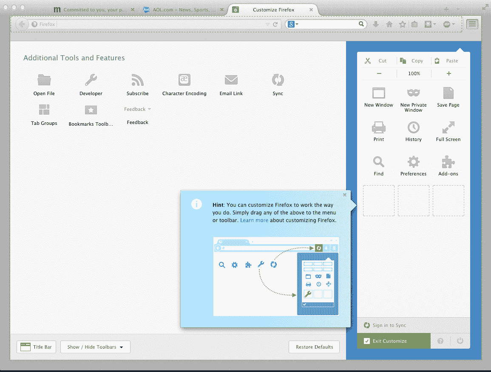
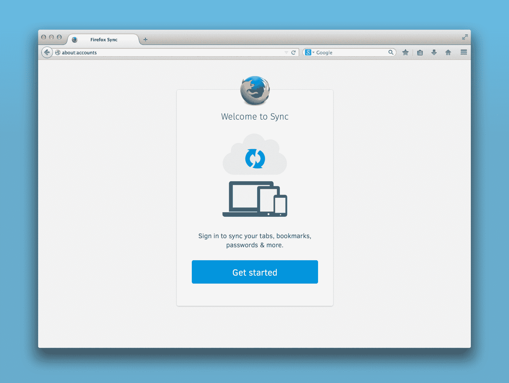

# Firefox 29 发布，进行了重大重新设计，Firefox 帐户集成 

> 原文：<https://web.archive.org/web/http://techcrunch.com/2014/04/29/firefox-29-launches-with-major-redesign-firefox-account-integration/?ncid=rss&source=gravity&cps=gravity>

Mozilla 今天发布了很长一段时间以来最重要的 Firefox 版本。经过近两年的工作，其澳大利亚重新设计，该公司现在终于准备好把它纳入其稳定的发布渠道。

第一次加载后，您可能会有点困惑。这是 Firefox 自几年前开始快速发布以来最彻底的重新设计。新版本看起来比旧版本更像 Chrome。例如，它在右边有同样的三栏菜单和圆形标签。不过，与此同时，它保留了独立的搜索表单——这是大多数其他浏览器现在已经放弃的。

“重新设计的目的是让设计适应现代用户参与网络的方式，”Mozilla 火狐[副总裁张克帆·南丁格尔](https://web.archive.org/web/20230129222254/https://blog.mozilla.org/press/bios/johnathan-nightingale/)本月早些时候告诉我。自从一年前首次公开介绍关于[的 Australis 重新设计以来，该团队总共修复了 1300 个用户界面和错误。](https://web.archive.org/web/20230129222254/https://techcrunch.com/2013/06/01/mozilla-readies-major-firefox-redesign-as-it-ponders-what-the-browser-of-the-future-should-look-like/)

[https://web.archive.org/web/20230129222254if_/https://www.youtube.com/embed/bEw7VdZ_CZw?feature=oembed](https://web.archive.org/web/20230129222254if_/https://www.youtube.com/embed/bEw7VdZ_CZw?feature=oembed)

视频

用户可能会注意到 Chrome 的用户界面相似性，其中一些反应可能并不完全积极，但 Nightingale 似乎并不太担心这一点。“谷歌没有发明简单性，”他告诉我。“我们以不同的方式做很多事情。”

这次重新设计触及了浏览器的更多方面，而不仅仅是用户界面，旨在让人们能够完全定制他们的浏览体验。“在核心内容之外，每个人使用浏览器的方式都不一样，”他指出。比如有些人，从来不用后退键(这看起来很奇怪，但也许他们用的是键盘快捷键)。

这个版本的一个主要方面是使浏览器更加可定制。Firefox 总是具有广泛的定制选项，但这些选项总是有些隐藏，尤其是对于主流用户来说，他们可能并不总是钻研浏览器的高级菜单。

经过这次重新设计,“定制”按钮现在总是出现在新的火狐菜单中。点击该按钮后，浏览器切换到定制模式，然后你可以在几乎所有 Firefox 的用户界面元素之间移动，并根据它们如何工作来组织浏览器。自定义现在就像将元素拖放到您想要的任何地方一样简单。

其他旨在让浏览器适应各种类型用户的变化包括，Firefox 现在完全不强调未选中的标签。它们基本上消失在背景中，这使得我们这些有很多打开的标签页(也许还有很多应用程序标签页)的人可以专注于我们正在看的那些。

除了这些变化之外，Firefox 现在还具有一个改进的书签机制，当你给一个页面加星号时，它使用一个几乎不像 Firefox 的动画(星号然后落入书签列表按钮，告诉你在哪里可以再次找到它)。

作为此次更新的一部分，Firefox 现在也使用 Mozilla 的 Firefox 帐户在机器之间同步设置和书签。新系统依赖于 Mozilla 的在线服务，而不是其相当神秘的旧同步系统，该系统大多避免使用任何云服务来存储你的信息。南丁格尔告诉我，以前，许多用户甚至不知道 Firefox 有内置同步功能，而那些知道的用户通常不会使用它，因为它不太容易使用。新的 Firefox 账户使用通常的电子邮件和密码组合，而不是随机代码。

Nightingale 告诉我，团队已经在考虑如何在应用程序的其他部分使用 Firefox 帐户。很明显，新账户已经深入整合到了火狐操作系统中，今天也将有[火狐安卓系统](https://web.archive.org/web/20230129222254/https://play.google.com/store/apps/details?id=org.mozilla.firefox&utm_source=mozilla&utm_medium=Referral&utm_campaign=mozilla-org) [。](https://web.archive.org/web/20230129222254/https://www.mozilla.org/en-US/mobile/29.0beta/releasenotes/)

鉴于其快速的发布周期，为什么 Mozilla 花了这么长时间才发布重新设计？毕竟，它已经以这样或那样的形式流传了两年了。Nightingale 强调，许多早期的设计是硬编码的，为了使定制功能发挥作用，团队不得不重写界面的大部分内容，使其更加灵活。它也必须测试这一点，最后，它希望确保 Firefox 用户今天将看到的新用户之旅运行良好。

显然，Mozilla 正在经历一段有趣的历史时期。它正试图快速进入移动领域，今天的发布是其最重要的发布之一。与此同时，它试图做的许多事情最近都被围绕布兰登·艾希短暂的首席执行官任期的讨论所掩盖。今天的发布可能会再次把焦点放回到 Mozilla 的主要任务和产品上，但这也可能是一个有点争议的发布。