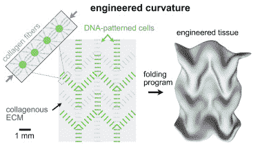

# 对活体组织进行编程以形成新的 3D 形状非常容易 

> 原文：<https://web.archive.org/web/https://techcrunch.com/2017/12/28/its-surprisingly-easy-to-program-living-tissue-to-form-new-3d-shapes/?ncid=rss&sr_share=facebook>

# 对活体组织进行编程以形成新的 3D 形状非常容易

随着研究人员发现生物学和技术之间越来越多的相似之处，二者之间的界限越来越模糊。今天，他们发现，通过将模式编程到细胞中，使细胞生长并自行折叠成碗、线圈和盒子等形状，从本质上破解活组织是相对简单的。

你可以在上面的图片中看到一些结果:例如，注意右下角的物体是如何自然地将自己折叠成一个立方体。

从活细胞中制造生物兼容机器是一个追求多年的想法，但通常组织形成形状的方式是通过模具限制其生长，或者通过一点一点地放下组织来进行基本的 3D 打印。

这种技术是不同的，允许细胞或多或少地正常生长，但使用一种叫做 [DNA 编程细胞组装(DPAC)](https://web.archive.org/web/20230129073957/https://www.ncbi.nlm.nih.gov/pmc/articles/PMC5183975/) 的技术来指导生长。细胞本身正常发育——编程的 DNA 不在细胞本身中，而是以一种模板的形式存在，导致它们以不同的方式组织。

论文中的一个图表显示了在发育之前形成的模式是如何产生可预测的折叠结构的。

DNA 模式导致组织层生长，以研究人员选择的任何方式自然弯曲和折叠。

“这个想法的效果如此之好，细胞的行为如此简单，这让我感到惊讶，”该论文的作者之一 Zev Gartner 在伴随论文的新闻稿中说。“发展开始成为工程的画布，通过将发展的复杂性分解为更简单的工程原理，科学家开始更好地理解并最终控制基础生物学。”

事实证明，顺应自然比违背自然更好；通过哄骗细胞做它们自然做的事情，结果不仅更容易预测，而且更容易实现。这项技术最终可能被用于制造医学中的生物机器和结构。

该小组位于加州大学旧金山分校，他们的论文发表在今天的《发育细胞》杂志上[。](https://web.archive.org/web/20230129073957/http://www.sciencedirect.com/science/article/pii/S1534580717309899)