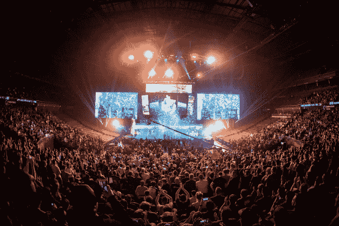

# 脸书与 Twitch 签订新的电子竞技直播协议 

> 原文：<https://web.archive.org/web/https://techcrunch.com/2017/05/19/facebook-takes-on-twitch-with-new-livestreaming-deal-for-esports/?ncid=rss&utm_campaign=Luis%2BAbreu%2BNewsletter&utm_medium=web&utm_source=Luis_Abreu_Newsletter_5>

除了脸书[宣布与 MLB](https://web.archive.org/web/20221206202339/https://beta.techcrunch.com/2017/05/18/facebook-and-mlb-partner-to-bring-live-streamed-games-to-the-social-network/)建立新的合作伙伴关系，以直播一些常规赛，这家社交网络本周还与全球电子竞技公司 ESL 签署了一项协议，将超过 5550 小时的电子竞技赛事和其他原创内容带到脸书，包括 1500 小时的原创节目。

此举将有助于脸书挑战亚马逊旗下的 Twitch 和 Twitter，这两家公司都有电子竞技协议，作为他们在直播领域努力的一部分。

例如，Twitter 在 3 月份[宣布](https://web.archive.org/web/20221206202339/https://beta.techcrunch.com/2017/03/02/twitter-will-live-stream-1500-hours-of-esports-including-original-content/)与 ESL 和 DreamHack 合作，将 ESL One、英特尔极限大师赛和 DreamHack circuits 的超过 15 场比赛带到 Twitter，在那里，这些比赛将直接通过 Twitter 应用程序在网络和移动设备上进行直播。

与此同时，视频游戏流媒体网站 Twitch 今天仍然是电子竞技内容的事实上的家。去年六月，[的一份报告](https://web.archive.org/web/20221206202339/https://venturebeat.com/2016/06/10/twitchs-100-million-viewers-watched-800-million-hours-of-esports-in-the-last-10-months/)指出，超过 1 亿 Twitch 用户在过去的十个月里通过这项服务观看了 8 亿小时的电子竞技，赛事和联赛组织者收集了这些观看的最大份额——占所有电子竞技观众的 71.3%。

脸书的交易将于下个月开始，首先是来自《反恐精英:全球进攻社区》的内容。除此之外，还有一个 30 分钟的独家 CS:GO 每周秀，将展示顶级玩家、即将到来的天才和其他比赛亮点。

所有 ESL One 和英特尔至尊大师赛也将通过 ESL 的脸书网络以六种语言播放，包括英语、法语、西班牙语、葡萄牙语、波兰语和德语。

最近几天，该公司还采取了其他更多措施来吸引直播流媒体。它在用户配置文件中添加了对桌面流媒体的支持，使游戏玩家更容易地传输他们的游戏，并宣布了与电子竞技团队 Team Dignitas 和 Echo Fox 的其他内容合作伙伴关系。

对于 ESL 这样的电子竞技公司来说，在脸书上直播的机会意味着他们将有机会接触到更广泛的观众——也许包括更多主流观众，他们不会经常光顾 Twitch 这样以视频游戏为主的目的地。

然而，这些交易并不排除 ESL 也向 Twitch、Twitter 或 YouTube 等竞争网络提供流媒体服务。

ESL 社交媒体和编辑副总裁 Johannes Schiefer 在一份声明中重申了这一点，他说:“脸书每月活跃用户超过 19.4 亿，这是向主流观众扩大电子竞技覆盖面迈出的一大步。”“去年，ESL 内容在脸书上产生了超过 20 亿次展示，全球用户超过 2 亿。现在，随着所有主要的ESL活动的直播，以及围绕 CS:G*O*和 ESEA 的独家内容的增加，我们很高兴能够扩大我们的受众范围，建立强大的高度参与的电子竞技粉丝当地社区，”他补充道。

ESEA 是 ESL 面向业余、半职业和职业 CS:GO 玩家的订阅平台。它的 Rank S 比赛汇集了 300 多名北美和欧洲最优秀的 ESEA 玩家，他们每月在两个地区争夺 40，000 美元的奖金池。

ESL 也可能将脸书视为在电子竞技观众不主动寻找游戏内容时重新吸引他们的一种方式，这要归功于脸书通过推送通知提醒用户新的直播流的能力，以及当他们更被动地浏览网络时的其他提醒。

脸书[最近也调整了手机上的视频设置](https://web.archive.org/web/20221206202339/https://newsroom.fb.com/news/2017/02/new-ways-to-watch-facebook-video/),在播放视频时自动播放声音——这一变化可能会增加像这样的直播、专业制作的视频内容的收视率，并为更多的广告可能性打开大门

电子竞技是一项快速增长的业务和收入来源——[2016 年，全球收入达到 4.93 亿美元](https://web.archive.org/web/20221206202339/https://dotesports.com/business/esports-market-report-2017-4627)，预计今年将增长 41.3%。到 2020 年，预计将达到 14.88 亿美元。

这些内容将于 2017 年 6 月开始在 [ESEA 脸书页面](https://web.archive.org/web/20221206202339/http://facebook.com/ESEA)及其官方脸书群组[上播放。](https://web.archive.org/web/20221206202339/http://facebook.com/groups/ESEAofficial)