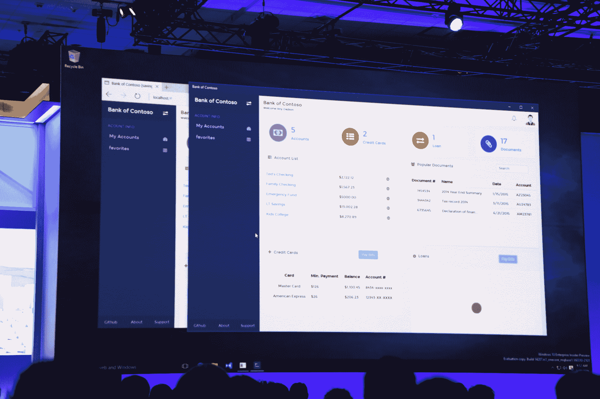

# 微软将 Bash shell 引入 Windows 10 

> 原文：<https://web.archive.org/web/https://techcrunch.com/2016/03/30/be-very-afraid-hell-has-frozen-over-bash-is-coming-to-windows-10/?ncid=rss&utm_content=buffer7926a&utm_medium=social&utm_source=twitter.com&utm_campaign=buffer>

# 微软将 Bash shell 引入 Windows 10

这里有一个来自微软 Build 的公告，你可能没有看到:微软今天宣布将 GNU 项目的 Bash shell 引入 Windows。Bash(又叫 Bourne SHell)长期以来一直是 OS X 和许多 Linux 发行系统的标准，而 Windows 上开发人员的默认终端是微软自己的 [PowerShell](https://web.archive.org/web/20221209061621/https://msdn.microsoft.com/powershell) 。

比把外壳带到 Windows 上更重要的是，开发人员现在可以编写他们的。sh Bash 脚本(或者使用 Emacs 来编辑它们的代码)。微软指出，这将通过微软与 Canonical 合作的 Windows 10 中新的 Linux 子系统来实现。

Canonical 创始人马克·舒托沃尔斯在今天的一份声明中表示:“在 Windows 上提供完整的 Ubuntu 环境，无需虚拟化或仿真，这是一个挑战传统的里程碑，也是通往令人着迷的陌生领域的大门。”。“在我们将自由软件带给尽可能多的受众的旅程中，这不是我们能够预测的时刻。然而，我们很高兴支持 Ubuntu for Windows，致力于解决 Windows 开发人员以这种令人惊叹的新方式探索 Linux 的需求，并对这一意想不到的事态发展所预示的可能性感到兴奋。”

这里的想法显然是将 Windows 定位为一个更好的操作系统，供那些希望开发除微软平台之外的其他平台的开发者使用。在新任首席执行官塞特亚·纳德拉的领导下，该公司迅速接受了这一想法，即它希望针对所有的开发者和平台——而不仅仅是自己的。虽然仅仅在几年前，看到微软与 Linux 等竞争对手的操作系统有任何联系都是不可思议的，但该公司现在在 Azure 上提供对 Linux 的支持，开源了许多技术，甚至计划在不久的将来将旗舰数据库产品 SQL Server 引入 Linux。

Bash 将在今年夏天作为 Windows 10 周年更新的一部分到来，但它将在此之前提供给 Windows 内部人员。展望未来，微软表示，随着时间的推移，它也可能会给 Windows 带来其他外壳。

