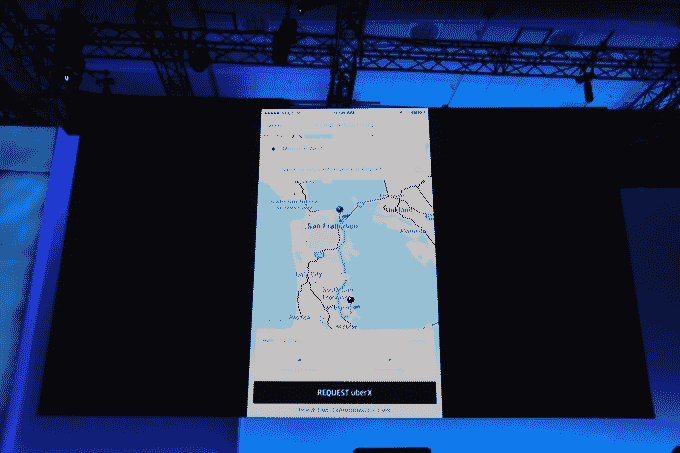
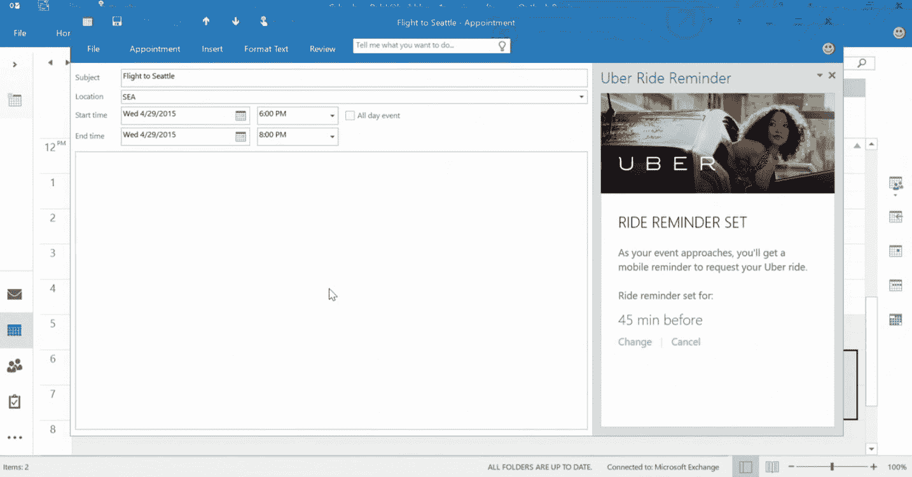

# 微软向第三方插件开放 Outlook.com 

> 原文：<https://web.archive.org/web/https://techcrunch.com/2015/04/29/microsoft-opens-outlook-com-to-third-party-add-ins/?ncid=rss&utm_content=bufferc1594&utm_medium=social&utm_source=twitter.com&utm_campaign=buffer>

# 微软向第三方插件开放 Outlook.com

Outlook.com，微软基于网络的电子邮件和日历客户端，现在向想要在它的基础上开发工具的第三方开发者开放。使用 Outlook API 的[，开发者可以为 Outlook.com 构建微软所说的“情境体验”。这显然是微软](https://web.archive.org/web/20221209060634/https://dev.outlook.com/)[整体努力](https://web.archive.org/web/20221209060634/https://beta.techcrunch.com/2015/04/29/microsofts-new-add-in-frameworks-let-developers-access-offices-data-graph/)的一部分，让用户在其生产力应用程序中创建的数据在这些工具之外可用。

鉴于 Outlook.com 是一个网络应用，开发人员将使用 HTML、CSS 和 JavaScript 来构建他们的插件就不足为奇了。因为这些加载项使用与桌面版 Outlook 的扩展相同的 API，所以 Outlook.com 的加载项也可以在桌面版和 Office 365 的 Outlook web app 中工作(这不同于更面向消费者的 Outlook.com，因为对所有不同版本的 Outlook 永远不会有足够的混淆)。

不过，看起来微软打算采取一种故意缓慢的方式将这些插件带给用户。今年夏天，优步和电子邮件调度工具 Boomerang 将推出他们的插件。有了这个，你就可以从 Outlook 日历中安排行程，而 Boomerang 将把它的智能日历助手和电子邮件提醒带到 Outlook.com。

随着时间的推移，微软也将向更多的开发者开放这项功能，但目前还不清楚它计划何时这样做。

