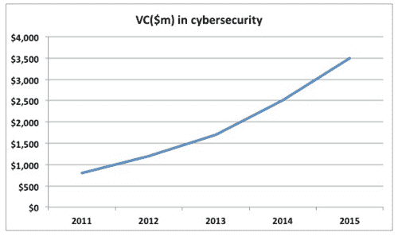
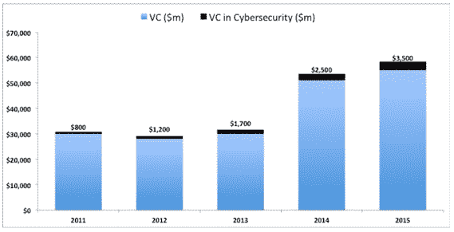
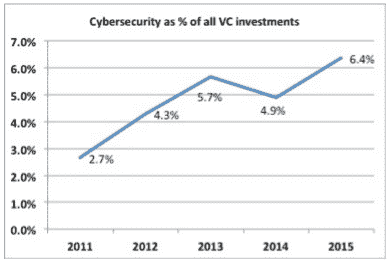
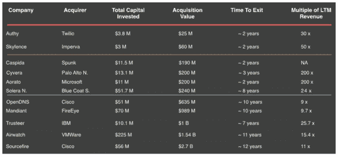
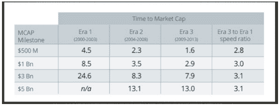
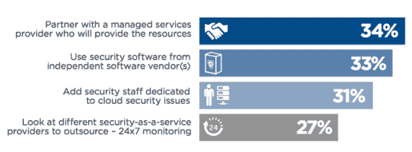
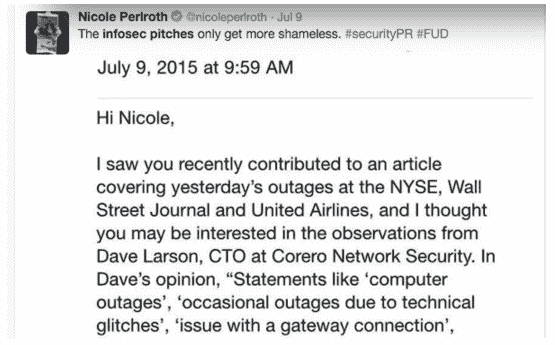
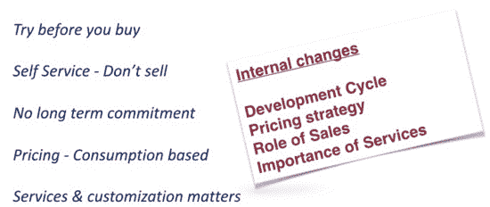
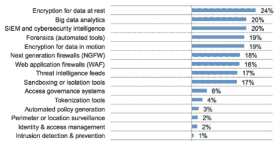

# 蟑螂对独角兽:网络安全初创公司的黄金时代 

> 原文：<https://web.archive.org/web/https://techcrunch.com/2016/01/06/cockroaches-vs-unicorns-the-golden-age-of-cybersecurity-startups/?ncid=rss&utm_content=buffere8bb6&utm_medium=social&utm_source=twitter.com&utm_campaign=buffer>

摩哂陀·拉姆辛哈尼撰稿人

[Mahendra Ramsinghani](https://web.archive.org/web/20221209060242/https://www.linkedin.com/in/mahendraram)

是的创始人

[Secure Octane Investments](www.secureoctane.com)

，投资云基础设施和安全初创公司。不投资的时候，他就忙着写博客，写书。他的第三本书《坚韧的创始人》将于 2022 年出版。

More posts by this contributor

根据 Gartner 的数据，2015 年全球信息安全 [支出达到 769 亿美元](https://web.archive.org/web/20221209060242/http://www.securityweek.com/global-cybersecurity-spending-reach-769-billion-2015-gartner) 。随着黑客攻击的频率和强度不断恶化，安全支出预计到 2020 年将达到 1700 亿美元。这是五年内超过 100%的增长。

风险资本(VC)对网络安全初创公司的投资继续稳步增长(过去 5 年每年约 40%)；2015 年可能达到历史最高水平，预计将达到 35 亿美元。

来源:CB Insights

然而，当我们看网络安全占所有风险投资的百分比时，情况有些令人担忧。网络安全不到所有风险投资的 7%。尽管受到黑客攻击和媒体关注，安全部门是否资金不足？

资料来源:NVCA，CB Insights

资料来源:NVCA，CB Insights

## 保守派风投的观点

这都是关于出口和回报。独角兽在安全领域是罕见的。安全出口往往分为三个不同的级别:约 5000 万美元、约 2 亿美元和 5 亿多美元。与其他垂直行业相比，资本消耗非常高效，但退出时间要长得多。

网络安全退出范围。来源:作者分析。来自 CrunchBase 的数据

双重认证公司 Authy(2FA)融资 380 万美元 [被 Twilio 收购。](https://web.archive.org/web/20221209060242/https://beta.techcrunch.com/2015/02/24/twilio-acquires-two-factor-authentication-service-authy/) 另一家 2FA 公司， [Toopher，在融资不到 300 万美元后，于 2015 年 4 月被 Salesforce 收购](https://web.archive.org/web/20221209060242/https://beta.techcrunch.com/2015/04/01/toopher-salesforce/) 。背靠 Accel 的 Aorato 被 [微软以 2 亿美元收购。](https://web.archive.org/web/20221209060242/https://beta.techcrunch.com/2014/11/13/microsoft-buys-israeli-hybrid-cloud-security-startup-aorato-in-200m-deal/) 该公司消耗了不到 1500 万美元。较小的退出发生在 3 年左右。

第三个退出区间出现在 5 亿美元以上。OpenDNS 于 2015 年被思科以 6.35 亿美元收购。据消息人士透露，它的 ARR 达到了 6000 多万美元，但从推出到现在花了 10 多年的时间。Lancope 也在 2015 年被思科以 4.35 亿美元收购，用了 14 年才退出。像 fire eye(2014 年首次公开募股)或 Palo Alto Networks(2012 年首次公开募股)这样的偶然 IPO 可以创造一股肾上腺素热潮……但这些都是例外。

> 令人困惑的是，为什么企业网络安全预算停留在陈旧的逻辑中。

很多安全创业公司不是独角兽；相反，他们是蟑螂——他们很少死亡，在艰难时期，他们可以切换到节俭/咨询模式。像蟑螂一样，它们可以熬过漫长的核冬天。安全公司可以节省资本，通常要花费大约 4000 万美元才能达到收支平衡。这给了他们生存的优势——但是风投们正在寻找“成长的优势”

安保公司的增长速度较慢。FireEye(市值 65 亿美元)从创业到上市花了 10 多年时间。帕洛阿尔托网络公司(市值:116 亿美元)到达那里的速度稍快——用了 7 年时间。谈到增长速度和快速价值创造，安全领域没有优步。

速度很重要！2009 年至 2013 年间，科技公司可以在 1.6 年内实现 5 亿美元的市值。(来源:比格斯顾问公司)

一些风投界的科技宠儿在不到三年的时间里就达到了 10 亿美元的市值(令人羡慕的独角兽地位)。这对网络安全企业家来说是一个挑战！如果我们不能以这样的速度增长，风投就不会太关注我们。网络安全方面的投资将保持停滞，不到风险投资总额的 10%。

硅谷的一位主要风险投资人(该基金刚刚筹集了超过 5 亿美元)告诉我，安全是很酷的——但回报是零星的，低于平均水平。低回报加上漫长的退出周期的双重打击挫伤了风投的热情。但是如果我们阅读茶叶，事情会变得更好。

## 扩大预算

令人困惑的是，为什么企业网络安全预算停留在陈旧的逻辑中。一般认为，安全开支应该占 IT 总预算的 10%。在宏观层面上，麦肯锡专家在其著作《超越网络安全:保护您的数字业务》中指出，全球 IT 总支出接近 2 万亿美元。

但是安全开支仍然不到 1000 亿美元。只需要一次破解。一些预算飙升至 300%以上。我采访的几位网络安全专家肯定了这一点。在 Venture Alpha West 2015 上，我主持了一个由主要网络安全风投组成的小组。Greylock Partners 的 Asheem Chandna 是 Palo Alto Networks、Skyhigh Networks 和其他领先安全公司的董事会成员，他指出，在所有企业中，安全预算都在增加。这对网络安全初创公司来说是个好兆头。

> 随着黑客攻击变得越来越激烈，安全意识和重要性正在上升。

至少，买家意识到了这一点。董事会要求更好的安全状况的呼声更高。Battery Ventures 的 Dharmesh Thakker 领导了 Cloudera 和 MongoDB 的投资，他描述说传统公司无法对技术转变做出快速反应。赛门铁克和惠普正在经历结构性变革，他们创新和推出新产品的能力受到限制。他们很想成为合伙人。

[Bob Ackerman](https://web.archive.org/web/20221209060242/http://www.allegiscapital.com/team-ackerman.html)，Allegis Capital 创始人，投资网络安全超过 15 年。他指出，对于网络安全企业家来说，现在是前所未有的好时机。尽管基本面没有改变，但退出的动力可能正在改变。

###### 在 Venture Alpha West 2015 上的网络安全风险投资小组。从左到右:摩哂陀·R(安全辛烷)、阿希姆·钱德纳(格雷洛克)、鲍勃·阿克曼(阿勒吉斯资本)和达尔梅什·塔克(电池风险投资)

## 不断扩大的买家群体

当谈到网络安全的退出时，大多数风险投资都抓耳挠腮。传统的途径——首次公开募股和收购——往往狭窄且受限。IPO 窗口受到各种市场条件的影响。当像赛门铁克和惠普这样的现有公司步履蹒跚，无法适应时，新来者就会受益。在过去的三年中，赛门铁克已经失去了两位首席执行官，其收入继续萎缩。

其年收入 9 亿美元的安全业务将很快从存储部门分离出来。惠普每年销售约 10 亿美元的安全软件和服务，但其安全收入正在迅速萎缩。而思科只能收购这么多公司。但精明的投资者看到，随着市场上一些新进入者的出现，市场格局正在发生变化。

安全的责任正在转移到两组新的参与者身上——操作系统层和运营商。在操作系统层，微软、英特尔和谷歌等公司继续在安全方面投入资金。谷歌是安全初创公司的最大收购者之一。随着数据中心和云提供商的激增，一个新的买家群体正在浮现。

## 从商品到安全

运营商已经厌倦了商品业务，将安全视为获得信任、增加云采用和追加销售的机会。今年早些时候，新加坡电信宣布 [以 8.1 亿美元收购网络安全公司 Trustwave](https://web.archive.org/web/20221209060242/https://beta.techcrunch.com/2015/04/07/singtel-trustwave/) 。托管安全服务(MSS)是一个150 亿美元的市场，以两位数增长。

Gartner 估计，2019 年，企业安全服务 IT 外包和咨询服务市场的总规模将达到 470 亿美元。像 IBM、戴尔和 AT & T 这样的大型安全服务公司每年的 CAGR 超过 10 %,而中小型服务提供商每年增长 100%。

这是运营商们渴望摆脱商品数据中心竞争的耳朵听到的音乐。美国的威瑞森、英国的英国电信、法国的 Orange 和日本的 NTT 都在大力投资网络安全服务。随着企业向云迁移，他们计划将安全负担转移给安全服务提供商。当被问及企业希望如何管理云安全时，34%的受访者表示他们会选择托管安全服务提供商(MSSP)。

来源:云安全聚焦报告，2015 年 9 月调查(1，010 名受访者)

创业公司应该在他们的产品中加入托管服务战略(尽管风投不喜欢，但客户需要服务)。与 MSSPs 结盟可能是一条有价值的退出之路。

在一个平行的世界里，私人股本公司发现证券交易是一种高效的赚钱方式。黑石收购了 Accuvant 和 Fishnet，创建了 Optiv——美国最大的网络安全软件经销商之一。2015 年 3 月，托马斯·布拉沃(Thoma Bravo)以 24 亿美元的价格将 Blue Coat 出售给私募股权公司贝恩资本(2011 年 12 月，托马斯·布拉沃以 13 亿美元的价格收购了 Blue Coat)。

私人股本公司在网络安全领域发挥作用的根本原因是，许多初创公司/解决方案都是利基产品。没有“放之四海而皆准”的安全平台——这是一个令人麻木的碎片化市场，让投资者和客户恼火不已。

## 2016 年的挑战

不堪重负的 CISO 时代。随着越来越多的黑客入侵，CISO 的生活变得更加混乱。一位 CISO 告诉我，“在我的暖通空调供应商和我的董事会之间，我很紧张。每天我都会收到来自供应商的上百个 LinkedIn 请求。 他们的 FUD 证券销售方式令人疲惫不堪。”

目前有 50 多家大型安全供应商，而且这个数字还在快速增长。每年有超过 200 家新的安全初创公司获得资助，争夺 CISO 的注意力和预算。推销使用 FUD(恐惧、不确定、怀疑)作为主要策略:

这就像卖人寿保险，只不过是在里面蹭脸而已。一个来自你的保险销售人员的问题，比如，“如果你死于车祸，你的孩子会怎么样？”不会产生任何信任。相反，我想要一个聪明的方法。给我看看数据和概率树。带着理智的诚实来找我。赢得我长期的信任——而不是短期的 BS 蒸汽产品销售。

ciso 希望在值得信赖的合作关系中高枕无忧。如果他们有问题，他们是否足够信任你，会在半夜给你打电话？他们更喜欢全面的(而不是小众的)解决方案，这些解决方案可以集成到他们现有的系统中，并由安全专家构建。尽管所有产品都声称强大可靠，但 CISOs 们需要“类似 IBM”的解决方案，这种方案可以在董事会上得到辩护。毕竟，他们的工作岌岌可危。

> 安全创新的步伐往往落后于技术创新的步伐。

这给寻求快速发展的初创公司带来了挑战；谁是你的早期用户？当然不是普通的 CISO。BlueBox Security(由 A16Z 支持)的联合创始人亚当·埃利(Adam Ely)就是这么做的。“在我们建立公司的过程中，我们与富有创新精神和企业家精神的首席信息官密切合作。他说:“了解这样的 CISOs 对于创建你的安全初创公司至关重要。

对网络安全企业家来说，更大的问题不是技术创新，而是成为一个值得信赖的合作伙伴。

随着 SaaS 安防产品成为主流，企业销售流程也在发生变化。在一个低接触的世界里，开发者需要参与进来。“先试后买”已成为证券销售的主要模式。让顾客来，玩它，试它！

中国移动安全公司猎豹移动(市值:= 25 亿美元)提供移动消费安全产品的免费下载。它拥有超过 5 亿 mau。在三藩市的一次点心午餐上， [猎豹移动](https://web.archive.org/web/20221209060242/http://www.cmcm.com/) CEO 傅生告诉我，安全销售模式已经过时了。“它没有与时俱进。我们需要以不同的方式思考，”他说。

筹集种子资金变得更加困难。对于种子期的证券公司来说，2016 年融资不会变得更容易。根据 CB Insights 的数据，安全种子投资平均约占投资总额的 2%，并在 2014 年达到五年来的最低点。

首轮投资金额稳步下降，从 2013 年占全部投资的 31%降至 2015 年 H1 的 18%。随着 B 轮融资从 23%增长到 30%，C 轮融资从 9%增长到 28%。安全公司现在必须证明他们的产品已经过了概念验证阶段，可以快速扩展。

这在很大程度上是因为安全初创公司的庞大数量。正如一个 VC 告诉我的，这些创业公司有一半不知道自己到底在做什么，听起来都是一个样子。为了筹集资金，初创公司需要超越噪音——用清晰和信念来区分。

## 信号、噪音和秘密行动

**不要创新——要差异化。“在过去的 12 个月里，我至少见过 40 个 *火眼杀手* ，”一位总部位于帕洛阿尔托的风投告诉我。显然他已经筋疲力尽了。一些子行业过热，投资者谨慎行事。安全创始人通常依靠他们的技术技能在市场上找到一个合适的位置。但是建立竞争优势是关键。这些竞争优势可以围绕重点、功能、渠道、定价和销售方法等垂直领域。**

买家行为迫使证券销售和产品开发发生变化

由于证券销售不是基于投资回报，所以制定商业计划通常更难。这是一种风险管理方法。古老的“基于恐惧”的销售策略对聪明的首席信息官不起作用。

对其他获得资助的创业公司有一个清晰的背景认知，可以让你更容易找到合适的风投，并展示你的价值主张。今天，当大多数公司都保持低调时，情境意识变得更加困难。谁资助了哪家公司？这对你的轨迹有什么影响？在完成一次推介后，这位风投对创始人说，“谢谢你的分享，但我的投资组合中有一家一模一样的公司，”然后就离开了。

**创新滞后——未来之路。** 安全创新的步伐往往落后于技术创新的步伐。SAP 的 CISO 贾斯汀·索马尼告诉我，“技术曲线需要变平，这样安全曲线才能跟上。”安全仍然是事后的想法，但这种情况正在改变。

SecOps/DevOps 和持续监控机会正在推动创新。甚至私人控股的卡巴斯基实验室也在向外寻找创新的安全初创公司。2015 年 2 月，他们 [宣布了一场黑客马拉松](https://web.archive.org/web/20221209060242/https://beta.techcrunch.com/2015/02/24/ssc/) 以寻求下一件大事。

今年早些时候，Ponemon Institute 发布了一份技术机会清单。加密、自动化和分析位列前五，不用说，客户需要数据保护和自动化。

来源:全球网络安全大趋势，Ponemon 研究所，2015 年 3 月

这些趋势为安全企业家创造了巨大的机会。面向工业/SCADA 的垂直专用安全工具需求量很大。Wurldtech 专注于基础设施和电力设施的安全。 [通用电气收购了](https://web.archive.org/web/20221209060242/https://beta.techcrunch.com/2014/05/09/ge-buys-wurldtech-to-beef-up-internet-of-things-industrial-infrastructure-security/) 公司，尽管当时 Wurldtech 只筹集了不到 1000 万美元。

一位投资者告诉我，回报“确实相当不错”吉普-克莱斯勒黑客事件导致了一场 [召回 140 万辆汽车](https://web.archive.org/web/20221209060242/http://www.wired.com/2015/08/chrysler-harman-hit-class-action-complaint-jeep-hack/) 和一场集体诉讼。此后不久，像[TowerSec](https://web.archive.org/web/20221209060242/http://www.tower-sec.com/)和[Argus](https://web.archive.org/web/20221209060242/http://www.argus-sec.com/)这样的汽车安全创业公司获得了关注。抛开道德判断不谈，阿什利·麦迪逊的被黑可能导致了自杀事件。

随着黑客攻击变得越来越激烈，安全意识和重要性也在上升。虽然没有人愿意生活在鲨鱼横行的数字海洋中，但这正是我们的目的地。

随着预算(以及黑客)的增加，我们将在 2016 年看到更多的创始人投身创业。然而，机遇的浪潮也给旅游业带来了挑战。

安全集市比以往任何时候都更加嘈杂和混乱。每家公司听起来都和其他八家一模一样，界限变得模糊。那些茁壮成长的企业将通过差异化来实现。节俭固然很好，但风投们并不关心保护不利因素，而是关心巨大的有利因素。

如果网络安全公司的规模扩大得更快，我们将会看到更多的资本流入这个领域。第二波安全创新才刚刚开始。愿蟑螂在独角兽时代茁壮成长。