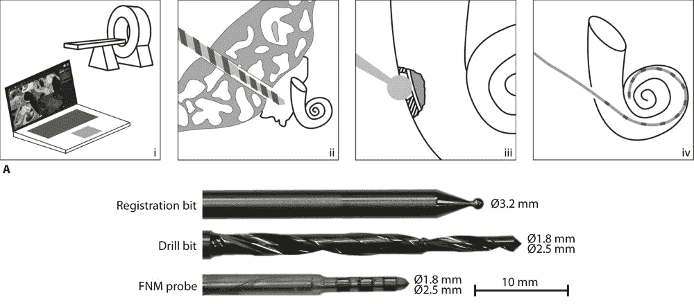

# 说真的，这个颅骨钻孔机器人对人类来说是个好消息

> 原文：<https://web.archive.org/web/https://techcrunch.com/2017/03/15/seriously-this-skull-drilling-robot-is-good-news-for-humanity/?ncid=rss&utm_source=dlvr.it&utm_medium=linkedin>

# 说真的，这个颅骨钻孔机器人对人类来说是个好消息

当有人发明了一个专门用来钻入失去意识、无法动弹的人的头骨的机器人时，你会情不自禁地产生类似“看在上帝的份上，为什么？”但是相信我，这个特殊的机器人钻孔站是个好主意。

这个问题围绕着所谓的显微外科手术，特别是安装耳蜗植入物，这是一种将声音直接传递到听力障碍者内耳的微小设备。

植入这些东西的过程每年要进行成千上万次，但这是一个非常危险和复杂的过程，最轻微的错误或不自觉的移动都会造成永久性的伤害。

正如在精度至关重要的其他情况下，机器可以有所帮助。在这种情况下，来自伯尔尼大学的研究人员一直在研究一种机器人，这种机器人执行最微妙和潜在的破坏性步骤:在头骨的精确位置和深度钻孔，以进入耳蜗的右侧部分。

是的，他们有特殊的钻头来钻透头骨和组织。该图的第三和第四部分提出了机器人植入程序的进一步机会，但未经测试。

该团队的论文[今天发表在《科学机器人学](https://web.archive.org/web/20230319162305/http://robotics.sciencemag.org/content/2/4/eaal4916.full)上，报告了将机器人用于钻孔目的的成功，并提出了进一步的应用，如实际的植入过程。

与此同时，他们以钻孔过程为平台，证明机器人可以钩入手术规划系统、立体视觉、组织类型的活体检测等。其他微型手术也可以从这项技术中获益。

如果机器人来了，他们不需要治疗计划就能钻入你的大脑。在那之前，像这样的机器人可以在外科手术中提供一些急需的一致性，就像这个一样，存在于人类能力的边界。