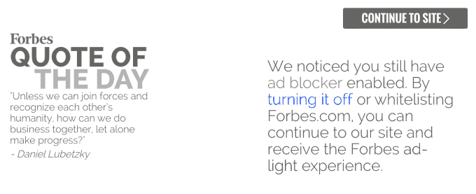

# Shine 与首个欧洲运营商签署网络级广告拦截技术

> 原文：<https://web.archive.org/web/http://techcrunch.com/2016/02/18/shine-bags-first-european-carrier-as-three-uk-deploys-network-level-ad-blocking/?ncid=rss&utm_source=dlvr.it&utm_medium=twitter&utm_campaign=Feed:+Techcrunch+(TechCrunch>)

随着移动网络级广告拦截器初创公司 [Shine](https://web.archive.org/web/20230326062459/https://www.getshine.com/) 宣布与首批欧洲运营商签署协议，推出其技术，广告拦截战今天正在加速进行。

三家英国公司和三家意大利公司今天表示，它们正在实施 Shine 的技术，为三家集团中的其他品牌效仿铺平了道路。目前还不清楚两家运营商将在何时推出消费者广告屏蔽服务——我们已经问过了，并将根据任何回复更新这个故事。

在关于 Shine 实施的一份声明中，三英国 CMO 汤姆·马勒希茨说:“不相关和过多的移动广告会惹恼客户，影响他们的整体网络体验。我们不认为客户应该为移动广告带来的数据使用付费。整个行业必须通力合作，为客户提供他们想要的移动广告，并从中受益。这些目标将为客户提供更多选择，并显著改善他们的广告体验。”

Shine 的 CMO·Roi Carthy 告诉 TechCrunch，它现在正在与“全球 60 多家运营商进行谈判，包括欧洲和美国的其他运营商”——表示有信心在未来六个月内宣布更多运营商的推出。(郑重声明[凯西曾经是 TC 的撰稿人](https://web.archive.org/web/20230326062459/https://techcrunch.com/author/roi-carthy/)。)

> 我们预计到 2016 年底，将有数亿消费者选择加入或有机会加入。

“我们预计，到 2016 年底，数亿消费者要么选择加入，要么有机会选择加入,”他补充道。(根据记录，英国最小的移动网络运营商 Three UK 截至去年 8 月拥有 880 万客户。)

目前还不清楚这三种实现方式具体如何运作，尽管该运营商表示，部署 Shine 的三个“主要目标”是:为其客户消除广告数据费用；保护客户隐私和安全；并痛斥“过度的、侵入性的、不想要的或无关的广告”，认为“客户应该有权接收与他们相关和感兴趣的广告，而不是让他们的移动数据体验降级”。

该公司还表示，其目标不是完全消除移动广告，而是“给消费者更多的控制权、更多的选择和更大的透明度”。

这与其他英国运营商正在采取的初期广告屏蔽措施一致。例如，去年 11 月， [EE 表示](https://web.archive.org/web/20230326062459/https://techcrunch.com/2015/11/23/u-k-carrier-ee-looking-at-giving-users-control-over-mobile-ads/)正在对广告拦截进行战略评估。另一家英国运营商 [O2 也表示](https://web.archive.org/web/20230326062459/https://techcrunch.com/2015/11/25/o2-eyeing-ad-blocking/)去年秋天它正在积极测试广告拦截技术。两家公司都表示，他们并不打算根除广告，而是希望给用户更多的控制权。

然而，Shine 目前的提议——该公司声称是目前唯一一家提供网络级移动广告拦截的公司(移动用户的其他选择包括使用[专用广告拦截浏览器](https://web.archive.org/web/20230326062459/https://techcrunch.com/2015/09/08/adblock-plus-browser-apps/))——不包括任何所谓的“可接受广告”的白名单(正如流行的桌面时代广告拦截器 [AdBlock Plus](https://web.archive.org/web/20230326062459/https://techcrunch.com/2015/07/22/adblock-plus-talks-content-blocking-and-the-tricky-shift-to-mobile/) 所做的那样)，因此很难看出其运营商合作伙伴最初将如何做得比让客户能够看到更少的广告更多。

在这一点上，Shine 正集中力量阻止展示广告。凯西说，这归结为取缔基本的横幅，弹出窗口，弹出 unders 又名第三方广告内容，主动中断移动浏览体验，例如，要求用户点击一个小十字来消除它。

“展示广告是每个人都看到和讨厌的东西，通常没有太多乐趣，”他说。

然而，本土广告，在其所有的蛇油形式，目前得到了通过从闪耀。“本土广告有几种形式。有原生内容——像杜蕾斯赞助的约会技巧——显然那不是我们能够触及的东西，因为它是“内容”。但这是出版商和读者之间的问题，不管它是否被清楚地陈述等等。那是他们自己的事，”凯西指出。

“第二种是本土产品体验——脸书、推特……这类东西……我们不接触广告有两个原因。首先，运营商实际上并没有要求我们控制这种类型的广告。虽然他们可能仍然不满意它的存在，并以负面方式影响用户体验，但他们更多地看到了整体产品体验，并没有要求我们接触它。

“其次，我们不会删除那些我们不确定在删除广告后能否提供适当用户体验的广告。也就是说，我们不会给出一个破碎的体验，而是一个虐待的体验。”

与 Shine 的第一个运营商合作伙伴，去年 9 月宣布部署该技术的加勒比移动运营商 Digicel 不同，欧洲的三大运营商将选择为客户实施网络级广告拦截。据 Carthy 称，这归因于地区监管差异。因此，欧洲用户将不得不选择打开广告拦截。而 Digicel 的客户都是自动选择加入的。(Carthy 说 Shine 在 Digicel 上有 1400 万用户，digi cel 也就是该公司的全部客户群。他声称，没有一个 Digicel 用户选择退出广告拦截。)

Shine 不向运营商收取技术费用——而是自行承担硬件和运营服务的费用。事实上，该公司目前还没有明确的商业模式，尽管它确实有投资者——迄今为止已经筹集了 330 万美元——因此需要在某个时候盈利。

卡奇在我们的采访中承认了这一点。因此，听起来 Shine 未来的商业模式将不可避免地涉及向用户提供某种形式的“可接受”广告——T2 a laAdBlock Plus——而不仅仅是其目前提供的“滥用广告”的选择，正如他所说的“当前一代展示广告素材”。

也就是说，在现阶段，Carthy 没有给出 Shine 未来商业模式的任何细节。

“这不一定是我们现在正在推出的东西，”他说，并讨论了未来与广告技术人员讨论敲定某种形式的“可接受广告”的想法。“但我们当然很乐意就此展开对话。就什么是正确的政策达成一致需要对话和时间。这不是瞬间的，正如你所能想象的，这将是争论。我们已经看到 AdBlock Plus 受到了多少批评。”

“我们从事消费者保护业务，不会背叛消费者对盈利的信任。也就是说，我们不是慈善家，我们有想拿回钱的投资者，我们相信我们可以与消费者建立信任和选择的关系，这对我们来说是一种更长久的关系，”他补充道。

“我们相信，如果消费者信任我们来保护他们和他们的广告体验，我们可能会找到让 Shine 成为一家非常成功的公司的方法。”

Shine 预计多久后才能开始将其用户群货币化？“我还不太确定，”卡奇说。“对我们来说，这是一个漫长的过程。对我们来说，真正的目标是将我们的技术推广到越来越多的运营商，并吸引数亿消费者加入我们的服务。这是我们的目标。”

“如果我们违背承诺，或者如果消费者不确定他们是否能信任我们，他们将完全有权停止使用我们，这是完全公平的，”他补充道。

Shine 也羞于谈论其技术如何运作的细节。Carthy 会说它安装在运营商的数据中心，他把它的操作比作父母控制软件，用于阻止某些类型的年龄不适宜的内容。在这些硬件安装的基础上，Shine 与运营商合作，为他们的用户提供量身定制的特定服务，重点是广告拦截和隐私保护(即广告跟踪拦截)这两大支柱。

他表示:“我不能详细谈论(这项技术)的原因是，这是一场技术战争。”。“火对火。高赌注的猫捉老鼠游戏。作为一家网络安全公司，我们不会公开泄露我们的信息。

“这样说来，我可以向高层解释。我们使用具有实时人工智能算法的 DPI(深度数据包检测)机器来检测广告(这比听起来更难，因为存在持续的逃避和伪装)。然后我们会删除它们，并确保网页或应用程序不会被破坏。”

消费者为什么要相信第三方公司能够清楚地了解他们的移动浏览习惯？在这一点上，凯西强调了 Shine 的安全证书。该公司的背景故事是，它的成立是为了保护消费者免受恶意软件的侵害。“忠于我们的事业，我们发现自己是保护消费者免受广告技术侵害的最坚固的防线，”它写道。

凯西明确证实，Shine 本身没有进行任何数据收集、网络数据分析或用户跟踪。他说，做 DPI 只是为了搜寻和消灭广告。

“我们的起源是网络安全和白帽黑客。公司就是这么来的。该公司的成立是为了重新发明反病毒软件。发生了一些事情，现在我们正在帮助消费者保护自己免受广告技术的侵害。但是我们不是在虐待消费者，我们是在保护他们，或者帮助他们保护自己。因此，任何关于我们滥用数据或出于任何不可告人的动机的想法，对我们来说都是站不住脚的。”

回到广告拦截战场，一个有趣的发展是拦截广告拦截用户的出版商数量增加。凯西将此表述为“一种极其短视的歇斯底里的反应”。但这也是一种反应，可能会降低 Shine 对智能手机用户的吸引力。因为如果人们通过他们的运营商打开 Shine，发现他们无法阅读他们最喜欢的新闻网站，那么他们可能会再次关闭它…

“这些(广告拦截软件)公司没有接受他们的最佳盈利实践已经过时的事实，”凯西说。“我们现在处于两个章节之间，他们需要理解这一点。一个时代已经结束，一个新时代正在开始，在这个时代，货币化不会超过消费者的利益。”

“任何时候，如果广告技术或出版商愿意和 Shine 坐下来讨论未来，讨论什么对消费者有利，我们都很乐意这样做，”他补充道。

从技术角度来看，另一个可能威胁 Shine 提供网络级广告拦截能力的发展当然是加密的使用越来越多，这将阻止其通过 DPI 识别广告的能力。

除此之外，还有关于网络中立规则是否可能不排除 ISP 部署广告拦截的问题——尽管三人明确认为[欧洲最近形成的网络中立规则](https://web.archive.org/web/20230326062459/https://techcrunch.com/2015/10/27/ep-telecoms-vote/)不会阻止向其用户提供选择加入的广告拦截服务。

尽管面临所有这些挑战，Carthy 表示，许多媒体和广告技术公司已经接触了 Shine，希望就其技术进行讨论(但他不会指名道姓)。“讨论的本质是……真正激励 Shine 的是什么。我们已经澄清的是，第一，我们不反对广告，我们反对滥用广告。第二，我们不会视而不见——也就是说，没有任何方法可以让我们视而不见。

“这些是谈话的关键内容，已经传达得非常清楚，对方也非常清楚。他们知道我们从哪里来。他们相信我们肯定没有让他们的生活变得更轻松，但他们明白，我们确实支持我们所说的话。”

那么，什么样的可接受的广告会在未来大放异彩呢？这一点，凯茜有大概的想法吗？毕竟，如果他告诉出版商，他们需要清醒过来，闻一闻咖啡的味道，发展自己的商业模式，那么让他指出一些他们内容的替代货币化战略的实际例子可能会有所帮助。

“还没有，”他回答说。“但我们非常乐意进行这些对话，如果我们相信各方是认真的，我们可以达成一项不会让消费者受到伤害的协议，那么我们可能会找到一些办法。”

但是当然，Shine 需要首先建立自己的网络——变得足够大和有威胁性，迫使广告技术公司改变他们的方式。而且要达到数亿用户的目标还有很长的路要走。它在这里赢得了一场战斗，获得了第一批欧洲航空公司。但是手机广告拦截战才刚刚开始。而且也不清楚各种行动和反行动将如何进行。

“目前，我们只专注于给消费者带来正确的广告，保护他们免受数字滥用，”凯西补充说，非常清楚地着眼于发展自己的网络奖。