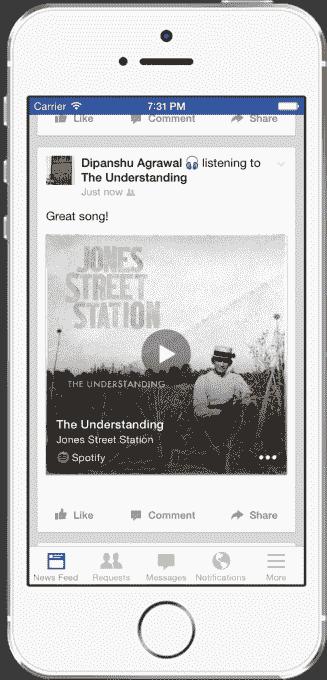

# 脸书正在推动唱片公司为你的视频配乐

> 原文：<https://web.archive.org/web/https://techcrunch.com/2017/02/13/facebook-soundtracks/?ncid=rss&utm_source=dlvr.it&utm_medium=twitter&utm_campaign=getslokka>

脸书和 Instagram 如何让他们的业余视频比你在 Twitter 或 Snapchat 上看到的更有趣？一个杀手原声带。这就是为什么脸书现在对唱片公司施加更大的压力来达成授权协议。

谈判成功后，用户可以将流行音乐编辑到他们的作品中，或者以流行音乐为背景录制视频片段，而不会因为侵犯版权而被删除。脸书甚至可以建立一种方式，让人们可以轻松地选择歌曲添加到他们的视频中，就像我们之前建议的那样。

至少从 2015 年开始，脸书就一直在与唱片公司进行[谈判，当时 NYT 表示，它正在寻求将音乐视频纳入人们的 feed。一些人错误地猜测，脸书将很快推出自己成熟的音乐流媒体服务，与 Spotify 竞争。](https://web.archive.org/web/20230315105038/https://www.nytimes.com/2015/07/10/business/media/facebook-said-to-seek-music-video-licensing-deals.html)

去年年底，Billboard 报道称，脸书正在开发一款音乐反盗版工具，这将补充其阻止视频盗版的[版权管理器](https://web.archive.org/web/20230315105038/https://techcrunch.com/2016/04/12/content-fb/)工具。现在[彭博](https://web.archive.org/web/20230315105038/https://www.bloomberg.com/news/articles/2017-02-13/facebook-tries-to-offer-music-labels-an-alternative-to-youtube)表示，脸书已经加倍努力，重点保护用户制作视频的版权音乐。

如果没有这些协议，脸书不得不阻止上传视频或删除包含唱片公司音乐的视频，从而让人们失望和愤怒。例如，从家庭度假到爸爸最喜欢的经典摇滚音乐的剪辑视频可能不被允许。或者，一个朋友在汽车里闲逛的愚蠢片段可能会被删除，因为它听到了背景中播放的一首热门歌曲。

这可能会阻止用户在未来为脸书制作视频，剥夺社交网络最生动和最赚钱的内容。

YouTube 通过其内容识别系统解决了同样的问题。它可以检测版权音乐的使用情况，并让音乐所有者选择删除视频，或者成为视频广告收入分成的受益者。第二种选择更受欢迎，因为用户不会讨厌地删除他们的视频，艺术家可以通过他们的音乐获得草根推广，唱片公司可以通过他们拥有的艺术作品赚取费用。

脸书已经建立了自己的音频指纹技术，该技术于 2014 年发布，可以自动显示你正在听的歌曲或正在看的节目，这样你就可以在状态更新中标记它们。现在的问题是与唱片公司达成一项令人满意的协议，这样他们就可以从视频配乐中获得报酬。

如果唱片公司很聪明，他们会想办法让它发挥作用，而不是让这些分销和收入选择白白浪费。脸书刚刚聘请了谷歌和 YouTube 音乐合作伙伴关系的前主管[塔玛拉·赫里夫纳克](https://web.archive.org/web/20230315105038/https://www.linkedin.com/in/tamara-hrivnak-7696b6aa)领导其音乐战略并与唱片公司合作。

问题是脸书是否能在音乐的偶然使用和故意盗版之间划一条线，前者歌曲更多的是视频的伴奏，后者视频实际上只是一个占位符，用户可以免费搜索和收听歌曲。一些唱片公司高管鄙视的后一种做法在 YouTube 上很常见。

与合法用户制作视频的音乐伴奏达成协议，可能会打开与专业音乐视频唱片公司进行更深入合作的大门。脸书还可以通过创建一个向人们推荐特定歌曲作为配乐的功能，来获得对唱片公司的影响力和公开的赞助机会。

但目前，脸书只是试图消除其当前畅销产品[的任何增长障碍。大多数人都不是优秀的摄像师，更不用说录音师了。用户制作的视频可能看起来很无聊，听起来也很糟糕。但有了合适的歌曲，那些摇摇欲坠的派对片段和僵硬的风景全景突然变得史诗般。](https://web.archive.org/web/20230315105038/https://techcrunch.com/2016/11/03/facetube/)