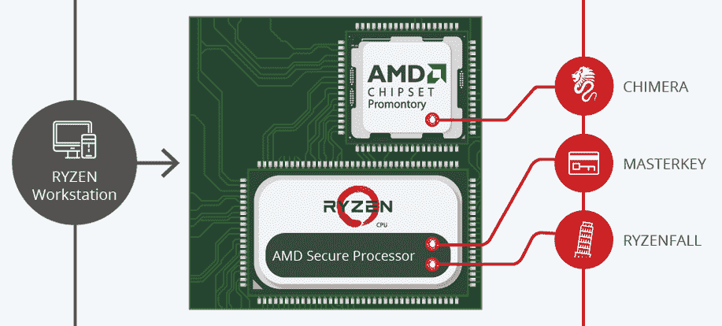

# 安全研究人员发现 AMD 芯片中的缺陷，但仓促披露令人惊讶 

> 原文：<https://web.archive.org/web/https://techcrunch.com/2018/03/13/security-researchers-find-flaws-in-amd-chips-but-raise-eyebrows-with-rushed-disclosure/?ncid=rss&utm_source=dlvr.it&utm_medium=twitter>

AMD 芯片中新发现的一组漏洞引起轩然大波，不是因为这些缺陷的规模，而是因为研究人员披露这些漏洞的仓促、现成的方式。上一次一个 bug 有自己专业拍摄的视频和公关代表，而受影响的公司只是提前 24 小时得到警告是什么时候？这些缺陷可能是真实的，但这里开的先例令人不快。

问题中的缺陷是由以色列的网络安全研究机构 CTS 实验室发现的，并被赋予了一系列吸引人的名字:Ryzenfall、Masterkey、Fallout 和 Chimera，以及相关的徽标、专门的网站和描述它们的白皮书。

到目前为止，一切正常:像 Heartbleed，当然还有 Meltdown 和 Spectre 这样的主要 bug 也有名字和标识。

不同的是，在这些情况下，受影响的各方，如英特尔、OpenSSL 团队和 AMD 都提前得到了警告。这是“负责任的公开”的概念，在问题公开之前，让开发人员首先解决问题。

关于大公司应该在多大程度上控制自身缺点的公开存在合理的争论，但总的来说，为了保护用户的利益，这一惯例往往会得到遵守。然而，在这种情况下，CTS 实验室团队在几乎没有警告的情况下，将他们的缺陷抛给了完全成型的 AMD。

该团队发现的缺陷是真实的，尽管它们需要管理权限来执行一系列操作，这意味着利用它们需要相当多的目标系统访问权限。这项研究将其中一些描述为台湾公司 ASmedia 故意包含在芯片中的后门，该公司与许多制造商合作生产组件。

与 Meltdown 和 Spectre 等利用内存处理和架构级别的问题相比，访问要求使它们更加受限。他们当然是认真的，但是他们被公开的方式已经引起了网络上的怀疑。

为什么非常没有技术含量的[视频](https://web.archive.org/web/20230130225010/https://youtu.be/pgYhOwikuGQ)是在绿色屏幕上拍摄的，并合成了股票背景？为什么在军事上使用 AMD 的恐吓战术？为什么 bug 没有 [CVE 号](https://web.archive.org/web/20230130225010/http://cve.mitre.org/cve/)，这是几乎所有严重问题的标准跟踪方法？为什么给 AMD 的回应时间这么少？为什么不呢，如果像 FAQ 建议的那样，一些修复程序可以在几个月内完成，至少可以推迟发布，直到它们可用。关于 CTS“可能直接或间接地对 AMD 的表现有经济利益”的披露是怎么回事？在这种情况下，这种披露并不常见。

(我已经联系了列出缺陷的公关代表[！]来寻找这些问题的答案。)

很难否认有人对 AMD 心怀怨恨。这并没有使缺陷变得不那么严重，但它确实给人留下了不好的印象。

AMD 发表声明称，“我们正在调查这份刚刚收到的报告，以了解调查结果的方法和价值。”一天之内很难做其他事情。

与这些大漏洞一样，它们的真实影响范围、严重程度、用户或企业是否会受到影响，以及它们能做些什么来防止这些问题，都是有待专家仔细研究和验证数据的信息。