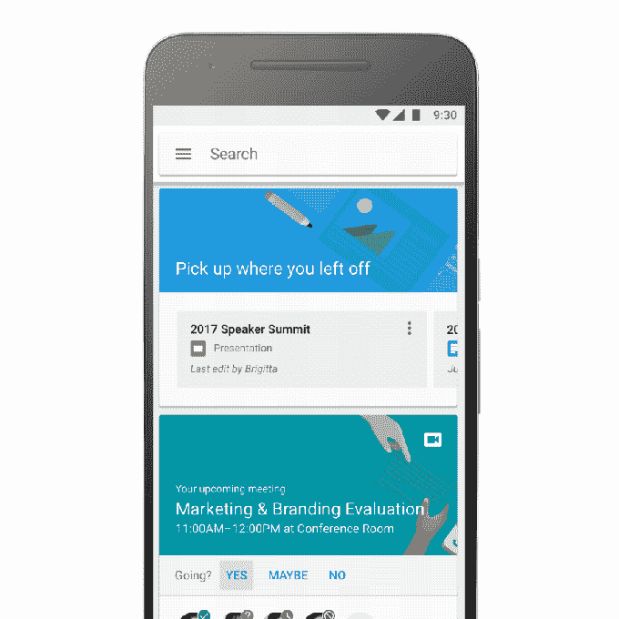

# 谷歌首次推出云搜索，这是一款面向 G 套件客户的智能搜索引擎 

> 原文：<https://web.archive.org/web/https://techcrunch.com/2017/02/07/google-debuts-cloud-search-a-smart-search-engine-for-g-suite-customers/?ncid=rss&utm_source=feedburner&utm_medium=feed&utm_campaign=Feed%3A+Techcrunch+%28TechCrunch%29&utm_content=FaceBook&sr_share=facebook>

# 谷歌首次推出云搜索，这是一款面向 G 套件客户的智能搜索引擎

谷歌今天为其商业客户推出了一款名为[谷歌云搜索](https://web.archive.org/web/20221205160752/https://gsuite.google.com/products/cloud-search/)的新工具，该工具将允许用户搜索 G Suite 产品，包括 Drive、Gmail、网站、日历、文档、联系人等。这项服务之前在[的一个有限预览版](https://web.archive.org/web/20221205160752/https://cloud.googleblog.com/2016/06/powering-a-more-connected-and-collaborative-enterprise.html)中提供，在那里它被称为跳板，[将](https://web.archive.org/web/20221205160752/https://beta.techcrunch.com/2016/06/14/google-launches-springboard-an-ai-powered-assistant-for-its-enterprise-customers/)描述为类似于企业员工的 Google Now。

Springboard，也就是现在的云搜索，是为大公司设计的，在大公司里，不同的团体和个人可以访问不同的文件。搜索服务尊重文件共享权限，因此用户只能访问他们可用的内容，无论是公司范围内的资源，如政策手册、团队项目还是只有他们可以看到的文档。

除了显示工作文档，云搜索还可以作为一种目录服务，允许用户查找同事的联系信息，同时还可以查看他们共有的事件和文件。当在搜索结果中查看某个联系人的信息时，用户可以点击开始发送电子邮件、打电话或聊天。

与 Google Now 类似，Google Cloud Search 采用卡片式设计向您呈现信息，无论您是通过手机还是笔记本电脑访问搜索服务。与 Google Now 一样，这项服务利用机器智能来突出显示它认为你最可能需要的信息。在这些卡片中——或被称为“辅助卡片”——谷歌云搜索将弹出诸如最近访问的文件、会议提醒、笔记等内容。

最近几个月，增加机器智能以增强其生产力工具一直是谷歌的一个重点。除了(仍有疑问的) [G 套件更名](https://web.archive.org/web/20221205160752/https://beta.techcrunch.com/2016/09/29/google-rebrands-its-business-apps-as-g-suite-launches-team-drive-upgrades-apps/)之外，[公司还宣布了](https://web.archive.org/web/20221205160752/https://beta.techcrunch.com/2016/09/29/google-rebrands-its-business-apps-as-g-suite-launches-team-drive-upgrades-apps/)一系列机器智能驱动的功能，包括驱动器中的“快速访问”,它可以在你开始打字之前预测你接下来需要哪个文件。谷歌当时声称，这将使获取正确文件的平均时间减少 50%。

通过谷歌云搜索转化为预测性搜索服务，目标是为 G Suite 用户提供类似的生产力提升。正如谷歌在宣布云搜索的博客[帖子](https://web.archive.org/web/20221205160752/https://blog.google/products/g-suite/introducing-google-cloud-search-g-suite/)中指出的，如今，员工一周要花 20%的时间来搜索和整合信息。这项新服务旨在减少这一数字。

谷歌云搜索正在为使用 G Suite Business 和 Enterprise editions 的客户推出。谷歌表示，未来将推出更多功能，并将与第三方应用程序集成。