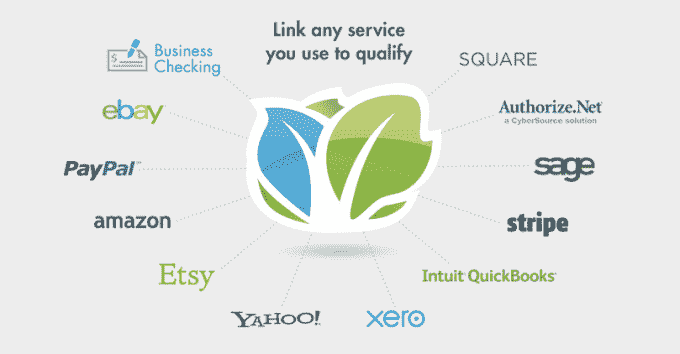

# Kabbage 的 SMB 贷款平台作为白标服务进入亚太地区 

> 原文：<https://web.archive.org/web/https://techcrunch.com/2015/03/24/kabbages-smb-loan-platform-moves-into-asia-pacific-as-a-white-label-service/?ncid=rss&utm_source=feedburner&utm_medium=feed&utm_campaign=Feed%3A+Techcrunch+%28TechCrunch%29&utm_content=Netvibes>

Kabbage 已经在美国和英国市场扎根，成为小企业可以快速申请和获得流动资金贷款的平台——Kabbage 通过智能算法和在线及离线数据源的组合，快速做出资格决定。现在，这家初创公司正在两条战线上发展业务。它正在启动一项新的白标服务，第三方将使用 Kabbage 的技术为贷款服务提供动力。通过它的第一个白牌合作伙伴，它正在扩展到第三个市场，澳大利亚，这是它在亚太地区的第一个市场。

澳大利亚的这项服务将通过一项名为 [Kikka Capital](https://web.archive.org/web/20221007222732/http://www.kikka.com.au/) 的新服务提供，该服务将于 5 月份推出。kabb age——以俚语“钱”命名——表示 Kikka 将授权其平台搭载客户，并承销和监控贷款。与此同时，Kikka 将负责营销、融资、贷款服务和其他业务。贷款将高达 10 万美元，期限为 1 至 6 个月。

Kabbage 去年暗示将向澳大利亚和更广泛的亚太地区扩张，当时它筹集了由日本投资者软银资本(SoftBank Capital)牵头的[5000 万美元的 D 轮融资。](https://web.archive.org/web/20221007222732/https://beta.techcrunch.com/2014/05/05/kabbage-50m/)

总的来说，Kabbage 通过债务和股权的混合方式筹集了超过 4 . 6 亿美元的资金。其中很大一部分将用于为中小企业在其平台上借款提供前期资金。首席执行官 Rob Frohwein 告诉我，到目前为止，Kabbage 已经贷款 7 亿美元，今年还将向中小企业贷款 10 亿美元，此外还有其较新的消费者业务 Karrot。该公司目前共有 40，000 多名活跃客户。

(与此同时，Karrot 业务也在增长:Frohwein 表示，它“今年将发放 2.5 亿美元的贷款，明年的目标是 10 亿美元。”)

这不是 Kabbage 第一次合作扩大业务规模。在美国，该公司还与银行合作提供贷款服务；本月早些时候，它宣布了一项与万事达卡的[交易，为万事达卡将通过其商户收单银行提供的小企业贷款服务提供动力。](https://web.archive.org/web/20221007222732/http://www.virtual-strategy.com/2015/03/10/mastercard-expands-services-small-business-segment-kabbage-partnership#axzz3VI61Kwuq)

首席执行官 Rob Frohwein 告诉我，Kabbage 将在接下来的四周内按照万事达卡交易的思路发布两个类似的公告。“这些交易具有排他性，将我们带入银行和密切相关的金融服务公司，如商业收购者，”他说。

(这意味着，理论上，美国的中小企业现在可以直接通过 Kabbae 自己的零售门户网站、银行或通过他们的信用卡服务供应商(通常也是银行)获得 Kabbage 贷款。)

Kikka 服务的不同之处在于，这将是 Kabbage 第一次在国际上推出这一服务，并将品牌和参与业务融资的工作交给另一家初创公司，仅充当技术合作伙伴——这与最近被 PayPal 收购的【Paydiant 在其移动钱包服务 CurrentC 中提供的服务没有什么不同。

白标结构也意味着 Kabbage 可以更快地向其他市场扩张。事实上，当 Kabbage 在近一年前宣布其 5000 万美元的 D 轮融资及其亚洲计划时，Frohwein 指出，扩张不会立即发生:

“显然，许多国际市场不仅存在监管障碍，还存在技术挑战，”他当时表示。“我们倾向于关注小型企业拥有强大技术基础设施的市场，以及能够以电子方式有效获取数据的市场。”

虽然这可能意味着 Kabbage 自己在这些贷款中的佣金比例较小，但它在其他领域的成本较低。例如，通过转换到白标模式，Kabbage 能够绕过一些许可和融资，如果它推出完整的产品，可能需要进行这些部分，将这些部分留给本地提供商。

Kikka Capital 创始人兼董事总经理大卫布伦南(David Brennan)在一份声明中表示:“与 Kabbage 合作给了我们一个巨大的机会，可以将他们突破性的借贷技术平台和无缝的用户体验带给澳大利亚各地的小企业。”。“Kabbage 平台的推出使我们能够大幅加快进入小企业贷款领域，并通过在企业的整个生命周期中实时承保业务来有效管理风险。”

Kabbage 平台的独特卖点牢牢建立在数据的基础上。该公司目前根据申请人在许多不同服务领域的过往记录和数据来确定其贷款资格。最初是为在线业务开发的，它大量使用来自易贝、亚马逊和 Etsy 等网站的数据，这些中小企业可能已经在这些网站开展业务，加上其他一些来源，如 Xero 和 Intuit 等公司的会计软件。

最终，Kabbage 声称，其混合的数据来源以及如何解析信息使其能够更准确地阅读合适的贷款候选人，并有助于更确定借入的东西也能得到偿还(这是一个棘手的问题，已经让其他在线贷款提供商感到困惑)。