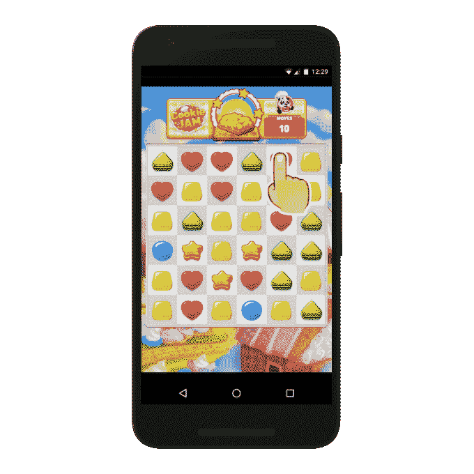
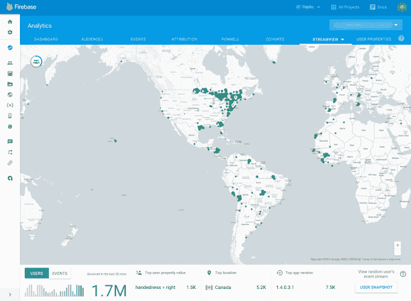

# 谷歌为 Android 游戏开发者和其他工具发布可玩广告 

> 原文：<https://web.archive.org/web/https://techcrunch.com/2017/03/01/google-unveils-playable-ads-for-android-game-developers-and-other-tools/?ncid=rss&utm_source=feedburner&utm_medium=feed&utm_campaign=Feed:+Techcrunch+%28TechCrunch%29>

谷歌本周在旧金山的 GDC 上为 Android 游戏开发者推出了一系列新工具，这些工具提供了吸引用户下载游戏的新方法，以及从游戏中赚更多钱的方法，并跟踪用户如何与他们的游戏互动。

其中一个更值得注意的产品是谷歌所谓的“playables”，顾名思义，这是一种交互式广告格式，让用户在看到另一款游戏中的广告时，可以播放一款游戏的轻量级版本。

这是一个几个 [第三方](https://web.archive.org/web/20221209103819/https://www.geek.com/games/playable-ads-could-be-the-new-game-demos-1655186/) [第三方](https://web.archive.org/web/20221209103819/http://www.mediapost.com/publications/article/287090/the-power-of-playable-ads.html)已经在争夺开发者注意力的领域，所以谷歌加入战局是有道理的。

这种格式是通过谷歌的通用应用活动(Universal App Campaigns)推出的几种格式之一，该活动通过谷歌的资产推送广告，包括谷歌显示网络、AdMob、YouTube、谷歌搜索和谷歌播放。然而，谷歌表示，可播放的广告可能会在谷歌显示网络上超过 100 万个应用程序中的任何一个中显示。该格式将在“未来几个月”推出

开发者的另一个新功能是自动翻转功能，该功能会根据用户当前手持手机的方式自动调整广告方向。通常，用户是垂直拿着他们的手机，但是广告是为水平观看而设计的。现在，当一个水平视频上传到 AdWords 时，谷歌将自动为开发者创建第二个垂直视频广告。

[https://web.archive.org/web/20221209103819if_/https://www.youtube.com/embed/yPt2V0Jvvec?feature=oembed](https://web.archive.org/web/20221209103819if_/https://www.youtube.com/embed/yPt2V0Jvvec?feature=oembed)

视频

一些有趣的技术正在幕后工作，因为谷歌在创建垂直副本时利用机器学习来找出视频中最重要的部分。该公司表示，在早期测试中，其自动设计的垂直广告的点击率比垂直观看的水平广告高出约 20%。

谷歌还将付费视频广告的范围从 AdWords 扩大到 AdMob。这些视频为观看视频的游戏玩家提供应用内奖励。它们也将通过通用应用程序活动提供，开发者可以重复使用现有的创意材料。

最后，该公司正在推出更好的测量工具，通过 C++ SDK 和领先游戏引擎 [Unity](https://web.archive.org/web/20221209103819/https://unity3d.com/) 的 SDK，将 [Firebase Analytics](https://web.archive.org/web/20221209103819/https://firebase.google.com/features/analytics/) 带给更多的游戏开发者。这将允许开发者捕捉诸如关卡完成、游戏时间等事件，以更好地了解他们的用户如何参与，以及他们的终身价值。