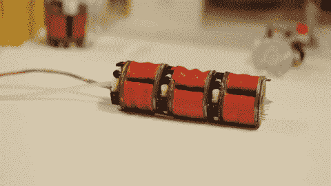
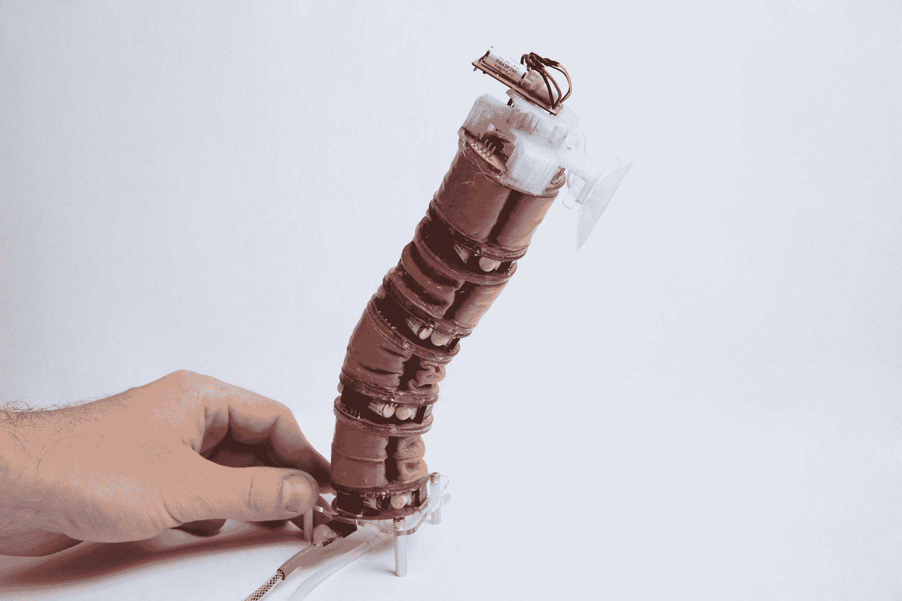

# 这个真空激活的模块化机器人既肮脏又整洁

> 原文：<https://web.archive.org/web/https://techcrunch.com/2017/08/30/this-vacuum-activated-modular-robot-is-equally-nasty-and-neat/?ncid=rss&utm_source=gil&utm_medium=124>

软机器人是目前研究的一个主要领域，但一般的范式似乎是，你向某物(肌肉或管子)中注入其他东西(空气、液体)，使其改变形状。但是瑞士机器人专家研制的机器人却做了相反的事情:当空气被抽走时，它的小肌肉会绷紧。这很酷——但看起来也有点恶心。

我是说，拜托:

 每一小段都有几块肌肉，每一块肌肉都可以收缩到不同程度，以扭曲该段，向某个方向施力。全都朝着一个方向，机器人弯下了腰；有节奏地做它，它就能走路，或者至少蠕动着前进。或者真空可以在吸盘中释放，让机器人安全地附着在墙上，就像你在上面看到的那样。

它是由 EPFL 洛桑联邦理工学院的 Jamie Paik 和 Matt Robertson 开发的，他们[在](https://web.archive.org/web/20230320085233/http://robotics.sciencemag.org/lookup/doi/10.1126/scirobotics.aan6357)[新的《科学机器人学》杂志](https://web.archive.org/web/20230320085233/https://techcrunch.com/2016/12/06/new-journal-science-robotics-is-established-to-chronicle-the-rise-of-the-robots/)上发表的论文中描述了它。

尽管其他类似机器人的设备已经将真空用于各种目的——我们在舞台上有一个使用真空安全地抓取易碎物品——研究人员声称这是第一个完全通过真空工作的机器人。白先生在一封电子邮件中告诉我，真空产生的收缩作用不仅独特，而且实用。

弯曲。我警告过你这看起来很恶心！

“与扩张致动器相比，收缩更类似于生物肌肉的功能，”她说。“不去更精确和详细的模仿，这可能是足够的应用功能方面的优势；在你想要使用/增强/辅助身体关节的情况下(如在可穿戴设备中)，模仿真正的肌肉，而不是引入其他可能妨碍自然功能的力或运动模式。”

它也是完全模块化的，所以如果你想用它们来做手指或手臂，这很有用，一条巨大的，可怕的蛇也是一种选择。(我宁愿你没有。)

“所有可能的几何形状和性能仍在研究中，但我们的实验室已经测试了许多其他形状，总的想法仍然是开放的，”Paik 写道。“最终，这种模块化套件将成为一种家用主食工具，用于自动化物体或执行简单但多样的任务(钉钉子、通宵清理冰箱、在房子周围寻找丢失的物品)。或者它将成为主动可穿戴机器人的组成部分，可以为用户提供帮助/反馈。”

目前，测试都是手动的——你必须组装每一个部件并手工测试——但该团队正在开发自动化工具，可以虚拟组装和测试不同的配置。

这种技术的缺点是，由于真空泵并不十分轻便或便携，机器人必须一直拴在上面。

“气动泵还没有为便携性进行优化，因为它们通常用于固定设置，”Paik 解释说。"希望这些能像四旋翼飞行器技术一样快速改进."

必须指出的是，它并不像你可以在后院飞行的无人机那样性感，但如果 Paik 和 Robertson 的想法成功，这可能是一种像无人机一样无处不在的技术的先驱。