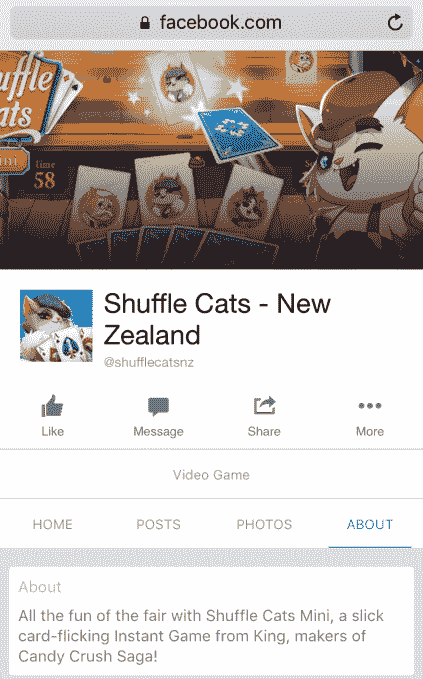
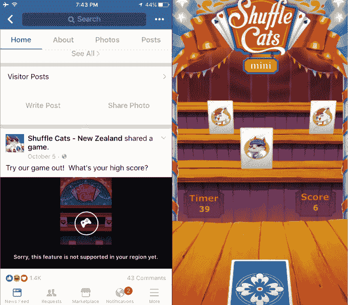
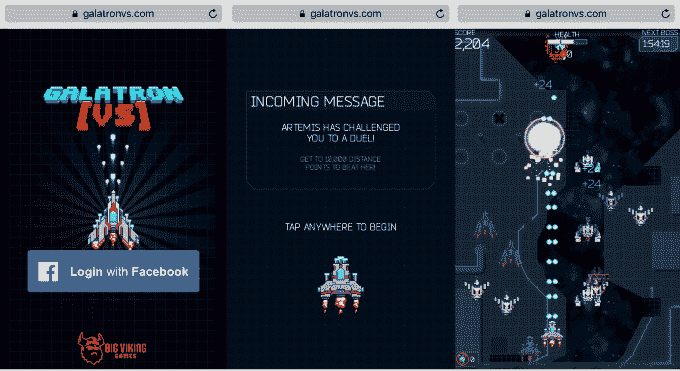
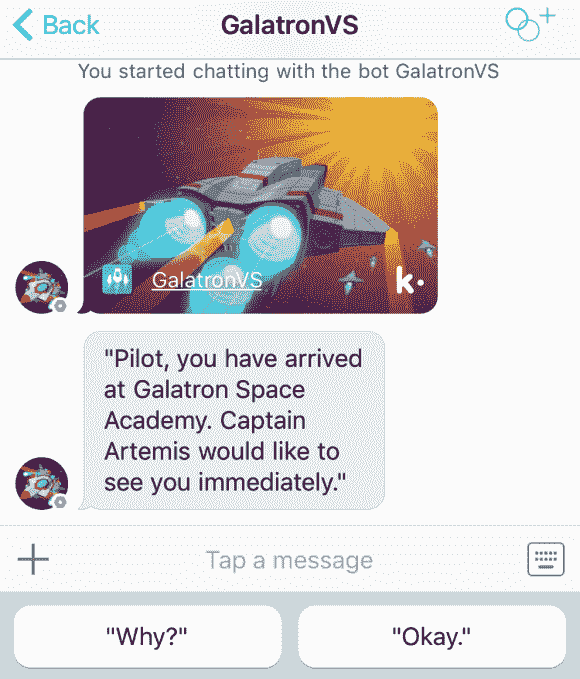
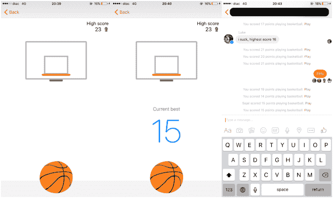

# Facebook Messenger 正在测试类似 King  的“即时游戏”

> 原文：<https://web.archive.org/web/https://techcrunch.com/2016/11/04/facebook-messenger-instant-games/?ncid=rss?SRC=MOBILE_DEV_MEMO>

Facebook Messenger 正准备推出一个新的“即时游戏”平台，让人们与朋友玩轻量级游戏。TechCrunch 发现，糖果粉碎制造商 King.com 已经在新西兰测试一款名为“洗牌猫迷你”的即时游戏。包括 Big Viking 在内的其他工作室似乎也在为即时游戏的推出做准备。

[2016 年 11 月 29 日更新: [Facebook Messenger 现已推出即时游戏平台](https://web.archive.org/web/20230323205510/https://techcrunch.com/2016/11/29/messenger-instant-games/)

King.com 即时游戏“洗牌猫迷你版”的脸书页面

脸书在很大程度上被苹果的 iOS 和谷歌的 Android 拒之门外。但是，通过将游戏作为移动网络应用的入口嵌入 Messenger，脸书可以创建一个新的平台来推动 Messenger 的参与。用户可以在 Messenger 上玩即时游戏，通过脸书消息向朋友挑战，并有可能从游戏购买中为脸书赢得一部分。脸书没有立即回应置评请求。

今天早些时候， [The Information](https://web.archive.org/web/20230323205510/https://www.theinformation.com/facebook-preps-larger-rollout-for-messenger-games) 报道称，脸书正在打造异步游戏的即时游戏平台，你可以和朋友轮流玩，不一定是在同一时间。今年早些时候，即时游戏公司允许第三方开发者开发国际象棋、[篮球](https://web.archive.org/web/20230323205510/https://techcrunch.com/2016/03/18/facebook-sneaked-a-seriously-addictive-basketball-game-into-messenger/)和[足球](https://web.archive.org/web/20230323205510/https://techcrunch.com/2016/06/15/how-to-play-facebook-messengers-new-super-addictive-and-hidden-soccer-game/)迷你游戏，这是脸书自己为 Messenger 开发的。脸书计划在本月晚些时候发布一个开发工具包或工具，尽管开发者还没有被告知他们是否能够对游戏内购买收费。

## 第一个即时游戏

该消息写道，脸书已经在私下测试即时游戏，但没有指明任何工作室。TechCrunch 发现休闲游戏巨头 king.com 已经为其 Shuffle Cats Mini 游戏建立了一个[脸书页面，它称之为“来自 King 的一款流畅的挥卡即时游戏”。](https://web.archive.org/web/20230323205510/https://www.facebook.com/shufflecatsnz/)

该页面积极允许新西兰等特定地区的用户玩，但美国用户在试图将它加载到移动设备上时会收到一条错误消息。Shuffle Cats Mini 似乎部分加载到了网络上，揭示了一个游戏，在这个游戏中，你可以在一个小射击场中向目标扔卡片，但你不能结束游戏或与朋友分享你的分数，这将反映 Messenger 的篮球和足球游戏的工作方式。

洗牌猫迷你被限制在某些地区，但这里有一个游戏的预览

据 [VentureBeat](https://web.archive.org/web/20230323205510/http://venturebeat.com/2016/11/02/html5-gaming-studio-big-viking-raises-21-75-million-in-funding/) 报道，经过进一步挖掘，我们发现本周早些时候，一家名为 Big Viking 的初创公司宣布，它已经筹集了超过 2100 万美元来开发“HTML5 即时游戏”。

当我今天向 Big Viking 首席执行官 Albert Lai 询问该公司的计划时，他告诉我“HTML5 是一种基本上允许我们将游戏嵌入任何东西以及带有机器人的 messenger 平台内部的技术。在任何一个 messenger 平台上，[人]都可以玩我们的游戏。这完全改变了配电系统的电力。只要有信使，我们就能即时传递我们的游戏。”

然而，当我问这是否意味着大维京的标题可能是脸书即时游戏，他突然变得谨慎，并告诉我，“我不能谈论任何有关我们可能会或可能不会在脸书做什么。”这听起来像是脸书禁止他讨论这件事。

在即时通讯应用 Kik 上，GalatronVS 通过聊天机器人提供服务，这可能暗示了 Facebook Messenger 的即时游戏可能会如何工作

在[大维京的网站](https://web.archive.org/web/20230323205510/https://www.bigvikinggames.com/galatronvs/)上，你可以玩[银河大战](https://web.archive.org/web/20230323205510/https://galatronvs.com/)的预览，这是一款垂直滚动的街机宇宙飞船射击游戏，有一个消息传送的转折。你会收到游戏中的挑战，比如试图通过电脑控制角色的信息获得 10，000 分。

这款游戏已经可以通过消息应用 Kik 的游戏商店获得。在那里，你和一个机器人聊天，这个机器人把你招进了“银河太空学院”。经过一番戏谑之后，你得到了一个玩 HTML5 游戏的链接。你可以参加比赛，在比赛中，你的飞船旁边会显示出其他玩家的“幽灵”。这符合即时游戏异步的理念。你在 Facebook Messenger 上的朋友可能会玩，然后向你挑战，当你玩你的游戏时，你会看到他们跑步的回声。

对于一款 HTML5 游戏来说，Galatron 看起来尤其令人印象深刻，画面清晰，控制灵敏。说明 HTML5 可能已经最终成熟到了移动 web 标准值得与原生移动游戏一争高下的地步。

## 脸书运动会的回归

大约在 2009 年，脸书与 Zynga 和 EA 等开发商合作，在其桌面网站上建立了一个非常受欢迎的游戏平台。但是随着用户转向手机，脸书的游戏跟不上了。iOS 和 Android 成为移动和社交游戏的大本营，脸书停止了对游戏内购买征收 30%的税。

2011 年，脸书试图推出一个代号为斯巴达项目的 HTML5 游戏平台。问题是 HTML5 标准仍然很弱，开发者还没有想出如何突破它的性能极限。工作室无法制作出对抗原生 ios 和 Android 游戏的游戏，该平台很快失败并被废弃。

脸书在 2011 年试图开发一个代号为“斯巴达项目”的 HTML5 游戏平台，但失败并被关闭

在 2012 年第四季度其桌面时代结束时，脸书从其 10.6 亿用户中获得了 2.56 亿美元的付费收入，主要来自游戏。自那以后，脸书的用户已经增长到 17.9 亿，但支付收入却下降到 1.96 亿美元。

但是现在脸书正在向游戏领域大举进军。本周，它正式宣布[脸书游戏室](https://web.archive.org/web/20230323205510/https://techcrunch.com/2016/11/01/facebook-gameroom/)，一个类似 Steam 的桌面 PC 游戏平台，但更专注于休闲游戏。与此同时，它正在准备一次机动攻击。

## 方便、易接近和社交

即时游戏是多年基础工作的顶峰。脸书在 2015 年 4 月推出了用于内容和实用程序的[信使平台](https://web.archive.org/web/20230323205510/https://techcrunch.com/2015/03/25/facebook-launches-messenger-platform-with-content-tools-and-chat-with-businesses/)，还有一款名为涂鸦的正版游戏出现了，但从未流行起来。今年四月，信使号发布了它的机器人平台。两者都被设计成允许用户不仅仅在应用程序中聊天，从呼叫优步或编辑照片到接收新闻和购物。

今年早些时候，脸书开发了自己的信使游戏原型，并大受欢迎

游戏可以扩展 Messenger 的功能，同时自然地利用脸书的社交网络。与更深入的原生手机游戏相比，Shuffle Cats Mini 或 Galatron VS 等轻量级 HTML5 游戏的魅力在于，你不需要太多的指导或经验，可以在一天中的短暂休息时间玩游戏。这使得它们变得方便，容易被主流接受，并且具有病毒式传播。

这些轻量级游戏缺乏的是单人可玩性。这就是朋友出现的地方。你可能不想一个人一遍又一遍地扔卡片或射击小飞船。但是如果你正在努力打破你最好朋友的新记录，你可能会继续使用 Facebook Messenger。