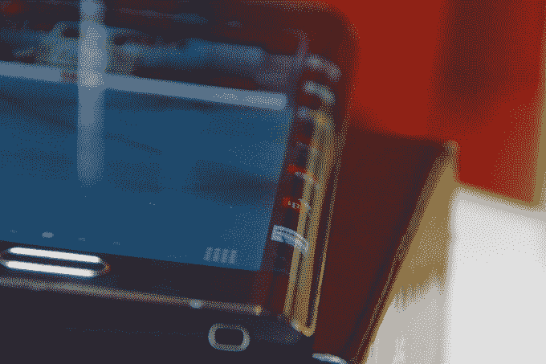

# 三星似乎将于 3 月 1 日发布 Galaxy S6 

> 原文：<https://web.archive.org/web/http://techcrunch.com/2015/02/02/samsung-galaxy-s6/?ncid=rss?utm_content%3Dsuggestion&utm_medium=social&utm_source=socialpilot.co&utm_campaign=SocialPilot>

# 三星似乎将于 3 月 1 日发布 Galaxy S6

现在是二月，这意味着三星回到了戏弄模式，因为它准备推出旗舰 Galaxy S 系列的最新智能手机。该设备看起来将于 3 月 1 日在巴塞罗那亮相，与此同时，移动世界大会是西班牙电信业的大型贸易展。

关于三星的活动邀请(上图)，有趣的是它暗示下一代 Galaxy 可能是弯曲的。预告中起伏的线条让人想起了 Galaxy Note Edge 的弯曲边缘，这是三星去年发布的 Galaxy Note 4 的变体，如下图所示。

三星似乎不太可能推出 Galaxy S6，因为我们认为其下一款旗舰产品将被命名，这一功能尚未在消费者中得到证实——但或许它将在主版本的同时推出一款“边缘”版本的设备？考虑到三星申请了一项专利，显示屏幕两侧的弯曲设计，这似乎是可行的，正如 [Sam Mobile 最近报道的](https://web.archive.org/web/20230130234749/http://www.sammobile.com/2015/02/02/patent-shows-samsungs-dual-edge-display-and-an-peculiar-panel/)。

关于 Galaxy S6 的一个值得注意的事实是，它将运行在三星芯片上，而不是通常的高通芯片。[高通似乎证实了](https://web.archive.org/web/20230130234749/http://www.engadget.com/2015/01/28/qualcomm-lost-a-large-customer-samsung/)关于这一变化的传言——这显然是[由于该公司最新芯片组](https://web.archive.org/web/20230130234749/http://www.bloomberg.com/news/articles/2015-01-20/samsung-said-to-drop-qualcomm-chip-from-next-galaxy-smartphone)过热——我们不用等太久就能看到这将如何影响最终产品和用户体验。

[三星刚刚公布了三年来的首次年度利润下滑，因此可以公平地说，下一代 Galaxy S 智能手机有很大的希望，该系列设备在销售和消费者认知度方面一直是最成功的。](https://web.archive.org/web/20230130234749/https://techcrunch.com/2015/01/28/samsung-reports-lowest-annual-profit-in-three-years-due-to-lagging-smartphone-sales/)