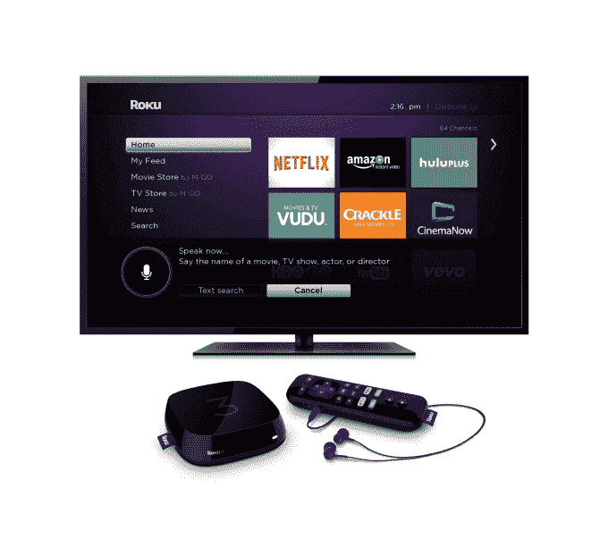

# Roku 的盒子获得了更好的硬件和寻找观看内容的新方法

> 原文：<https://web.archive.org/web/http://techcrunch.com/2015/04/06/rokus-boxes-get-better-hardware-and-news-ways-to-find-stuff-to-watch/?ncid=rss?utm_content%3Dsuggestion>

# Roku 的盒子有了更好的硬件和寻找观看内容的新方法

今天， [Roku 2](https://web.archive.org/web/20230315121854/https://www.roku.com/products/roku-2) 和 [Roku 3](https://web.archive.org/web/20230315121854/https://www.roku.com/products/roku-3) 流媒体盒子正在更新，当你在频道和应用程序之间跳转时，新的硬件提供了更快的界面移动。

对于那些购买最高端 Roku 3 的人来说，还有一种新的输入法:遥控器现在包括一个用于语音搜索的麦克风，这是当你按下搜索按钮时弹出的默认选项。

在我上周看到的一个快速演示中，语音搜索功能对于最近上映的电影和《绝命毒师》(Breaking Bad)等热门节目来说很快，但在搜索像“TechCrunch”这样有独特名称的频道时却很困难(诀窍是只说“Crunch”)。对于那些喜欢用老方法的人来说，这是一个额外的按键来使用传统键盘。

虽然新的搜索选项是为 99 美元的 Roku 3 保留的，但 Roku 2(以及当前一代的盒子和运行 Roku 软件的电视)也将获得新的重大发现功能:Roku Feed。当你在 Roku 上搜索一部电影时，你可以选择关注它，并在它出现在新频道或价格下降时接收更新。Roku 没有弹出更新通知，而是决定让你在还没想好要看什么的时候查看这个 feed。

目前，它专注于仍在影院上映的电影——其想法是，尽管影院上映日期得到了广泛宣传，但由于上映窗口的混乱状态，当一部电影从票房过渡到网飞或亚马逊 Prime 时，往往会令人惊讶。

升级后的 Roku 2 售价 69 美元，但不包括遥控器上的麦克风或耳机插孔，以便在不打扰室友或其他重要人士的情况下看电视。

Roku 表示，我将在本周初的某个时候审查一个单元，所以请务必回来查看我们的新机顶盒和新 Roku 应用程序的视频实践，其中包括直接从你的手机进行语音搜索。