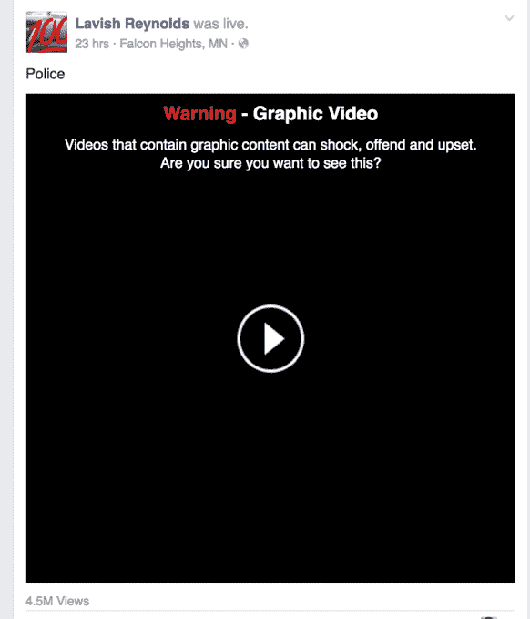

# 脸书解释直播视频的审查政策

> 原文：<https://web.archive.org/web/https://techcrunch.com/2016/07/08/facebook-censorship-policy/?ncid=tcdaily>

据一位发言人称，脸书只会删除那些颂扬或美化暴力的内容，而不会删除那些只有图片或令人不安的内容。

脸书还坚称，菲兰多·卡斯蒂利亚死亡的视频暂时无法获得，原因是脸书的技术故障。这与以下理论相矛盾:视频消失的原因是脸书对它是否应该保留犹豫不决，大量报道称它包含暴力内容，警方删除了卡斯蒂利亚女友的电话和脸书账户，或者警方要求删除它。

然而，脸书拒绝详细说明故障的确切原因，比如流量高峰。然而，它确实[发布了这个声明](https://web.archive.org/web/20230403105300/http://newsroom.fb.com/news/h/community-standards-and-facebook-live/)。

暂时删除引起了 BuzzFeed 、 [TechCrunch](https://web.archive.org/web/20230403105300/https://techcrunch.com/2016/07/07/live/) 和其他媒体的质疑，质疑脸书在主持公民新闻方面的角色和责任，这可能是有争议的或生动的。

## 脸书的图形内容审查政策

我与一位脸书发言人进行了长时间的交谈，以获得关于其关于图形内容的[社区标准](https://web.archive.org/web/20230403105300/https://www.facebook.com/communitystandards)的确切政策的答案，以及何时违规会导致审查。尽管他们拒绝在官方声明之外被引用，但我们学到了以下几点:

*   脸书的社区标准概述了从色情到暴力再到仇恨言论等社交网络上允许和不允许的内容。它们适用于实时视频，就像适用于录制的照片和视频一样。
*   关于图形内容的政策是，如果庆祝、颂扬或嘲笑受害者，脸书不允许也不会删除描绘暴力的内容。然而，如果张贴暴力内容是为了引起对暴力的注意或谴责暴力，那么生动或令人不安的暴力内容就不是违法行为。
*   本质上，如果有人发布了一段生动暴力的视频，说“这太棒了，所以得到了他们想要的东西”，它将被移除，但是如果他们说“这太可怕了，这些事情需要停止”，它仍然可以被看到。
*   用户可以出于各种原因(包括描述暴力的原因)之一，将任何内容(包括正在播放的 Live 视频)报告为冒犯性内容。
*   即使是一个报告标志也会将内容发送给脸书社区标准团队进行审查，该团队在全球范围内 7x24 小时运营。这些团队成员可以查看公开或私下共享的内容。标志的数量与内容是否被审查没有关系，更高数量的标志不会触发自动删除。
*   没有选项报告内容为“图形但有新闻价值”，或任何其他方式报告内容可能会令人不安，应该被删除。相反，脸书要求用户报告该视频是暴力的，或者任何其他选项。然后，经过培训的团队成员将对其进行审查，以确定内容是否违反了脸书的标准。
    
*   审查有三种可能的结果。1)内容不违反脸书的标准，不被视为图形，并按原样保留。2)内容违反了脸书的标准，被删除。3)内容被认为是图形或令人不安的，但不违反，并留下来，但有免责声明。
*   黑色的免责声明屏幕隐藏了内容的预览，并显示“警告-图形视频。包含图形内容的视频可能会令人震惊、冒犯或不安。你确定要看这个吗？”这些视频不会在新闻提要中自动播放，并且通常禁止 18 岁以下的用户观看。
*   如果有报道，直播视频可以在进行中被审查，如果违反标准，脸书可以中断并关闭视频流。脸书还监控任何达到足够高的观众水平的公共流。
*   如果脸书的团队认为共享内容中描述的人对自己或他人构成威胁，他们将联系当地执法部门。它还将鼓励标记内容的用户联系当局。

总体而言，这些政策似乎没有过度限制。脸书的审查规则侧重于美化暴力，如发布视频宣传或庆祝恐怖主义。

该政策没有区分死因、视频制作者和拍摄对象之间的关系以及执法部门的介入。与脸书上发布的所有内容一样，创作者保留所有权。

## 公民新闻的未来

在菲兰多卡斯蒂利亚视频的例子中，脸书说它的目的是平衡意识和内容的图形暴力性质。该公司告诉我，它理解视频直播的独特挑战，需要一种负责任的方法。

在给 TechCrunch 的一份声明中，该公司表示:

> “非常抱歉，视频暂时无法访问。它因技术故障而关闭，在我们能够进行调查后就恢复了。
> 
> 我们可以确认它在脸书直播。几个小时后，它关闭了大约一个小时。该视频没有违反标准，但我们用警告将其标记为令人不安。"

该公司可疑地拒绝详细说明故障原因，尽管流量激增是一种可能性。尽管如此，这种模糊性引发了人们的担忧，即脸书是故意拿掉这段视频的。

即使这是一个技术故障，这也是脸书必须防止未来发生的事情。Live 是其成为实时新闻中心的机会，历史上，实时新闻首先出现在 Twitter 上。随着对 Periscope 的收购，Twitter 也想控制视频直播。用户可能会选择他们认为最有可能让他们的声音被听到的，而不会审查他们。

关于脸书和公民新闻的未来，该公司[写道](https://web.archive.org/web/20230403105300/http://newsroom.fb.com/news/h/community-standards-and-facebook-live/)“正如(直播视频)让我们看到人们生活中最美好的时刻，它也可以让我们见证最糟糕的情况。在危机中，实时视频可以成为记录事件或寻求帮助的有力工具。”

脸书似乎致力于托管马克·扎克伯格所说的内容，这些内容可以“照亮”不公正，即使它可能会震惊人们。

拨打 911 无法带来视频直播所能带来的透明度和影响力。拥有 16.5 亿用户的脸书，或许比任何其他通信渠道都更能连接我们，并为我们提供了一个现场摄像机，让全世界都能看到我们做错的事情。

这种获利的能力和潜力伴随着不回避争议的责任。