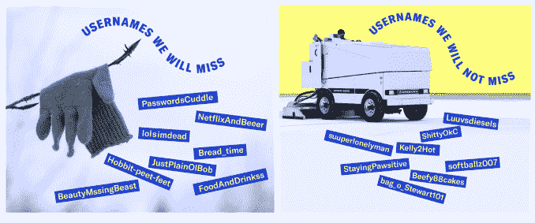
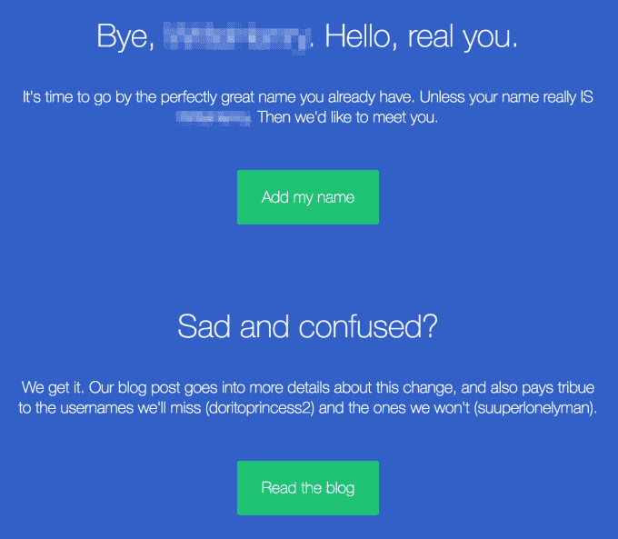

# 由于用户反对新的“实名制”政策，OKCupid 的评级下降

> 原文：<https://web.archive.org/web/https://techcrunch.com/2017/12/29/okcupids-rating-sinks-as-users-rebel-over-new-real-name-policy/?ncid=tcweekly_mobile_apps>

OKCupid 的用户很愤怒—*非常非常*愤怒。就在新年前夕，该公司对其政策进行了彻底的改变，现在要求人们使用真实姓名，而不是像以前一样使用 OKCupid 用户名。这一变化消除了约会应用与 Tinder 和 Bumble 等竞争对手之间的最大差异之一，这些竞争对手让用户通过脸书登录，以便在约会档案中使用他们的真实姓名。

自从上周[宣布](https://web.archive.org/web/20230129064116/https://theblog.okcupid.com/an-open-letter-on-why-were-removing-usernames-addressed-to-the-worst-ones-we-ve-ever-seen-dd017c75d49a)更新以来，OKCupid 的应用在 App Store 上遭到了恶评。12 月份超过一半的评论(56.3%)只有一颗星——高于 11 月份的三分之一。如果 App Store 中只显示过去一个月的评论，这将使该应用程序获得令人沮丧的 2.2 星评级。(不过，苹果现在允许开发者在发布新版本时选择[不重置评级](https://web.archive.org/web/20230129064116/https://techcrunch.com/2017/06/07/ios-app-developers-will-be-able-to-keep-app-store-ratings-when-releasing-an-update/)；OKC 选择此选项来维持其 4.2 星评级。)

该公司在一篇厚脸皮的博客文章中解释了这一变化背后的原因，该博客文章取笑了人们多年来在其网站上采用的愚蠢用户名，例如 DoritoprincessXO、DaddyzPrincess29、StayingPawwsitive、Dootdootledootd0、Britney__Tears、laidback___stu、BigDaddyFlash916 和 unicorn__jizz。(OKC 表示，事实上，这些是人们在其服务上使用的真实用户名，但为了保护人们的隐私，这些用户名被略微编辑过。)

它还将这一转变与用户名时代的终结联系在一起——注意到 [AIM 最近永久关闭了](https://web.archive.org/web/20230129064116/https://techcrunch.com/2017/12/15/aim-is-officially-dead/)。基本上，这意味着愚蠢的在线手柄时代可能也已经结束了。

对于 OKCupid 的许多用户来说，这些解释都不够好，坦率地说，他们对人们当初为什么选择 OKC 有点不屑一顾。

正如一些评论人士指出的那样，实名制政策和 OKC 通过旨在根据共同兴趣找到附近匹配的功能推进发现的结合，可能意味着其用户的隐私减少。

毕竟，有了姓名、年龄、照片和城市，如今通过谷歌或脸书搜索相关人员并找出他们是谁、在哪里工作、住在哪里是相当简单的事情。这并不是所有约会应用程序用户都想立即给陌生人的信息。

一位愤怒的用户 UniqueTwain 在应用商店评论中写道:“我们中的一些人更喜欢个人用户名的隐私。”。“当提到我的名字时，我希望有人认识我，然后直接问我。我又不是穿着我的昵称或姓名徽章或绣有字母的衣服去参加派对。不，我必须和人们交谈，了解他们，让他们告诉我他们的名字。为什么网上应该有什么不同？”

其他几个人在他们的应用商店评论[和博客评论](https://web.archive.org/web/20230129064116/https://theblog.okcupid.com/an-open-letter-on-why-were-removing-usernames-addressed-to-the-worst-ones-we-ve-ever-seen-dd017c75d49a)中指出，OKCupid 的声明给人的印象是“居高临下”、“粗鲁”和“傲慢”

该公司可能挑选了一些更令人生厌的用户名来取笑，但许多人认为用户名通常是一种简单快捷的方式，可以了解某人的情况，同时还能保护他们的隐私。

还有一种普遍的感觉是，OKCupid 试图变得太像 Tinder，而不是保留使其独一无二的功能。例如，该应用程序已经停止了人们喜欢的功能，如查看访客的功能，因为它更加关注 Tinder 式的功能，如突出用户照片。

“Match.com 应该在这一点上关闭 OKCupid 他们已经拥有 Tinder，没有必要建立第二个 Tinder，”tby77 在另一篇应用商店评论中嘲笑道。(Match 是许多约会应用的母公司，包括 OKCupid、Tinder、PlentyofFish 和 [others](https://web.archive.org/web/20230129064116/http://mtch.com/brands/) 。)

更糟糕的是，OKCupid 将一些人锁定在应用程序之外，直到他们遵守新政策，而不是提供宽限期。

其他人很生气，因为他们最近向 OKC 支付了近 50 美元，通过高级升级的方式来改变他们的用户名。(当时唯一有这个选项的方法。)他们不会得到退款，尽管改名功能现在是免费提供的。

虽然评论很残酷，但 OKC 的应用商店排名还没有受到这一变化的影响(在 iOS 的社交网络中排名第 53)。这可能是因为苹果的排名只考虑了应用程序的安装量和安装速度——它不知道有多少人在删除应用程序。

对于 OKC 的新政策，至少有一个警告——你不必使用你的法定姓名，该公司在其声明的底部指出。上面说，你可以用你希望你的约会对象“称呼你”的名字来代替。

后来它试图在一条推文中进一步澄清这一点，解释说昵称甚至缩写都是允许的，完整的名字不是必须的。

但是等等…绰号？首字母？

如果 OKCupid 实际上并不要求*真实的*名字，为什么要取消用户名政策呢？

*美国东部时间下午 4 点更新:*

OKCupid 提供了以下声明来回答我们关于政策变化的问题。我们所说的声明是指他们写了另一篇博文:

> 给你一些更多的背景资料，解释为什么我们决定删除用户名——这是我们为约会增加更多内容和深度的使命的一部分。OkCupid 希望让体验更加个性化。与“用户名”相比，拥有一个名字更能增加人的因素。
> 
> 作为对“变通办法”的回应，我们已经声明，要成为一个合格的名称，它必须至少有两个字母，没有数字或符号。我们也有一个不符合条件的禁用词列表。重要的是要澄清，这不必是你的真实/合法的名字，它可以是你希望别人称呼你的任何名字。
> 
> 我们没有任何恢复用户名的计划。我们知道有些人不喜欢用户名消失，但我们收到了很多(数千个！)的信息，他们说他们被人们使用的一些用户名冒犯了…或者他们真的真的很难想出一个用户名，我们能不能帮助他们创造出一种融合了恐龙、玉米卷或披萨，理想情况下三者都有的东西。或者他们想出了一个非常棒的用户名，但现在他们忘记了，我们能帮他们恢复吗？我们收到成千上万的更改用户名的请求，因为感觉这样做不对了。
> 
> 我们最关心的是用户的安全。这就是为什么我们是今年早些时候推出约会誓言的第一个约会应用程序。这就是为什么我们有一个令人难以置信的审核团队，亲自审查任何问题，并清除违反我们规则的人。
> 
> 自从我们做了这个改变后，我们从很多人那里听说它让 OkCupid 更人性化了。这难道不是约会应用程序的正确举措吗？