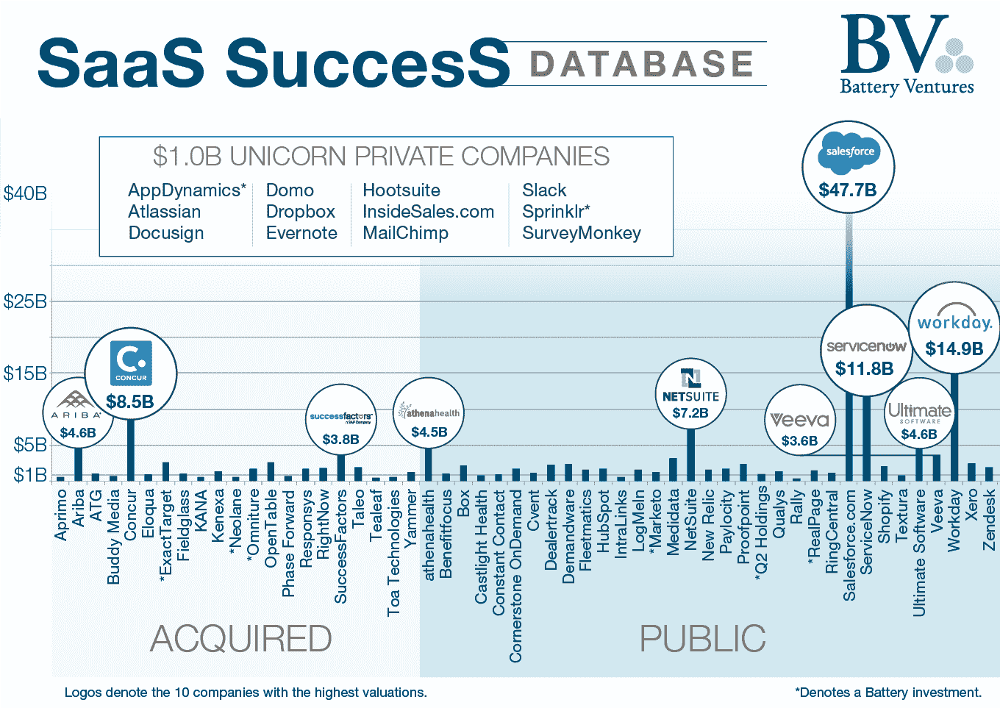
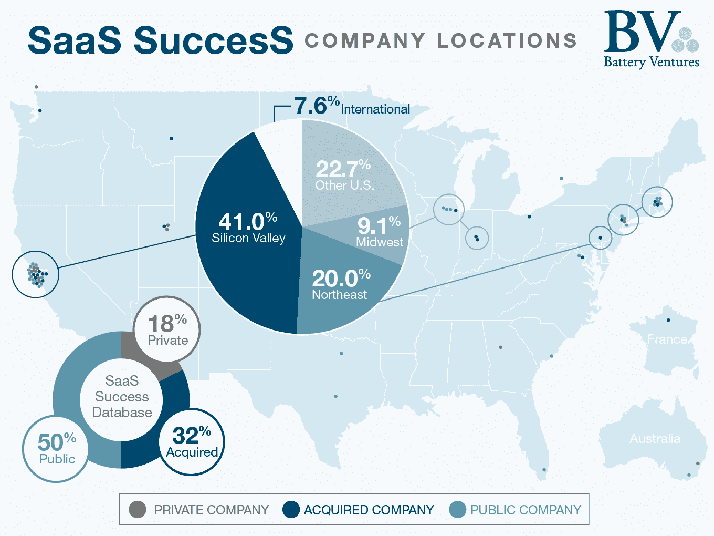
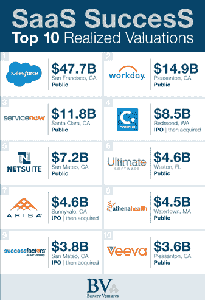

# SaaS 成功数据库 

> 原文：<https://web.archive.org/web/https://techcrunch.com/2015/08/29/the-saas-success-database/?ref=saasinvaders.com>

尼拉杰·阿格拉瓦尔撰稿人

More posts by this contributor

洛根·巴特利特撰稿人

More posts by this contributor

建立一个十亿美元的 SaaS 企业软件公司需要什么？在最近的 TechCrunch 贴子[SaaS 历险记](https://web.archive.org/web/20221206221346/https://beta.techcrunch.com/2015/02/01/the-saas-travel-adventure/)中，我们对这个复杂而有趣的问题给出了一个 30000 英尺的答案。

总结一下:我们观察到大多数 SaaS 公司走向市场成功的七个关键阶段。大多数阶段都围绕着一个咒语，我们称之为“三倍，三倍，两倍，两倍”(简称 T2D3)，指的是公司的年化收入增长。

我们称这次旅程为“SaaS 冒险”，这也是我们对风险投资工作的大致看法:在 SaaS 公司攀登十亿美元的顶峰，甚至更高的目标时，作为一个更有经验的旅行向导。

我们得到了对 SaaS 探险邮报和 T2D3 概念非常强烈的回应。与此同时，我们也对风投伙伴艾琳·李(Aileen Lee)原创的独角兽公司分析印象深刻，她上个月刚刚更新了一些新内容。所有这些促使我们对 SaaS 公司进行更深入的分析。

我们的新分析(部分内容见此处)提供了高水平的收获，以及攀登 SaaS 成功的更细致入微的画面——我们希望所有这些都将帮助新企业家塑造他们自己的成功攀登。

把这个想象成一张探险地图；登山者喜欢称之为“beta”:给尝试某次攀登的新手的宝贵建议。我们计划定期刷新这个数据集，并附带分析。

因此，我们在这里介绍 SaaS 成功数据库:66 家领先的 SaaS 公司的汇总，上市*和*私营，定义了这个行业。该数据库包括实现退出超过 5 亿美元的公司(截至 6 月 30 日，通过公开市场或并购交易)和价值 10 亿美元或以上的私营公司。

SaaS 成功数据库将 SaaS 公司的发展追溯到早期，那时它们还被称为应用服务提供商(ASP)。它包括 Battery 有幸投资的八家公司。

我们名单上 20%的公司成立于 1997 年之前，但大多数成立于 1997 年之后和 2008 年危机之前；36.3%是在 1998 年至 2002 年间创办的，30.3%是在 2003 年至 2007 年间创办的。

那些成立于 2008 年或之后的公司——app dynamics *、Castlight Health、Domo、Hootsuite、New Relic、Slack、Sprinklr*和 Yammer——尽管经济困难，但仍全力以赴，强调通常不是市场条件，而是团队和产品与市场的契合度能够带来成功。

在未来的文章中，我们将围绕冒险的每个阶段解决关键问题，并与数据库中一些自己攀登过的公司的首席执行官交谈。(我们已经通过视频采访了两位成功的高管:Marketo*的菲尔·费尔南德斯和 AppDynamics*的约蒂·班萨尔。)

就谁在创办这些成功的公司而言，我们的分析表明，他们大多是由团队创办的:两位创始人(占总数的 34.9%)是我们数据库中最常见的公司配置，33.3%的公司由三人或更多人创办(在我们的数据库中多达七人)。令人惊讶的是，这些创始团队通常是陌生人:60.0%的人之前没有一起工作的历史。在上榜的 SaaS 公司中，只有 31.8%的公司有个人创始人。

除了人口统计数据，我们还调查了这些创始 CEO 的背景，并提出了一些问题，比如:有多少人是第一次担任 CEO？(略高于 67%——尽管 SaaS 的首席执行官通常都是成年人:60%的创始首席执行官在 30 多岁时创办了自己的公司，13.8%在 40 多岁时，6.2%在 50 多岁时。)

他们给这份工作带来了怎样的教育和工作经验？这些创始首席执行官是为了 IPO 还是其他退出途径而留下来的？如果不是，那么在每个退出阶段，新 CEO 的特点是什么？这些都是我们将深入探讨的要点。

接下来，我们将考察这些公司的起源，解决地理、商业模式和销售策略等问题。

事实证明，SaaS 的成功不像其他科技领域那样以硅谷为中心:我们的公司中有近 41%位于硅谷，其次是东北部的近 20%，中西部的 9.1%，得克萨斯州、大西洋中部地区、落基山脉和西北部之间的比例相当均匀。(只有五家公司来自加拿大或美国以外的其他地方。)

我们的顶级 SaaS 玩家倾向于在许多行业广泛销售(82%)，产品的购买决策者要么是 CMO(27.2%)，要么是首席信息官(27.3%)。

我们研究的其余 18%的公司瞄准了特定的垂直行业，如制药(Medidata、Phase Forward、Veeva)、医疗保健(athenahealth)、房地产(RealPage)，甚至是超级特定的垂直行业(汽车经销商管理的 Dealertrack、车队管理的 Fleetmatics、餐馆的 OpenTable 或地区和社区银行的 Q2 控股*)。

在未来的帖子中，我们将解决这一阶段的其他问题，例如:这些公司是否转向 SaaS 交付或以这种方式开始，以及这种转变通常如何影响公司未来的成功？

在 SaaS 上市公司中，每个客户的收入有“最佳点”吗？你的 SaaS 公司的目标应该是捕获几条鲸鱼还是许多较小的鱼——每种方法对后续增长有何影响？

在导致上升或退出的大本营，我们想知道:鉴于流动性相对较长的时间——我们 36.5%的上市或被收购公司从成立到流动性需要超过 10 年的时间——更长(或更短)的上升与其他成功指标相关吗？濒临公开退出的成功 SaaS 公司的典型财务状况是怎样的？SaaS 顶级公司的首次公开募股日通常是怎样的？所有这些都是我们很快会谈到的话题。

我们名单上的新上市公司的增长前景如何？早期分析显示，这种趋势非常强劲，只有 6.7%的公司在 IPO 时收入同比增长低于 25%；42.2%是最大的群体，即在 IPO 当天收入增长超过 100%的公司。

攀登 SaaS 是艰难的，充满了意想不到的事情。没有一张地图能让你对沿途必要的即兴创作做好充分准备，或者给你攀登本身的勇气。但是我们希望 SaaS 成功数据库能为建立一个成功的 SaaS 企业软件公司提供有价值的见解——包括这一旅程的所有要素。

###### **关于所有电池投资和退出的完整列表，请点击* [*此处*](https://web.archive.org/web/20221206221346/https://www.battery.com/our-companies/list/) *。*