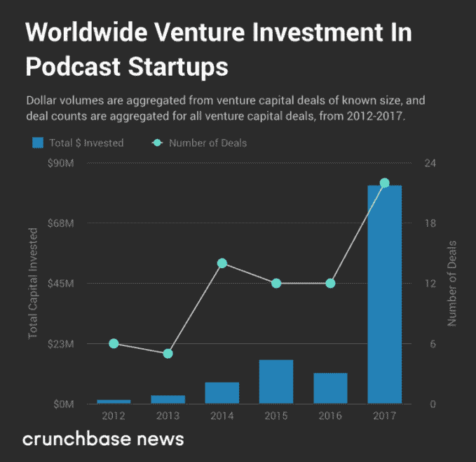

# 风投们喜欢他们从播客行业听到的东西

> 原文：<https://web.archive.org/web/https://techcrunch.com/2018/06/03/vcs-like-what-they-are-hearing-out-of-the-podcasting-sector/?renderMode=ie11>

# 风投们喜欢他们从播客行业听到的东西

杰森·罗利是

[Crunchbase](https://web.archive.org/web/20230226100957/https://about.crunchbase.com/news/)

的风险投资和科技记者。

更多帖子由本投稿人

播客是耳塞一代的电视。

播客已经存在了相当长的时间。如果你是 2014 年左右迷上播客的人之一，当 Sarah Koenig 和《美国生活》的其他制作人推出广受欢迎的系列播客时，你可能会认为这是一种全新的媒体。但是播客——通过 RSS 打包和整合的音频——自 21 世纪初就已经出现了。

尽管许多播客赚了钱，通常是通过赞助，播客行业(尽管如此)直到最近才获得风险投资。2017 年是该行业风险投资的关键一年。

## 风险就绪型行业？

在下面的图表中，我们绘制了由 Crunchbase 的[播客类别](https://web.archive.org/web/20230226100957/https://www.crunchbase.com/search/organizations/field/organizations/categories/podcast)中的公司或在描述中使用“播客”一词的公司筹集的风险融资的交易和美元金额:

在这样的图表中，人们通常会认为一个真正的大回合会带来美元交易量的大幅飙升，但这并没有发生在播客领域。相反，该领域与初创公司达成了几笔大交易。以下是 2017 年的一些亮点:

*   总部位于斯德哥尔摩的 Acast 公司为播客提供托管、分析和广告投放服务，并为他们的观众提供一款收听应用，该公司在 9 月份的 B 轮融资中筹集了[1950 万美元。](https://web.archive.org/web/20230226100957/https://crunchbase.com/funding_round/acast-series-b--28ac72b9)
*   [主播](https://web.archive.org/web/20230226100957/https://www.crunchbase.com/organization/anchor-fm#section-funding-rounds)，一个让用户只使用手机录制和制作播客的应用程序，在 3 月筹集了[280 万美元，在 9 月](https://web.archive.org/web/20230226100957/https://www.crunchbase.com/funding_round/anchor-fm-series-unknown--e9031db7#section-overview)的 A 轮[中又筹集了](https://web.archive.org/web/20230226100957/https://www.crunchbase.com/funding_round/anchor-fm-series-a--aaec0d51#section-lead-investors) [GV](https://web.archive.org/web/20230226100957/https://www.crunchbase.com/organization/google-ventures) 领投的 1000 万美元。
*   制作《回复所有人》和《启动》等热门节目的 Gimlet Media 在 8 月至 9 月间结束的两轮 B 轮融资中筹集了 2000 万美元。
*   播客托管、分发和货币化平台 [Art19](https://web.archive.org/web/20230226100957/https://www.crunchbase.com/organization/art19) 在由 [DCM Ventures](https://web.archive.org/web/20230226100957/https://www.crunchbase.com/organization/dcm) 和 [BDMI](https://web.archive.org/web/20230226100957/https://www.crunchbase.com/organization/bertelsmann-digital-media-investments) 领投的 A 轮融资[750 万美元。](https://web.archive.org/web/20230226100957/https://crunchbase.com/funding_round/art19-series-a--7f51730a)
*   2017 年 6 月， [Castbox](https://web.archive.org/web/20230226100957/https://www.crunchbase.com/organization/castbox-fm) 在首轮融资中为[筹集了 1280 万美元，帮助该公司为其以语音搜索为特色的播客应用的开发提供资金。Crunchbase 新闻报道了今年四月](https://web.archive.org/web/20230226100957/https://www.crunchbase.com/funding_round/castbox-fm-series-a--f5efcdda)[Castbox 1350 万美元的 B 轮](https://web.archive.org/web/20230226100957/https://news.crunchbase.com/news/castbox-raises-13-5-million-series-b-scale-cross-platform-podcast-app/)。同样是在 2017 年， [Podible](https://web.archive.org/web/20230226100957/https://www.crunchbase.com/organization/podible) 、 [Pippa](https://web.archive.org/web/20230226100957/https://www.crunchbase.com/organization/pippa) 、 [Breaker](https://web.archive.org/web/20230226100957/https://crunchbase.com/organization/breaker-3) 等播客创业公司从风投那里筹集了现金。

2018 年到目前为止，许多其他播客初创公司也筹集了风险资金，包括总部位于西好莱坞的播客网络[wondey](https://web.archive.org/web/20230226100957/https://www.crunchbase.com/organization/wondery)，它在 A 轮中筹集了[500 万美元。一家名字有点夸张的公司，](https://web.archive.org/web/20230226100957/https://www.crunchbase.com/funding_round/wondery-series-a--5351ca36)[播客应用](https://web.archive.org/web/20230226100957/https://www.crunchbase.com/organization/the-podcast-app)，通过 Y Combinator。

## 风投对播客感兴趣:为什么是现在？

为什么播客行业花了这么长时间才大规模吸引风投？在某种程度上，这是一个相当分散的行业。虽然有一些较大的播客网络，但大多数播客仍然是独立制作和推广的。但是，也许更重要的是，播客的商业价值直到最近才得以量化。不像网页或流媒体视频平台，基本上每个用户的行动都可以被跟踪和优化，历史上很难分析播客的收听习惯和目标广告。

但这种情况正在改变。播客现在是新闻和娱乐的主流媒体。2017 年 12 月，播客的长期支持者和播客的最大分销商苹果公司推出了播客剧集分析。这让播客制作人和他们的广告商知道人们是否真的听了整集并听到了广告。(注意:在苹果之前，一些较小的播客播放器提供了类似的分析和广告监控功能。)

这导致一些投资者相信，他们可以通过投资播客初创公司来获得“风险规模”的回报。