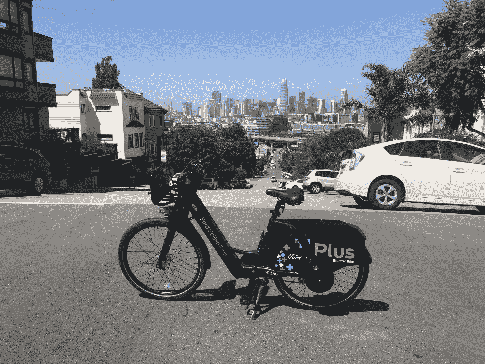

# 据报道，Lyft 即将收购福特 GoBike 和花旗自行车 TechCrunch 背后的公司

> 原文：<https://web.archive.org/web/https://techcrunch.com/2018/06/01/lyft-is-close-to-buying-the-company-behind-ford-gobike-and-citi-bike/?sr_share=twitter&utm_source=tctwreshare>

# 据报道，Lyft 接近收购福特 GoBike 和花旗自行车背后的公司

Lyft 即将收购 Motivate，该公司负责旧金山湾区的福特 GoBike 和纽约市地区的花旗自行车。据报道，这笔交易至少价值 2.5 亿美元。

Lyft 拒绝置评，截至发稿时，无法联系到 Motivate 发表评论。这笔交易将使 Lyft 在自行车共享方面领先于优步。[今年早些时候，优步以约 2.5 亿美元的价格收购了自行车共享初创公司 JUMP](https://web.archive.org/web/20221207204024/https://techcrunch.com/2018/04/09/uber-acquires-bike-share-startup-jump/) ，这是一家无人值守的电动自行车共享服务公司。JUMP 的足迹目前比 Motivate 的小得多，但优步肯定在努力扩大 JUMP 的存在。

MRD/TC 拍摄的照片

四月，[在三藩市推广电动自行车](https://web.archive.org/web/20221207204024/https://techcrunch.com/2018/04/23/electric-ford-gobikes-are-officially-here/)。一旦 JUMP 与该市为期 18 个月的试点项目于明年 6 月结束，我们可以期待看到 Motivate、Lime 和 Scoot 等公司申请在该市部署自己的无人驾驶自行车。

例如，就在这个月， [Scoot 在巴塞罗那推出了无码头电动自行车](https://web.archive.org/web/20221207204024/https://techcrunch.com/2018/05/30/scoot-launches-mopeds-and-bike-share-in-barcelona/)。Scoot 首席执行官迈克尔·基廷告诉我，他想在旧金山部署，但目前不能，因为该市拥有 JUMP 的独家许可。

此前不久，有消息称 Lyft 也在寻求进入电动滑板车。据报道，Lyft 一直在与旧金山市官员谈判，讨论申请许可，并起草了一些踏板车设计的原型。优步也盯上了电动滑板车，[优步首席执行官达拉·科斯罗萨西之前告诉我](https://web.archive.org/web/20221207204024/https://techcrunch.com/2018/04/09/uber-acquires-bike-share-startup-jump/)。

现在的情况是，优步和 Lyft 都在积极尝试成为多式联运公司。这意味着他们不再只是想提供叫车服务，而是寻求成为满足你所有交通需求的一站式商店。然而，优步在这一点上有点领先，因为它最近与公共交通公司 Masabi 合作，提供汽车租赁服务 Getaround，积极部署电动自行车和 uberAIR 计划。