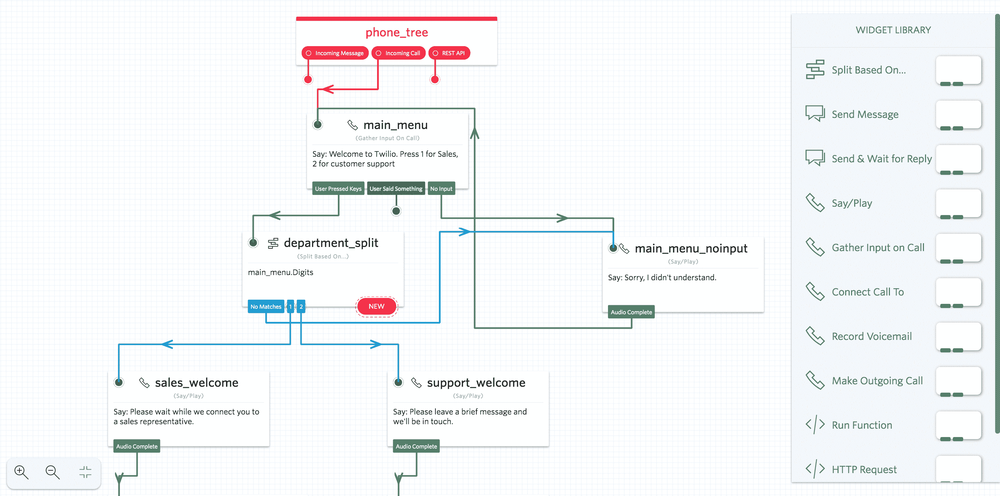

# Twilio Studio 让您无需编码即可构建通信服务

> 原文：<https://web.archive.org/web/https://techcrunch.com/2017/09/19/twilio-studio-lets-you-build-communication-services-without-having-to-code/?utm_campaign=Dzone&utm_source=placed-article&utm_medium=paid&utm_content=why-twilio-customers-post>

# Twilio Studio 让您无需编码即可构建通信服务

Twilio 长期以来一直以一种服务而闻名，这种服务可以让开发者轻松地将音频、视频和文本通信功能添加到他们的应用程序中，但随着 [Twilio Studio](https://web.archive.org/web/20230304013811/https://www.twilio.com/studio) 今天作为封闭预览版推出，该公司现在也将目标对准了非开发者。

这里的想法是允许几乎任何人在基于网络的拖放应用程序的帮助下构建客户参与应用程序，如语音响应系统、消息机器人和通知研讨会。不过，Studio 中还没有的一个 Twilio 功能是视频。值得注意的是，虽然 Twilio 的营销显然专注于这个用例，但该服务并不局限于构建这种应用程序。

虽然 Twilio Studio 本质上是一个用于构建非常特殊的应用程序的低代码服务，但该团队也瞄准了专业开发人员。Twilio 产品副总裁 Pat Malatack 告诉我:“这极大地增加了能够构建这些体验的人的数量，但它对许多组织中正在构建这些工作流的现有工程师也非常有用。”。

事实上，该团队将该公司的无服务器平台 Twilio Functions 集成到 Studio 中，以确保即使 Studio 提供对大多数现有 Twilio APIs 的图形访问，拖放界面也无法像直接编写代码那样灵活。然而，在开发人员完成他们的工作后，其他人仍然可以很容易地对应用程序进行基本的修改。

Twilio Studio 的定价将基于使用情况。在某种程度上有限的免费层之上，仍然允许开发人员创建无限的流量，该公司将提供一个功能更全的“Plus”层，用于每月 99 美元的生产使用，外加每次客户参与 0.005 美元。此外，还将为希望启动大规模实施的企业提供一个企业层。